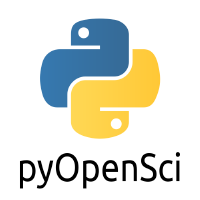

#  pyOpenSci scientific Python Packaging Guide
<!-- ALL-CONTRIBUTORS-BADGE:START - Do not remove or modify this section -->
[](#contributors-)
<!-- ALL-CONTRIBUTORS-BADGE:END -->


[](https://zenodo.org/badge/latestdoi/556814582)

[](https://circleci.com/gh/pyOpenSci/python-package-guide)

## What is pyOpenSci?

pyOpenSci is devoted to building diverse, supportive community around
the Python open source tools that drive open science. We do this through:

* open peer review
* mentorship and
* training.

pyOpenSci is an independent organization, fiscally sponsored by Community
Initiatives.

:construction: Construction note :construction:

This repository is currently under heavy construction. So please note that if
you are working through the content!

## Contributing statement


## How to setup

This repository contains the source files for the [pyOpenSci governance](https://pyopensci.org/governance).

## Build the governance document locally

Our governance documentation is built with [Sphinx](https://sphinx-doc.org) which is a documentation tool.

The easiest way to build our documentationis to use [the `nox` automation tool](https://nox.thea.codes/), a tool for quickly building environments and running commands within them.
Using `nox` ensures that your environment has all the dependencies needed to build the documentation.

To build, follow these steps:

1. Install `nox`

   ```console
   $ pip install nox
   ```
2. Build the documentation:

   ```console
   $ nox -s docs
   ```

This should create a local environment in a `.nox` folder, build the documentation (as specified in the `noxfile.py` configuration), and the output will be in `_build/html`.

To build live documentation that updates when you update local files, run the following command:

```console
$ nox -s docs-live
```


## Contributing to this guide

We welcome and issues and pull-requests to improve the content of this guide.
If you'd like to see an improvement, please [open an issue](https://github.com/pyOpenSci/governance/issues/new/choose).

## Contributors ✨

Thanks goes to these wonderful people ([emoji key](https://allcontributors.org/docs/en/emoji-key)):

<!-- ALL-CONTRIBUTORS-LIST:START - Do not remove or modify this section -->
<!-- prettier-ignore-start -->
<!-- markdownlint-disable -->
<table>
  <tbody>
    <tr>
      <td align="center" valign="top" width="14.28%"><a href="https://fosstodon.org/@eriknw"><br /><sub><b>Erik Welch</b></sub></a><br /><a href="https://github.com/pyOpenSci/python-package-guide/commits?author=eriknw" title="Documentation">📖</a> <a href="#design-eriknw" title="Design">🎨</a></td>
      <td align="center" valign="top" width="14.28%"><a href="https://nicholdav.info/"><br /><sub><b>David Nicholson</b></sub></a><br /><a href="https://github.com/pyOpenSci/python-package-guide/commits?author=NickleDave" title="Documentation">📖</a> <a href="#design-NickleDave" title="Design">🎨</a> <a href="#tutorial-NickleDave" title="Tutorials">✅</a></td>
      <td align="center" valign="top" width="14.28%"><a href="http://www.leahwasser.com"><br /><sub><b>Leah Wasser</b></sub></a><br /><a href="https://github.com/pyOpenSci/python-package-guide/commits?author=lwasser" title="Documentation">📖</a> <a href="#design-lwasser" title="Design">🎨</a></td>
      <td align="center" valign="top" width="14.28%"><a href="http://arianesasso.me"><br /><sub><b>Ariane Sasso</b></sub></a><br /><a href="https://github.com/pyOpenSci/python-package-guide/commits?author=arianesasso" title="Documentation">📖</a> <a href="#design-arianesasso" title="Design">🎨</a> <a href="https://github.com/pyOpenSci/python-package-guide/commits?author=arianesasso" title="Code">💻</a> <a href="https://github.com/pyOpenSci/python-package-guide/pulls?q=is%3Apr+reviewed-by%3Aarianesasso" title="Reviewed Pull Requests">👀</a></td>
      <td align="center" valign="top" width="14.28%"><a href="http://ml-gis-service.com"><br /><sub><b>Simon</b></sub></a><br /><a href="https://github.com/pyOpenSci/python-package-guide/commits?author=SimonMolinsky" title="Documentation">📖</a> <a href="#design-SimonMolinsky" title="Design">🎨</a></td>
      <td align="center" valign="top" width="14.28%"><a href="http://batalex.github.io"><br /><sub><b>Alexandre Batisse</b></sub></a><br /><a href="https://github.com/pyOpenSci/python-package-guide/commits?author=Batalex" title="Documentation">📖</a> <a href="#design-Batalex" title="Design">🎨</a></td>
      <td align="center" valign="top" width="14.28%"><a href="https://github.com/tupui"><br /><sub><b>Pamphile Roy</b></sub></a><br /><a href="https://github.com/pyOpenSci/python-package-guide/commits?author=tupui" title="Documentation">📖</a> <a href="#design-tupui" title="Design">🎨</a></td>
    </tr>
    <tr>
      <td align="center" valign="top" width="14.28%"><a href="http://ocefpaf.github.io/python4oceanographers"><br /><sub><b>Filipe</b></sub></a><br /><a href="https://github.com/pyOpenSci/python-package-guide/commits?author=ocefpaf" title="Code">💻</a> <a href="#design-ocefpaf" title="Design">🎨</a></td>
      <td align="center" valign="top" width="14.28%"><a href="https://jon-e.net"><br /><sub><b>Jonny Saunders</b></sub></a><br /><a href="https://github.com/pyOpenSci/python-package-guide/commits?author=sneakers-the-rat" title="Code">💻</a> <a href="#design-sneakers-the-rat" title="Design">🎨</a></td>
      <td align="center" valign="top" width="14.28%"><a href="https://github.com/radoering"><br /><sub><b>Randy Döring</b></sub></a><br /><a href="https://github.com/pyOpenSci/python-package-guide/commits?author=radoering" title="Code">💻</a> <a href="https://github.com/pyOpenSci/python-package-guide/pulls?q=is%3Apr+reviewed-by%3Aradoering" title="Reviewed Pull Requests">👀</a></td>
      <td align="center" valign="top" width="14.28%"><a href="https://social.juanlu.space/@astrojuanlu"><br /><sub><b>Juan Luis Cano Rodríguez</b></sub></a><br /><a href="https://github.com/pyOpenSci/python-package-guide/commits?author=astrojuanlu" title="Code">💻</a> <a href="#design-astrojuanlu" title="Design">🎨</a> <a href="https://github.com/pyOpenSci/python-package-guide/pulls?q=is%3Apr+reviewed-by%3Aastrojuanlu" title="Reviewed Pull Requests">👀</a></td>
      <td align="center" valign="top" width="14.28%"><a href="http://iscinumpy.dev"><br /><sub><b>Henry Schreiner</b></sub></a><br /><a href="https://github.com/pyOpenSci/python-package-guide/commits?author=henryiii" title="Code">💻</a> <a href="#design-henryiii" title="Design">🎨</a> <a href="https://github.com/pyOpenSci/python-package-guide/pulls?q=is%3Apr+reviewed-by%3Ahenryiii" title="Reviewed Pull Requests">👀</a></td>
      <td align="center" valign="top" width="14.28%"><a href="https://mentat.za.net"><br /><sub><b>Stefan van der Walt</b></sub></a><br /><a href="https://github.com/pyOpenSci/python-package-guide/commits?author=stefanv" title="Code">💻</a> <a href="#design-stefanv" title="Design">🎨</a> <a href="https://github.com/pyOpenSci/python-package-guide/pulls?q=is%3Apr+reviewed-by%3Astefanv" title="Reviewed Pull Requests">👀</a></td>
      <td align="center" valign="top" width="14.28%"><a href="https://github.com/eli-schwartz"><br /><sub><b>Eli Schwartz</b></sub></a><br /><a href="https://github.com/pyOpenSci/python-package-guide/commits?author=eli-schwartz" title="Code">💻</a> <a href="#design-eli-schwartz" title="Design">🎨</a> <a href="https://github.com/pyOpenSci/python-package-guide/pulls?q=is%3Apr+reviewed-by%3Aeli-schwartz" title="Reviewed Pull Requests">👀</a></td>
    </tr>
    <tr>
      <td align="center" valign="top" width="14.28%"><a href="https://github.com/rgommers/"><br /><sub><b>Ralf Gommers</b></sub></a><br /><a href="https://github.com/pyOpenSci/python-package-guide/commits?author=rgommers" title="Code">💻</a> <a href="#design-rgommers" title="Design">🎨</a> <a href="https://github.com/pyOpenSci/python-package-guide/pulls?q=is%3Apr+reviewed-by%3Argommers" title="Reviewed Pull Requests">👀</a></td>
      <td align="center" valign="top" width="14.28%"><a href="https://pradyunsg.me"><br /><sub><b>Pradyun Gedam</b></sub></a><br /><a href="https://github.com/pyOpenSci/python-package-guide/commits?author=pradyunsg" title="Code">💻</a> <a href="#design-pradyunsg" title="Design">🎨</a> <a href="https://github.com/pyOpenSci/python-package-guide/pulls?q=is%3Apr+reviewed-by%3Apradyunsg" title="Reviewed Pull Requests">👀</a></td>
      <td align="center" valign="top" width="14.28%"><a href="https://ofek.dev"><br /><sub><b>Ofek Lev</b></sub></a><br /><a href="https://github.com/pyOpenSci/python-package-guide/commits?author=ofek" title="Code">💻</a> <a href="#design-ofek" title="Design">🎨</a> <a href="https://github.com/pyOpenSci/python-package-guide/pulls?q=is%3Apr+reviewed-by%3Aofek" title="Reviewed Pull Requests">👀</a></td>
      <td align="center" valign="top" width="14.28%"><a href="https://orcid.org/0000-0003-2843-6044"><br /><sub><b>Chiara Marmo</b></sub></a><br /><a href="https://github.com/pyOpenSci/python-package-guide/commits?author=cmarmo" title="Code">💻</a> <a href="#design-cmarmo" title="Design">🎨</a> <a href="https://github.com/pyOpenSci/python-package-guide/pulls?q=is%3Apr+reviewed-by%3Acmarmo" title="Reviewed Pull Requests">👀</a></td>
      <td align="center" valign="top" width="14.28%"><a href="http://web.science.mq.edu.au/directory/listing/person.htm?id=tjames"><br /><sub><b>James Tocknell</b></sub></a><br /><a href="https://github.com/pyOpenSci/python-package-guide/commits?author=aragilar" title="Code">💻</a> <a href="https://github.com/pyOpenSci/python-package-guide/pulls?q=is%3Apr+reviewed-by%3Aaragilar" title="Reviewed Pull Requests">👀</a></td>
      <td align="center" valign="top" width="14.28%"><a href="https://frostming.com"><br /><sub><b>Frost Ming</b></sub></a><br /><a href="https://github.com/pyOpenSci/python-package-guide/commits?author=frostming" title="Code">💻</a> <a href="https://github.com/pyOpenSci/python-package-guide/pulls?q=is%3Apr+reviewed-by%3Afrostming" title="Reviewed Pull Requests">👀</a></td>
      <td align="center" valign="top" width="14.28%"><a href="https://github.com/hugovk"><br /><sub><b>Hugo van Kemenade</b></sub></a><br /><a href="https://github.com/pyOpenSci/python-package-guide/commits?author=hugovk" title="Code">💻</a> <a href="https://github.com/pyOpenSci/python-package-guide/pulls?q=is%3Apr+reviewed-by%3Ahugovk" title="Reviewed Pull Requests">👀</a></td>
    </tr>
    <tr>
      <td align="center" valign="top" width="14.28%"><a href="https://code.scienxlab.org"><br /><sub><b>Matt Hall</b></sub></a><br /><a href="https://github.com/pyOpenSci/python-package-guide/commits?author=kwinkunks" title="Code">💻</a> <a href="https://github.com/pyOpenSci/python-package-guide/pulls?q=is%3Apr+reviewed-by%3Akwinkunks" title="Reviewed Pull Requests">👀</a></td>
      <td align="center" valign="top" width="14.28%"><a href="https://github.com/jezdez"><br /><sub><b>Jannis Leidel</b></sub></a><br /><a href="https://github.com/pyOpenSci/python-package-guide/commits?author=jezdez" title="Code">💻</a> <a href="https://github.com/pyOpenSci/python-package-guide/pulls?q=is%3Apr+reviewed-by%3Ajezdez" title="Reviewed Pull Requests">👀</a></td>
      <td align="center" valign="top" width="14.28%"><a href="https://dhirschfeld.github.io"><br /><sub><b>Dave Hirschfeld</b></sub></a><br /><a href="https://github.com/pyOpenSci/python-package-guide/pulls?q=is%3Apr+reviewed-by%3Adhirschfeld" title="Reviewed Pull Requests">👀</a></td>
      <td align="center" valign="top" width="14.28%"><a href="http://blog.ucodery.com"><br /><sub><b>Jeremy Paige</b></sub></a><br /><a href="https://github.com/pyOpenSci/python-package-guide/commits?author=ucodery" title="Code">💻</a> <a href="https://github.com/pyOpenSci/python-package-guide/pulls?q=is%3Apr+reviewed-by%3Aucodery" title="Reviewed Pull Requests">👀</a> <a href="#tutorial-ucodery" title="Tutorials">✅</a> <a href="https://github.com/pyOpenSci/python-package-guide/pulls?q=is%3Apr+reviewed-by%3Aucodery" title="Reviewed Pull Requests">👀</a></td>
      <td align="center" valign="top" width="14.28%"><a href="https://github.com/abravalheri"><br /><sub><b>Anderson Bravalheri</b></sub></a><br /><a href="https://github.com/pyOpenSci/python-package-guide/commits?author=abravalheri" title="Code">💻</a> <a href="#design-abravalheri" title="Design">🎨</a></td>
      <td align="center" valign="top" width="14.28%"><a href="https://possenrie.de"><br /><sub><b>Daniel Possenriede</b></sub></a><br /><a href="https://github.com/pyOpenSci/python-package-guide/commits?author=dpprdan" title="Code">💻</a> <a href="https://github.com/pyOpenSci/python-package-guide/pulls?q=is%3Apr+reviewed-by%3Adpprdan" title="Reviewed Pull Requests">👀</a></td>
      <td align="center" valign="top" width="14.28%"><a href="https://github.com/yang-ruoxi"><br /><sub><b>ruoxi</b></sub></a><br /><a href="https://github.com/pyOpenSci/python-package-guide/commits?author=yang-ruoxi" title="Code">💻</a> <a href="https://github.com/pyOpenSci/python-package-guide/pulls?q=is%3Apr+reviewed-by%3Ayang-ruoxi" title="Reviewed Pull Requests">👀</a></td>
    </tr>
    <tr>
      <td align="center" valign="top" width="14.28%"><a href="https://github.com/isabelizimm"><br /><sub><b>Isabel Zimmerman</b></sub></a><br /><a href="https://github.com/pyOpenSci/python-package-guide/commits?author=isabelizimm" title="Code">💻</a> <a href="https://github.com/pyOpenSci/python-package-guide/pulls?q=is%3Apr+reviewed-by%3Aisabelizimm" title="Reviewed Pull Requests">👀</a></td>
      <td align="center" valign="top" width="14.28%"><a href="https://orcid.org/0000-0001-6628-8033"><br /><sub><b>Nick Murphy</b></sub></a><br /><a href="https://github.com/pyOpenSci/python-package-guide/commits?author=namurphy" title="Code">💻</a> <a href="https://github.com/pyOpenSci/python-package-guide/pulls?q=is%3Apr+reviewed-by%3Anamurphy" title="Reviewed Pull Requests">👀</a></td>
      <td align="center" valign="top" width="14.28%"><a href="https://github.com/Zeitsperre"><br /><sub><b>Trevor James Smith</b></sub></a><br /><a href="https://github.com/pyOpenSci/python-package-guide/commits?author=Zeitsperre" title="Code">💻</a> <a href="https://github.com/pyOpenSci/python-package-guide/pulls?q=is%3Apr+reviewed-by%3AZeitsperre" title="Reviewed Pull Requests">👀</a></td>
      <td align="center" valign="top" width="14.28%"><a href="https://github.com/merwok"><br /><sub><b>Éric</b></sub></a><br /><a href="https://github.com/pyOpenSci/python-package-guide/commits?author=merwok" title="Code">💻</a> <a href="https://github.com/pyOpenSci/python-package-guide/pulls?q=is%3Apr+reviewed-by%3Amerwok" title="Reviewed Pull Requests">👀</a></td>
      <td align="center" valign="top" width="14.28%"><a href="https://karencranston.ca/"><br /><sub><b>Karen Cranston</b></sub></a><br /><a href="https://github.com/pyOpenSci/python-package-guide/commits?author=kcranston" title="Code">💻</a> <a href="https://github.com/pyOpenSci/python-package-guide/pulls?q=is%3Apr+reviewed-by%3Akcranston" title="Reviewed Pull Requests">👀</a></td>
      <td align="center" valign="top" width="14.28%"><a href="http://jhkennedy.org"><br /><sub><b>Joseph H Kennedy</b></sub></a><br /><a href="https://github.com/pyOpenSci/python-package-guide/commits?author=jhkennedy" title="Code">💻</a> <a href="https://github.com/pyOpenSci/python-package-guide/pulls?q=is%3Apr+reviewed-by%3Ajhkennedy" title="Reviewed Pull Requests">👀</a></td>
      <td align="center" valign="top" width="14.28%"><a href="https://github.com/InessaPawson"><br /><sub><b>Inessa Pawson</b></sub></a><br /><a href="https://github.com/pyOpenSci/python-package-guide/commits?author=inessapawson" title="Code">💻</a> <a href="https://github.com/pyOpenSci/python-package-guide/pulls?q=is%3Apr+reviewed-by%3Ainessapawson" title="Reviewed Pull Requests">👀</a> <a href="#tutorial-inessapawson" title="Tutorials">✅</a></td>
    </tr>
    <tr>
      <td align="center" valign="top" width="14.28%"><a href="http://orcid.org/0000-0002-8999-9003"><br /><sub><b>William F. Broderick</b></sub></a><br /><a href="#tutorial-billbrod" title="Tutorials">✅</a></td>
      <td align="center" valign="top" width="14.28%"><a href="https://github.com/kierisi"><br /><sub><b>Jesse Mostipak</b></sub></a><br /><a href="#tutorial-kierisi" title="Tutorials">✅</a></td>
      <td align="center" valign="top" width="14.28%"><a href="https://github.com/mknorps"><br /><sub><b>Maria Knorps</b></sub></a><br /><a href="https://github.com/pyOpenSci/python-package-guide/commits?author=mknorps" title="Code">💻</a> <a href="https://github.com/pyOpenSci/python-package-guide/pulls?q=is%3Apr+reviewed-by%3Amknorps" title="Reviewed Pull Requests">👀</a></td>
    </tr>
  </tbody>
</table>

<!-- markdownlint-restore -->
<!-- prettier-ignore-end -->

<!-- ALL-CONTRIBUTORS-LIST:END -->

This project follows the [all-contributors](https://github.com/all-contributors/all-contributors) specification. Contributions of any kind welcome!
