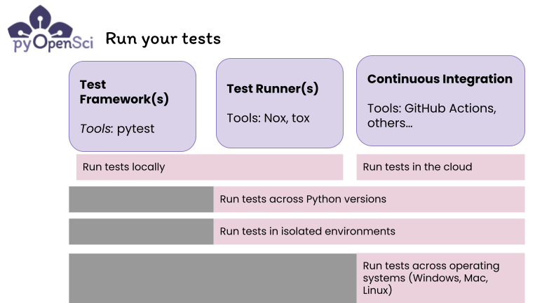

# Running your tests

Running your tests is important to ensure that your package
is working as expected. However it's also important to think about your code running, not only on your computer, but also on the computers of your users who may be running various Python versions and using various operating systems. Thus, you will want to consider the following when running your tests:

1. Run your test suite in a series of environments that represent the python versions and operating systems that you expect your users to have.
2. Running your tests in isolated environments ensures that your tests aren't randomly passing because of a specific condition of the current environment on your computer. For example you may have dependencies locally installed that aren't declared in your dependency table for your package. This would cause our package to not install or run properly on someone else's computer.

While the above might seem complex, there are tools to
help you do all of the above.

### Tools to run your tests

There are three types of tools that will make is easier to setup and run your tests in various environments:

1. A **testing framework**, as discussed here in this guide, is a package that provides a particular syntax and set of tools for _both writing your tests and running them_. Some testing frameworks also have plugins that add additional features such as evaluating how much of your code the tests cover or run. Below you will learn about the **pytest** framework which is one of the most commonly used python testing frameworks. Testing frameworks as essetnially but they won't allow you to run tests across Python versions without additional tools.
2. A **runner tool** refers to a tool that allows you to easily automate running things such as tests in specific ways using user-defined commands. For instance it's useful to be able to run tests across different Python versions. Tools such as nox and tox also allow you to run tests across Python versions. However, it will be difficult to test your build on different operating systems using only nox and tox - this is where continuous integration (CI) comes into play.

3. **Continuous Integration:** Discussed here, is the last tool that you'll need to run your tests both across python versions and operating systems (Windows, Mac and Linux). [We discuss using CI to run test here](tests-ci).

:::{figure-md}


There are three types of tools that will help you develop and run your tests. Test frameworks like pytest
provide syntax and a **framework** for you to write and
run tests. Test runners automate processes such as creating isolated environments to run your tests in, and running tests across Python versions with a single command. Finally Continuous integrate (CI) is a generic platform where you can run your tests across operating systems. CI allows you to run your tests on every PR and commit to ensure iterative checks as contributors suggest changes to your code.
:::

You will learn about both test frameworks and runners on this page.

## What testing framework / package should I use to run tests?

We recommend using `Pytest` to build and run your package tests. Pytest is the most common testing tool used in the Python ecosystem.

[The Pytest package](https://docs.pytest.org/en/latest/) also has a number of
extensions that can be used to add functionality such as:

- [pytest-cov](https://pytest-cov.readthedocs.io/en/latest/) allows you to analyze the code coverage of your package during your tests, and generates a report that you can [upload to codecov](https://codecov.io/).

[Learn more about code coverage here.](code-cov)

```{note}
TODO: add note about running tests in vscode, breakpoints and –no-cov flag. Then link to tutorial that explains how to deal with this.
```

## Run tests using pytest

If you are using **pytest**, you can run your tests locally by
calling:

`pytest`

Or if you want to run a specific test file - let's call such file - filename.py - you can run:

`pytest filename.py`

Learn more from the [get started docs here](https://docs.pytest.org/en/7.1.x/getting-started.html).

Running pytest on your computer is going to run your tests in whatever
Python environment you current have activated. This means that tests will be
run on a single version of Python and only on the operating system you
are running locally.

This is a great start to making your Python package more robust! However, your users may be using your package on different
versions of Python. Or they also may use other operating systems.

Runners can begin to help with the issue of running tests
in various environments using single commands.

### Tools to automate running your tests - Test runners

To run tests on various Python versions or in various specific environments with a single command, you can use a **test
runner**. A runner such as nox or tox will both create a virtual environment for you and run your tests in multiple environments. This allows you to test your package across Python versions.

We will focus on [Nox](https://nox.thea.codes/) in this guide given it's Python-based. nox is a Python-based automation tool that builds upon the features of both Make and Tox. Nox is designed to simplify and streamline testing and development workflows. Everything that you do with nox can be implemented using a Python-based interface.

```{admonition} Other runner tools you'll see in the wild
:class: note

- **[Tox](https://tox.wiki/en/latest/index.html#useful-links)** is an automation tool that supports common steps such as building documentation, running tests across various versions of Python, and more. You can find [a nice overview of tox in the plasmaPy documentation](https://docs.plasmapy.org/en/stable/contributing/testing_guide.html#using-tox).

- **[Hatch](https://github.com/ofek/hatch)** is a modern end-to-end packaging tool that works with the popular build backend called hatchling. Hatch offers a tox-like setup where you can run tests locally using different Python versions. If you are using hatch to support your packaging workflow, you may want to also use its testing capabilities rather than using nox.

```

### Where does Make fit in?

Some developers use Make, which is a build automation tool, for running tests
due to its versatility; it's not tied to a specific language and can be used
to run various build processes. However, Make's unique syntax and approach can
make it more challenging to learn, particularly if you're not already familiar
with it. Make also won't manage environments for you like **nox** will do.

## Run tests across Python versions with nox

We recommend Nox for running tests locally across Python versions. Since **Nox**
is Python-based, it's more accessible for scientific Python users.

### Why we like nox

Nox simplifies creating and managing testing environments. With Nox, you can
set up virtual environments, and run tests across operating systems with a
single command.

Nox can also be used for other development tasks such as building
documentation, creating your package distribution, and testing across various
environment managers such as conda and pip.

## Test Environments

By default, Nox uses the Python built in `venv` environment manager. A virtual environment (`venv`) is a self-contained Python environment that allows you to isolate and manage dependencies for different Python projects. It helps ensure that project-specific libraries and packages do not interfere with each other, promoting a clean and organized development environment.

An example of using nox to run tests in `venv` environments for Python versions 3.9, 3.10 and 3.11 is below.

```{warning}
Note that for the code below to work, you need to have all 3 versions of Python installed on your computer for `venv` to find.
```

### Nox with venv environments

TODO: add some tests above and show what the output would look like in the examples below...

Below is an example of setting up nox to run tests using `venv` which is the built in environment manager that comes with base Python.

Note that the example below assumes that you have setup your pyproject.toml to declare test dependencies in a way that pip
can understand. And example of that setup is below.

```toml
[project]
dependencies = [
  "geopandas",
  "xarray",
]

[project.optional-dependencies]
tests = ["pytest", "pytest-cov"]
```

If you have the above setup, then you can use `session.install(".[tests]")` to install your test dependencies.
Notice that below one single nox session allows you to run
your tests on 3 different Python environments (Python 3.9, 3.10 and 3.11).

```python
import nox

# For this to run you will need to have python3.9, python3.10 and python3.11 installed on your computer. Otherwise nox will skip running tests for whatever versions are missing

@nox.session(python=["3.9", "3.10", "3.11"])
def test(session):

# install
session.install(".[tests]")

# Run tests
session.run("pytest")

```

Above you create a nox session in the form of a function
with a `@nox.session` decorator. Notice that within the decorator you declare the versions of python that you
wish to run.

To run the above you'd use the command where `-s` stands for
session. Your function above is called test there for
the session name is test.

```
nox -s test
```

### Nox with conda / mamba

Below is an example for setting up nox to use mamba (or conda) for your
environment manager.
Note that when you are using conda, it can automatically install
the various versions of Python that you need. You won't need to install all three Python versions if you use conda/mamba, like you do with `venv`.

```{note}
For conda to work with nox, you will need to
install a conda-friendly version of Python. We suggest
the mamba-forge installation.

More on that here...<link to tutorial??>
```

```python
import nox

# The syntax below allows you to use mamba / conda as your environment manager, if you use this approach you don’t have to worry about installing different versions of Python

@nox.session(venv_backend='mamba', python=["3.9", "3.10", "3.11"])
def test_mamba(session):
    """Nox function that installs dev requirements and runs
    tests on Python 3.9 through 3.11
    """

    # Install dev requirements
    session.install(".[tests]")
    # Run tests using any parameters that you need
    session.run("pytest")
```

To run the above session you'd use:

```bash
nox -s test_mamba
```

## IGNORE ME - testing doctest (not working now)

```{testcode}
>>> a = 1+2
>>> print(a)
```

TODO: might be able to use doctest to run examples However so far it's not working as intended and may be extra work.
https://www.sphinx-doc.org/en/master/usage/extensions/doctest.html

---
