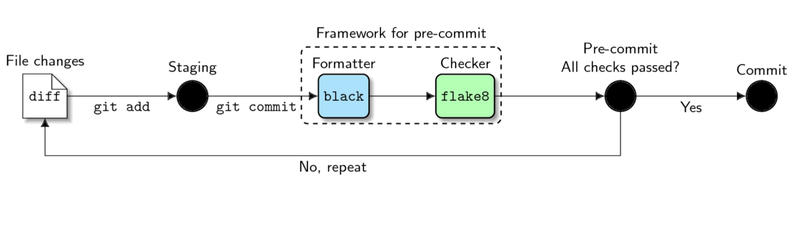

# Python Package Code Style, Format and Linters

```{admonition} Take Aways

* pyOpenSci requires authors to follow PEP 8 code format guidelines
* Setting up a code formatters like Black and isort will help you enforce PEP 8 style guidelines and also consistent, readable code format
* Some commonly used tools are: Black, Isort, flake8, Ruff
* You can also setup pre-commit hooks which will run code formatters locally
each time you make a commit.
* [precommit.ci](https://pre-commit.ci/) is a bot that you can add to your GitHub repository. It will automagically apply code format to every PR using the tools specified in your pre-commit-config.yaml file. It can save significant time and make contributions easier for new contributors.
* Automation is good! By making code quality tools care of your code, you can focus on structural and high values tasks.
```

Consistent code format and style is useful to both your package
and across the scientific Python ecosystem because using similar
formats makes code easier to read.

For instance, if you saw a sentence like this one without any
spaces, or punctuation, it would take your brain longer to process it.

```
forinstanceifyousawasentencelikethisonewithoutany...
```

pyOpenSci peer review process requires that you to follow standard
[Python PEP 8 format rules](https://peps.python.org/pep-0008/) as closely as
you can.

pyOpenSci doesn't require you to use a specific code format tool. However,
we do look for consistency and readability in code style. Below you will find
a discussion of:

1. The benefits of using linters and code format tools in your workflow
1. Some commonly used tools in the scientific Python space
1. Setting up pre-commit hooks and the pre-commit.ci bot to make using code
   format tools in daily workflows and in pull requests on GitHub easier.

## Use a code format tool (or tools) to make your life easier

We suggest that you use a code format tool, or a set of format tools, because
manually applying all of the PEP 8 format specifications is both time consuming
for maintainers and can be a road block for potential new contributors.
Code formatters will automagically reformat your code for you, adhering to
PEP 8 standards and applying consistent style decisions throughout.

Setting up a code format suite of tools will:

- Save you and your maintainer team time in fixing PEP 8 inconsistencies.
- Ensure that format and style is consistent across your entire code-base.
- Avoid lengthy discussions with contributors and other
  maintainers about personalized code format preferences during reviews.
- Avoid pure visual edits in the code base so that code reviews focus on added value

Many packages use a suite of tools to apply code format rules, taking
the work out of manually implementing code format requirements.

Consistent code format across packages within the (scientific) Python ecosystem,
will also broadly make code easier to scan, understand and contribute to.

## Linting vs format and style

Before we dive in let's get a few definitions out of the way.

### Code Linting

A code linter is a tool that will review your code and
identify errors or issues. A linter typically does not modify your code. It
will tell you what the error is and on what line it was discovered. Flake8,
discussed below, is an example of a commonly-used code linter.

### Code Formatters (and stylers)

Code formatters will reformat your code for you. Python focused code formatters
often follow PEP 8 standards. However, they also make stylistic decisions about
code consistency.

Black is an example of a commonly-used code formatter. Black both applies PEP 8
standards while also making decisions about things like consistent use of double
quotes for strings, and spacing of items in lists.

You will learn more about Black below.

## Code linting, formatting and styling tools

### Black

[Black](https://black.readthedocs.io/en/stable/) is a code
formatter. Black will automagically (and _unapologetically_)
fix spacing issues and ensure code format is consistent throughout your
package. Black also generally adheres to PEP 8 style guidelines with
some exceptions. A few examples of those exceptions are below:

- Black defaults to a line length of 88 (79 + 10%) rather than the 79 character `PEP 8` specification. However, line length is a setting can be manually overwritten in your Black configuration.
- Black will not adjust line length in your comments or docstrings.
- This tool will not review and fix import order (you need `isort` or `ruff` to do that - see below).

```{tip}
If you are interested in seeing how Black will format your code, you can
use the [Black playground](https://black.vercel.app/)
```

Using a code formatter like Black will leave you more time to work on
code function rather than worry about format.

### Flake8

To adhere to Python `pep8` format standards, you might want to add
[flake8](https://flake8.pycqa.org/en/latest/) to your code format
toolbox.

flake8 will:

- Flag every line in your code that extends beyond 79 characters (including those in docstrings and comments)
- Flag spacing issues that conflict with PEP 8 guidelines such as missing spaces after commas

Flake8 also flags unused imports and unused declared variables in your
modules.

Below you can see the output of running
`flake8 filename.py` at the command line for a Python file within a package
called `stravalib`.

The line length standard for PEP 8 is 79 characters.

Notice that flake8 returns a list of issues that it found in the model.py module
on the command line. The Python file itself is not modified. Using this output,
you can fix each issue line by line manually.

```bash
(stravalib-dev) username@computer stravalib % flake8 stravalib/model.py
stravalib/model.py:8:1: F401 'os' imported but unused
stravalib/model.py:29:80: E501 line too long (90 > 79 characters)
stravalib/model.py:34:80: E501 line too long (95 > 79 characters)
stravalib/model.py:442:80: E501 line too long (82 > 79 characters)
stravalib/model.py:443:39: E231 missing whitespace after ','
stravalib/model.py:493:20: E225 missing whitespace around operator
stravalib/model.py:496:80: E501 line too long (82 > 79 characters)
```

### Isort

Python imports refer to the Python packages that a module in your package
requires. Imports should always be located at the top of each Python module in
your package.

[PEP 8 has specific standards for the order of these imports](https://peps.python.org/pep-0008/#imports). These standards are listed below:

> Imports should be grouped in the following order:
>
> - Standard library imports.
> - Related third party imports.
> - Local application/library specific imports.

While `flake8` will identify unused imports in your code, it won't
fix or identify issues with the order of package imports.

`isort` will identify where imports in your code are out of
order. It will then modify your code, automatically reordering
all imports. This leaves you with one less thing to think about when cleaning
up your code.

#### Example application of isort

Code imports before `isort` is run:

Below, the `pandas` is a third party package, `typing` is a core `Python`
package distributed with `Python`, and `examplePy.temperature` is a first-party
module which means it belongs to the same package as the file doing the import.
Also notice that there are no spaces in the imports listed below.

:::{literalinclude} ../examples/pure-hatch/src/examplePy/temporal-raw.py
:language: python
:end-before: def calc_annual_mean
:::

From the project root, run:

```bash
isort src/examplePy/temporal.py
```

Python file `temporal.py` imports after `isort` has been run

:::{literalinclude} ../examples/pure-hatch/src/examplePy/temporal.py
:language: python
:end-before: def calc_annual_mean
:::

### Ruff

[Ruff](https://docs.astral.sh/ruff/) is a new addition to the code quality
ecosystem, gaining some traction since its release. `ruff` is both a linter
and a code formatter for Python, aiming to replace several tools behind a single
interface. As such, `ruff` can be used at a replacement of all other tools
mentioned here, or in complement to some of them.

`ruff` has some interesting features that distinguish it from other linters:

- Linter configuration in `pyproject.toml`
- Several hundred rules included, many of which are automatically fixable
- Rules explanation, see [F403](https://docs.astral.sh/ruff/rules/undefined-local-with-import-star/) for an example
- Fast execution time, makes a quick feedback loop possible even on large projects.

Here is a simple configuration to get started with `ruff`. It would go into your `pyproject.toml`:

:::{literalinclude} ../examples/pure-hatch/pyproject.toml
:language: toml
:start-at: [tool.ruff]
:end-before: [tool.ruff.isort]
:::

Depending on your project, you might want to add the following to sort imports correctly:

:::{literalinclude} ../examples/pure-hatch/pyproject.toml
:language: toml
:start-at: [tool.ruff.isort]
:::

## How to use code formatter in your local workflow

### Linters, code formatters and your favorite coding tools

Linters can be run as a command-line tool as shown above. They also can
be run within your favorite coding tool (e.g. VScode, pycharm, etc).
For example, you might prefer to have tools like Black and isort
run when you save a file. In some editors you can also setup shortcuts that run
your favorite code format tools on demand.

## Use pre-commit hooks to run code formatters and linters on commits

You can also setup a `pre-commit hook` in your Python package repository.

A pre-commit hook is a tool that allows an action (or actions)
to be triggered when you apply a commit to your git repository.

### Pre-commit hook example workflow

The precommit workflow looks like this:
You type and run:

`git commit -m "message here"` at the command line

- Once you hit return, pre-commit will run any tools that you have configured in a **.pre-commit-config.yaml** file.

- If the tools configured in the pre-commit hook run successfully without
  making changes or finding errors in your code, the commit will be applied
  to the repository.

- If the tools configured in the hook find errors in your files, the commit
  will NOT be applied to the repository. Remember from the discussion above that
  a code formatter like Black will run and reformat
  your code. A linter like _flake8_ will provide you with some output that details
  where there are syntax issues in your code. You will then need to fix those
  issues, manually.

- Once all of the fixes are applied you can re-add (stage) the files to be
  commit. And re-run your commit.

:::{figure-md} precommit-hook


The pre-commit workflow begins with you adding files that have changes to be
staged in git. Next, you'd run git commit. When you run git commit, the pre-commit
hooks will then run. In this example, Black, the code formatter and flake8, a linter both run. If all of the files pass Black and flake8 checks, then your commit will be recorded. If they don't, the commit is canceled. You will have to fix any flake8 issues,
and then re-add / stage the files to be committed. [_Image Source_](https://ljvmiranda921.github.io/notebook/2018/06/21/precommits-using-black-and-flake8/)
:::

<!-- For instance, if you setup the Black code formatter as a pre-commit hook,
when you go to commit changes to a code file and hit enter, Black will run
on your the code files in your commit. It will update any files to match
black format standards. You can then retype the commit and push files to
GitHub that have been formatted by black. -->

```{important}
If have a Python code-base and multiple maintainers actively working
on the code, and you intend to run a tool like Black, be sure to coordinate across your team. An initial commit that
applies Black to your entire package will likely change a significant amount of
your code. This could lead to merge conflicts on open and new PR's before the
new changes are merged.
```

## General pre commit checks

In addition to calling tools, Pre-commit also has a suite of [built in format
hooks](https://github.com/pre-commit/pre-commit-hooks#hooks-available) that
you can call. Some, such as `trailing-whitespace` can be also useful to add
to your pre-commit workflow to ensure clean, streamlined code files.

An example pre-commit-config.yaml file is below with examples of how this is
all setup.

## Pre-commit.ci

[Pre-commit.ci](https://pre-commit.ci) is a bot that may become your new
best friend. This bot, when setup on a repo can be configured to do the following:

- It will check every pull request using all of the pre-commit hook setting
- If you wish, it will also submit a pull request to your repo with pre-commit
  fixes, saving you, and new contributors the time of reformatting a pr that has
  format issues.
- You can also call the bot on any pull request to run / and fix the code.

The pre-commit.ci bot uses the same pre-commit-config.yaml file that you
use to setup pre-commit locally.

Setting up a bot like this can be valuable because:

- It can make is easier for maintainers as they no longer have to worry at allows
  about fixing code format. The bot will do the work for them.
- It can make it easier for new comers as they never have to setup pre-commit locally or worry about linting their code. They can even make small fixes to the code directly on GitHub without worry.

## Setting up a git pre-commit hook

To setup pre-commit locally, you need to do 3 things:

1. Install pre-commit (and include it as a development requirement in your repository)

```sh
python -m pip install pre-commit

# or

conda install -c conda-forge pre-commit
```

2. Create a .pre-commit-config.yaml file in the root of your package directory.

Below is an example **.pre-commit-cofig.yaml** file that can be used to setup
the pre-commit hook and the pre-commit.ci bot if you chose to implement that
too.

:::{literalinclude} ../examples/pure-hatch/.pre-commit-config.yaml
:language: yaml
:::

This file specifies a hook that will be triggered automatically before each `git commit`,
in this case, it specifies a `flake8` using version `6.0.0`.

3. Install your pre-commit hook(s) using `pre-commit install`. This will install all of the hooks specified in the pre-commit yaml file into your environment.

Once you have done the above, you are ready to start working on your code.
Pre-commit will run every time you run `git commit`.

## Summary

pyOpenSci suggests setting up a linter and a code styler for
your package, regardless of whether you use pre-commit hooks, CI
or other infrastructure to manage code format. Setting up these
tools will give you automatic feedback about your code's
structure as you (or a contributor) write it. And using a tool
like black that format code for you, reduce effort that
you need to make surrounding decisions around code format and
style.
