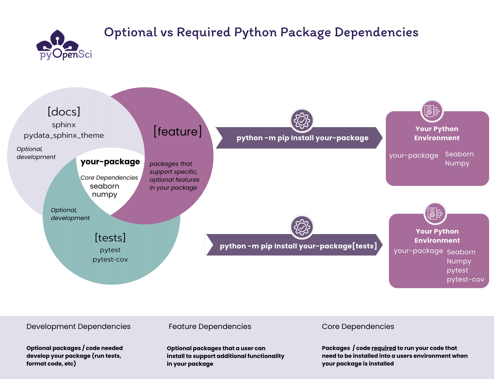

```{eval-rst}
:og:title: Add required and optional dependencies to your Python package
:og:description: A Python package dependency refers to an external package or software that your Python project requires to function properly. Learn how to add different types of dependencies to your Python package.
```

# Python Package Dependencies

## What is a package dependency?

A Python package dependency refers to an external package or
software that your Python project requires to function properly.
A dependency is not part of your project's codebase. It is a package or software that is called
within the code of your project.


### Optional vs. required dependencies
There are different types of dependencies to consider when creating
a Python package:

1. **Core dependencies:** These dependencies are called directly within your package's code. As such they are required in order to run your package.
2. **Development dependencies**: These are dependencies that are required to support development of your package. THey include tools to run tests such as pytest, linters and code formatters such as black and flake8 and even automation tools such as nox that run tasks.


:::{figure-md} python-package-dependencies



Caption here
:::

When a Python project is installed, the Python package manager (either `pip`
or `conda`) installs your package's dependencies automatically. This ensures
that when you call a function in a specific dependency, it is available in your
user's environment.

In the [pyproject.toml overview page](pyproject-toml-python-package-metadata),
you learned how to set up a **pyproject.toml** file with basic metadata
for your package. On this page, you will learn how to specify different types of
dependencies in your `pyproject.toml`.

:::{todo}

keep this comment - https://github.com/pyOpenSci/python-package-guide/pull/106#issuecomment-1844278487 in this file for now - jeremiah did a nice inventory of common shells and whether they need quotes or not. it's really comprehensive. but do we want it in the guide?? it's really useful for more advanced users i think.

Following this comment:
https://github.com/pyOpenSci/python-package-guide/pull/106#pullrequestreview-1766663571

Jonny will add a section that talks about:

Why you specify dependencies
How to specify dependencies
When you use different specifiers
:::

## How do you declare dependencies?

We suggest that you declare your dependencies using your `pyproject.toml` file.
This ensures that all of the metadata associated with your package is declared
in a single place, making it simpler for users and contributors to understand
your package infrastructure.

Previously, it was common to use a `requirements.txt` file declare dependencies.
However in recent years, the ecosystem has moved to storing this
information in your **pyproject.toml** file. You may notice however that some
projects still maintain a `requirements.txt` file for specific local development
needs.

:::{admonition} Other ways you may see packages storing dependencies
:class: tip

If a project contains extensions written in other languages, you may need a `setup.py` file. Or you may contribute to a package that us using `setup.cfg` for dependency declaration.
[Learn more about this in the setuptools documentation](https://setuptools.pypa.io/en/latest/userguide/dependency_management.html#declaring-required-dependency)
:::


### Required dependencies

Your core project dependencies represent the packages that
a package manager (`pip` or `conda`) needs to install in order for your package
to work properly in a user's environment. Dependencies can be stored in a
`dependencies` array located within the `[project]` table of your
**pyproject.toml** file. This looks something like this:

```toml
[project]
name = "examplePy"
authors = [
    {name = "Some Maintainer", email = "some-email@pyopensci.org"},
]

dependencies = [
    "rioxarray",
    "geopandas",
]
```

Ideally, you should only list the packages that are
necessary to install and use your package in the `[dependencies]` section. This minimizes the number of additional packages that your users must install as well as the number of packages that depend upon your package must also install.

Remember that fewer dependencies to install reduces the likelihood of version mismatches in user environments.


:::{admonition} A dependency example

Let's pretend you have a package called `plotMe` that creates beautiful plots of data stored in `numpy` arrays. To create your plots in the `plotMe` package, you use the `seaborn` package to stylize our plots and also `numpy` to process array formatted data.

In the example above, the plotMe package, depends upon two packages:

* seaborn
* numpy

This means that in order for plotMe to work in a users `environment` when installed, you also need to ensure that they have both of those required `dependencies` installed in their environment too.

Declaring a dependency in your `pyproject.toml` file will ensure that it is listed as a required dependency when published to PyPI and that it is automatically installed by pip or conda into a users environment when they run:

`python -m pip install plotMe`
:::

### Optional dependencies

Dependencies for building your documentation, running your tests and building your package's distribution files are often referred to as development dependencies. These are the dependencies that a user needs to run core development elements of your package such as:

* running your test suite
* building your documentation
* linting and other code cleanup tools

These dependencies are considered optional, because they are not required to install and use your package.

Optional dependencies can be stored in an
`[optional.dependencies]` table in your **pyproject.toml** file.

It's important to note that within the `optional.dependencies` table, you can store additional, optional dependencies within named sub-groups. This is a different table than the dependencies section discussed above which contains a single array with a single list of required packages.

## Create optional dependency groups

To declare dependencies in your **pyproject.toml** file:

1. Add a `[optional.dependencies]` table to your **pyproject.toml** file.
2. Create named groups of dependencies using the syntax:

`group-name = ["dep1", "dep2"]`

:::{admonition} Installing packages from GitHub / Gitlab
:class: tip

If you have dependencies that need to be installed directly from GitHub using
a `git+https` installation approach, you can do so using the pyproject.toml
file like so:

```toml
dependencies = [
"my_dependency >= 1.0.1 @ git+https://git.server.example.com/mydependency.git"
]
```

IMPORTANT: For security reasons, if your library depends on a GitHub-hosted
project, you will need to point to a specific commit/tag of that repository in
order to upload your project to PyPI
:::

Below we've created 3 sets of optional dependencies named: tests, docs and lint:

```toml
[project.optional-dependencies]
tests = [
  "pytest",
  "pytest-cov"
]
docs = ["sphinx", "pydata_sphinx_theme"]
lint = [
  "black",
  "flake8"
]

```
:::{admonition} Additional dependency resources

* [Learn more: View PyPA's overview of declaring optional dependencies](https://packaging.python.org/en/latest/specifications/declaring-project-metadata/#dependencies-optional-dependencies)

* [Dependency specifiers](https://packaging.python.org/en/latest/specifications/dependency-specifiers/)

:::

### Install dependency groups

:::{admonition} Using `python -m pip`

In all of the examples in this guide, you will notice we are calling
`pip` using the syntax:

`python -m pip`

Calling pip using `python -m` ensures that the pip that you are using to install your package comes from your current active Python
environment. We strongly suggest that you use this approach whenever
you call `pip` to avoid installation conflicts.

To ensure this works as you want it to, activate your package's development
environment prior to installing anything using `pip`.
:::

You can install development dependencies using the
groups that you defined above using the syntax:

`python -m pip install ".[docs]"`

Above you install:
* dependencies needed for your documentation,
* required package dependencies in the `dependency` array and
* your package

using pip. Below you
install your package, required dependencies and optional test dependencies.

`python -m pip install ".[tests]"`

You can install multiple dependency groups in the `[optional.dependencies]` table using:

`python -m pip install ".[docs, tests, lint]"`


```{admonition} For zsh shell users
:class: tip

There are different shell applications that you and your package contributors might use.
* zsh is the shell that comes with most Mac OS computer
* Windows users may use a tool such as git bash

Many shells don't support the bracket `[tests]` syntax which is why we add
quotes to the command in this guide like this:

`python -m pip install ".[tests]"`

In some cases you may see syntax without the quotes in guidebooks or contributing
guides like the example below:

`python -m pip install yourPackage[tests]`

Calling yourPackage[tests] without the double quotes will work on some shells but not all.

```

### Combining sets of dependencies

Above we reviewed how to install dependencies from your `pyproject.toml`. In some cases you may want to group sets of dependencies like so:

```toml
[project.optional-dependencies]
tests = ["pytest", "pytest-cov"]
docs = ["sphinx", "pydata_sphinx_theme"]
dev = [
    "packageName[tests, docs]",
    "build",
    "twine"
]
```

The above allows you to install both the tests and docs dependency lists
using the command:

`python -m pip install ".[dev]"`

```{tip}
When you install dependencies using the above syntax:

`python -m pip install ".[tests, docs]"`

`pip` will also install your package and its core dependencies.
```


:::{admonition} Where does conda fit in?
:class: note

The `pyproject.toml` file allows you to list any
Python package published on PyPI (or on GitHub/ GitLab) as a dependency. Once you create this file, declare dependencies, [build your package](python-package-distribution-files-sdist-wheel.md) and [publish your package to PyPI](publish-python-package-pypi-conda.md), people can install both your package and all of it's dependencies with one command.

`python -m pip install yourPackage`

This works great if your package is pure-python (no other languages used).

Some packages, particularly in the scientific Python ecosystem, require dependencies that are not written in Python. Conda was created to support distribution of tools that have code written in both Python and languages other than Python.
:::

## Support conda users with environment.yml files

The above workflow assumes that you want to publish your package on PyPI. And then you plan to publish to conda-forge (optionally), [by submitting a recipe using grayskull](https://www.pyopensci.org/python-package-guide/package-structure-code/publish-python-package-pypi-conda.html).

If you want to support conda users, you may want to also maintain a conda environment that they can use to install your package. Maintaining a conda environment will also help you test that your package installs as you expect into a conda environment.


```{admonition} A note for conda users
:class: tip

If you use a conda environment for developing your tool, keep in mind that when you install your package using `pip install -e .` (or using pip in general), dependencies will be installed from PyPI rather than conda.

Thus, if you are running a conda environment, installing your package in editable mode risks dependency conflicts. This is particularly important if you have a spatial package that required GDAL or has a GDAL supported dependency.

Alternatively, you can install your package using `pip install -e . --no-deps` to only install the package. And install the rest of your dependencies using a conda environment file.
```

## Dependencies in Read the Docs

Now that you have your dependencies specified in your project, you can use them to support other workflows such as publishing to Read the Docs.

Read the Docs is a documentation platform with a continuous integration / continuous deployment service that automatically builds and publishes your documentation.

If you are using Read the Docs to build your documentation, then you may need to install your dependencies using a **readthedocs.yaml** file.

Below is an example of installing the **docs** section of your dependency table in the pyproject.toml file within a readthedocs.yaml file.

```yaml
python:
  install:
    - method: pip
      path: .
      extra_requirements:
        - docs # you can add any of the subgroups of dependencies from your pyproject.toml file to this list.
```

:::{tip}

:::


:::{admonition} Read the Docs and Python packages
:class: note

* [Learn more about creating a `readthedocs.yaml` file here. ](https://docs.readthedocs.io/en/stable/config-file/index.html)
* If you want to install dependencies using
Poetry in Read the Docs, [you can learn more here.](https://docs.readthedocs.io/en/stable/build-customization.html#install-dependencies-with-poetry)

:::

:::{todo}
This is hidden. TO
:::
