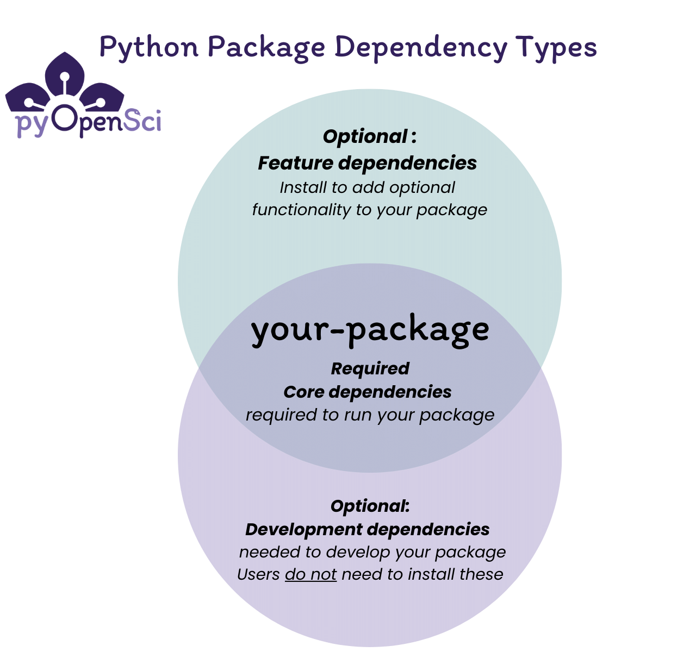

```{eval-rst}
:og:title: Add Required, Optional Dependencies and Dependency Groups to Your Python Package
:og:description: A Python package dependency refers to an external package or software that your Python project requires to function properly. Learn how to add different types of dependencies to your Python package.
```

:::{todo}

Keep this comment - https://github.com/pyOpenSci/python-package-guide/pull/106#issuecomment-1844278487 in this file for now - Jeremiah did a nice inventory of common shells and whether they need quotes or not. It's really comprehensive. But do we want it in the guide?? It's really useful for more advanced users.

Following this comment:
https://github.com/pyOpenSci/python-package-guide/pull/106#pullrequestreview-1766663571

Jonny will add a section that talks about:

Why you specify dependencies
How to specify dependencies
When you use different specifiers
:::

# Dependencies for your Python Package

## What is a package dependency?

A Python package dependency refers to an external package or
tool that your Python project:

1. Needs to function correctly.
2. Requires if someone wants to develop/work on improving your package locally or
3. Requires if a user wants to add additional functionality (that is not core) to your package.

A dependency is not part of your project's codebase. It is a package or software that is called
within the code of your project or used during the development of your package.

### Why you specify dependencies

Specifying dependencies in your `pyproject.toml` file ensures that libraries needed to run your package are correctly installed.
Users automatically get the packages your code needs to run. For instance, if your package requires Pandas to run properly, Pandas will be installed into the users' environment when they install your package using uv, pip or conda, if you specify it as a dependency in your `pyproject.toml` file.

:::{tip}
You can control which versions of dependencies are compatible with your package using specifiers. You will learn more about dependency specifiers in the sections below.
:::

## Version specifiers

Version specifiers control which versions of a dependency work with your
package. Use them to specify minimum versions, exclude buggy releases, or
set version ranges.

### Common operators

- **`>=`** - Minimum version set: `numpy>=1.20` (This is the most common approach and is recommended)
- **`==`** - Exact version: `requests==2.28.0` (Avoid pinning dependencies like this unless absolutely necessary)
- **`~=`** - Compatible release: `django~=4.2.0` (Allows patches: >=4.2.0,<4.3.0)
- **`<` or `>`** - Upper/lower bounds: `pandas>=1.0,<3.0`
- **`!=`** - Exclude version: `scipy>=1.7,!=1.8.0` (Rare but allows you to skip a buggy release version)

:::{tip}
**Best practice:** Use `>=` to specify your minimum tested version and
avoid upper bounds unless you know at what version that dependency is no longer compatible. UV will do this by
default when it adds a dependency to your pyproject.toml file. This keeps
your package flexible and reduces dependency conflicts.
```toml
dependencies = [
    "numpy>=1.20",              # Good - flexible
    "pandas>=1.0,<3.0",         # OK - known breaking change in 3.0
    "requests==2.28.0",         # Avoid - too restrictive
]
```
:::


### Understanding required vs. optional dependencies

:::{figure-md} python-package-dependency-types


Python package dependencies fall into two categories: **required**
dependencies that users need to run your package, and **optional**
dependencies for development work or additional features.
:::

There are two types of dependencies you can specify in your `pyproject.toml` file:

### Required (or core) dependencies
Required dependencies are called directly within your package's code and are needed for your package to run. You should place your core or required dependencies in the `dependencies` key of the `[project]` table of your `pyproject.toml` file.

For example, if your package processes data using Pandas and creates plots with Matplotlib, both would be required dependencies, as users need them to utilize your package's core functionality.

```toml
dependencies = [
                "pandas",
                "matplotlib"
                ]
```

### Optional dependencies

Optional (or feature) dependencies can be installed by users as needed. They add specific features to your package that not all users might need.  For example, if your package has an optional interactive plotting feature that uses Bokeh, you would list Bokeh as a feature dependency so users who don't need plotting don't have to install it.

Place these dependencies in the `[project.optional-dependencies]` table.

```toml
[project.optional.dependencies]
plot = ["bokeh"]
```

When a user installs your package, pip or conda automatically installs all required dependencies. Optional dependencies are only installed if the user explicitly requests them.

:::{admonition} Dependencies can be added to your pyproject.toml file

In the [pyproject.toml overview page](pyproject-toml-python-package-metadata),
you learned how to set up a **pyproject.toml** file with basic metadata
for your package. On this page, you will learn how to specify different types of
dependencies in your `pyproject.toml`.
:::

## How do you declare dependencies?

Declare your dependencies in your `pyproject.toml` file. This keeps all package metadata in one place, making it simpler for users and contributors to understand your package.

:::{admonition} Other ways to declare dependencies
:class: tip

While `pyproject.toml` is now the standard, you may encounter older approaches:
- **requirements.txt**: Previously common for dependencies, still used by some projects for local development
- **setup.py or setup.cfg**: May be needed for packages with extensions in other languages

[Learn more in the setuptools documentation](https://setuptools.pypa.io/en/latest/userguide/dependency_management.html#declaring-required-dependency)
:::


### Add required dependencies to your pyproject.toml file

You can add your core dependencies to the `dependencies` array in the
`[project]` table of your **pyproject.toml** file. When users install
your package with uv, pip, or conda, these dependencies will be
automatically installed alongside your package.

```toml
[project]
name = "examplePy"
authors = [
    {name = "Some Maintainer", email = "some-email@pyopensci.org"},
]
dependencies = [
    "rioxarray",
    "geopandas",
]
```

Ideally, you should only list the packages that are necessary to
install and use your package in the `dependencies` array. Remember that
fewer dependencies reduces the likelihood of version conflicts in user
environments.

:::{admonition} A dependency example

Let's say you have a package called `plotMe` that creates plots from
`numpy` arrays. Your code uses `seaborn` to stylize plots and `numpy`
to process data.

When you declare both packages in your `pyproject.toml` file's
`dependencies` array, uv, pip or conda will automatically install them
when a user runs:

`python -m pip install plotMe`

The same is true if you run uv sync:

`uv sync`

This ensures plotMe works correctly without users needing to manually
install seaborn and numpy separately.
:::

### Development dependency groups

Development dependencies are tools needed to work on your package
locally, such as:

* running your test suite (pytest, pytest-cov)
* building your documentation (sphinx, sphinx-theme packages)
* linting and formatting code (ruff, black)
* building distribution files (build, twine)

These dependencies are optional because they're not required for users
to install and use your package.

:::{admonition} New: PEP 735 development dependency groups
:class: note

PEP 735 introduced `[development-groups]`, a newer specification for
organizing development dependencies. This is separate from
`[project.optional-dependencies]` and provides a cleaner way to manage
development tooling.
:::

## Create development dependency groups

To declare development dependencies in your **pyproject.toml** file:

1. Add a `[development-groups]` table to your **pyproject.toml** file
2. Create named groups using the syntax: `group-name = ["dep1", "dep2"]`
```toml
[development-groups]
test = ["pytest", "pytest-cov"]
docs = ["sphinx", "pydata-sphinx-theme"]
lint = ["ruff", "black"]
```

You can also add feature dependencies to the
`[project.optional-dependencies]` table:
```toml
[project.optional-dependencies]
feature = ["pandas", "bokeh"]

[development-groups]
test = ["pytest", "pytest-cov"]
docs = ["sphinx", "pydata-sphinx-theme"]
lint = ["ruff", "black"]
```

### Adding dependencies with uv

You can use uv to add dependencies to your pyproject.toml file:

**Add a required dependency:**
```bash
uv add numpy
```

Will add numpy as a dependency

```
dependencies = [
    "numpy>=2.2.6",
]
```

**Add an optional dependency:**
```bash
uv add --optional feature pandas
```

Will add this to your pyproject.toml
```toml
feature = [
    "pandas>=2.3.3",
]
```

**Add a development group dependency:**
```bash
uv add --group tests pytest
uv add --group docs sphinx
```
Will add the following to your pyproject.toml file:

```toml
[dependency-groups]
tests = [
    "pytest>=8.4.2",
]
docs = [
    "sphinx>=8.1.3",
]
```

:::{admonition} Installing packages from GitHub / Gitlab
:class: tip

If you have dependencies that need to be installed directly from GitHub,
you can specify them in your pyproject.toml file:
```toml
dependencies = [
"my_dependency >= 1.0.1 @ git+https://git.server.example.com/mydependency.git"
]
```
IMPORTANT: For security reasons, if your library depends on a
GitHub-hosted project, you will need to point to a specific
commit/tag/hash of that repository in order to upload your project to
PyPI.
:::

:::{admonition} Additional dependency resources

* [Learn more: View PyPA's overview of declaring optional dependencies](https://packaging.python.org/en/latest/specifications/declaring-project-metadata/#dependencies-optional-dependencies)
* [Dependency specifiers](https://packaging.python.org/en/latest/specifications/dependency-specifiers/)

:::

### Install dependency groups

When users install your package, only core dependencies are installed by
default. To install optional dependencies, you
need to specify which groups to include when installing the package.

:::{figure-md} python-package-dependencies


When a user installs your package using `pip install your-package`, only
your package and its core dependencies get installed. When they install
with `pip install your-package[tests]`, pip will install your package,
core dependencies, and the test dependencies from the
`[project.optional-dependencies]` table.
:::

### Using uv

UV streamlines this process, allowing you to sync a venv in your project directory
with both an editable install of your package and its dependencies automatically.

:::{todo}
We shouldn't show UV pip install, so how do you add optional feature deps with UV??
:::

**Install optional dependencies:**
```bash
# FIXME
uv pip install -e ".[docs]"              # Single group
uv pip install -e ".[docs,tests,lint]"   # Multiple groups
```

**Install development groups:**

You can use uv sync to sync dependency groups too
```bash
# TEST ME
uv sync --group docs                     # Single group
uv sync --group docs --group test        # Multiple groups
uv sync --all-groups                     # All development groups
```

**Install everything (package + all dependencies):**
```bash
uv sync --all-extras --all-groups
```

:::{admonition} uv sync vs uv pip install
:class: tip

`uv sync` is the recommended command for development workflows. It
manages your virtual environment and keeps your lockfile up to date.
Use `uv pip install` when you need pip-compatible behavior.
:::

### Using pip

**Install optional dependencies:**
```bash
python -m pip install -e ".[docs]"              # Single group
python -m pip install -e ".[docs,tests,lint]"   # Multiple groups
```

:::{admonition} Using `python -m pip install` vs. `pip install`

We recommend calling pip using `python -m pip` to ensure you're using
the pip from your current active Python environment. This helps avoid
installation conflicts.
:::


:::{admonition} For zsh shell users
:class: tip

Some shells (like zsh on Mac and certain Windows shells) require quotes
around brackets:

`python -m pip install ".[tests]"`

Without quotes, the command may fail in these shells.
:::

### Combining dependency groups

You can create combined groups that reference other groups:
```toml
[project.optional-dependencies]
test = ["pytest", "pytest-cov"]
docs = ["sphinx", "pydata-sphinx-theme"]
dev = ["your-package[test,docs]", "build", "twine"]
```

Then install everything with:
```bash
uv pip install -e ".[dev]"
# or
python -m pip install ".[dev]"
```

:::{tip}
When you install optional dependencies, pip and uv also install your
package and its core dependencies automatically.
:::

### Using conda and pixi

The `pyproject.toml` file works great for pure-Python packages. However,
some packages (particularly in the scientific Python ecosystem) require
dependencies written in other languages like C or Fortran. Conda was
created to support distribution of tools with non-Python dependencies.

**For conda users:**

You can maintain an `environment.yml` file to help users and contributors
set up conda environments. This is especially useful for packages with
system-level dependencies like GDAL.

**Consider pixi for conda workflows:**

[Pixi](https://pixi.sh) is a modern package manager built on conda that
uses `pyproject.toml` for configuration. If your project relies heavily
on conda packages, pixi offers a streamlined workflow with lockfiles and
faster dependency resolution.

:::{admonition} A note for conda users
:class: tip

If you use a conda environment for development and install your package
with `python -m pip install -e .`, dependencies will be installed from
PyPI rather than conda. This can cause conflicts, especially for packages
with system dependencies.

To avoid this, install your package without dependencies:
`python -m pip install -e . --no-deps`

Then install dependencies through your conda environment.yml file.
:::

## Dependencies in Read the Docs

Once you've specified dependencies in your `pyproject.toml`, you can use
them in other workflows like building documentation on Read the Docs.

[Read the Docs](https://readthedocs.org) is a documentation platform
that automatically builds and publishes your documentation. To install
your dependencies during the build process, configure them in a
**readthedocs.yaml** file.

Here's an example that installs your `docs` optional dependencies:
```yaml
python:
  install:
    - method: pip
      path: .
      extra_requirements:
        - docs
```

:::{admonition} Learn more about Read the Docs
:class: note

* [Creating a readthedocs.yaml file](https://docs.readthedocs.io/en/stable/config-file/index.html)
* [Using uv with Read the Docs](https://docs.readthedocs.io/en/stable/build-customization.html)
* [Using Poetry with Read the Docs](https://docs.readthedocs.io/en/stable/build-customization.html#install-dependencies-with-poetry)
:::
