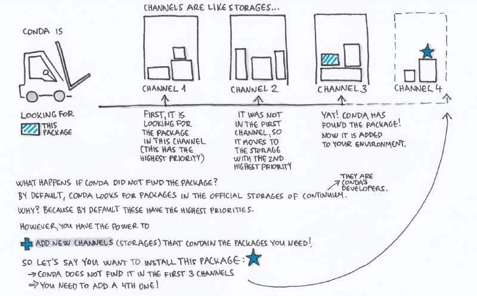
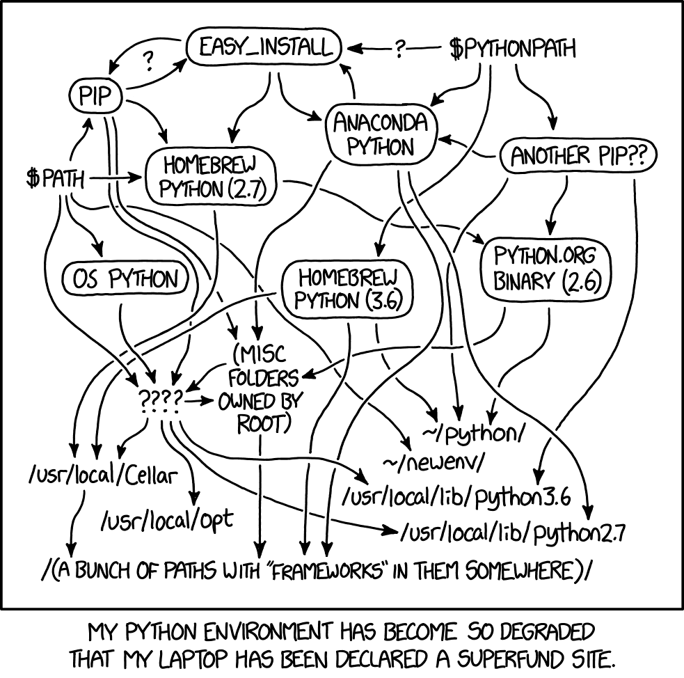

# Publishing Your Package In A Community Repository: PyPI or Anaconda Cloud

<!--todo: add as resource https://docs.conda.io/projects/conda/en/latest/glossary.html -->

pyOpenSci requires that your package has an distribution that can be installed from a public community repository such as PyPI or a conda channel such as `bioconda` or `conda-forge` in the Anaconda cloud.

Below you will learn more about the various publishing options for your Python
package.

```{important}
## Take Aways

* Installing packages in the same environment using both pip and conda can
lead to package conflicts.
* To minimize conflicts for users who may be using conda (or pip) to manage local environments, consider publishing your package to both PyPI and the conda-forge channel of the Anaconda Cloud.

Below you will learn more specifics about the differences between PyPI and conda publishing of your Python package.
```

### What is PyPI

[PyPI](https://pypi.org/) is an online Python package repository that
you can use to both find and install and publish your Python package. There is
also a test PyPI repository where you can test publishing your package
prior to the final publication on PyPI.

Many if not most Python packages can be found on PyPI and are thus installable using `pip`.

The biggest different between using pip and conda to install
a package is that conda can install any package regardless
of the language(s) that it is written in. Whereas `pip` can
only install Python packages.

<!-- TODO add link to build page below when this page is published -->

```{tip}
On the package build page, we discussed the [two package distribution
types that you will create when making a Python package](link-to-page-on-sdist): SDist (packaged as a .tar.gz or .zip) and
Wheel (.whl) which is really a zip file. Both of those file "bundles" will
be published on PyPI when you use [a standard build tool](link-to-build-page) to build
your package.
```

### What is Anaconda Cloud and Conda?

`Conda` is an open source package and environment management tool.
`Conda` can be used to install tools from the [Anaconda Cloud
repository](https://repo.anaconda.com/).

Anaconda cloud (anaconda.org) contains public and private repositories for
packages. These repositories are known as channels (discussed below).

The most common public channels are:

- defaults
- conda-forge and
- bioconda

```{tip}
While **conda** was originally created to support Python packages, it
is now used across all languages. This cross-language support
makes it easier for some packages to include and have access to
tools written in other languages such as c/c++ (gdal), Julia, or R.
Creating environment that mixes all those packages are usually easier and more consistent with full fledged package managers like conda.
```

```{tip}
While **conda** was originally created to support Python packages, it
is now used across all languages. This cross-language support
makes it easier for some packages to include and have access to
tools written in other languages (such as gdal, BLAS/LAPACK and other tools).
```

### Conda channels

Conda built packages are housed within repositories that are called
channels. The Conda package manager can install packages from different channels.

There are several core public channels that most people use to install
packages using conda including.

- **defaults:** this is a channel managed by the Anaconda, inc. It is the version of the Python packages that you will install if you install the Anaconda Distribution.
- [**conda-forge:**](https://anaconda.org/conda-forge) this is a community driven channel that focuses on scientific packages. This channel is ideal for tools that support geospatial data
- [**bioconda**](https://anaconda.org/bioconda): this channel focuses on biomedical

**conda-forge** emerged as many of the scientific packages did not
exist in the default Anaconda cloud channel.

:::{figure-md} fig-target



ADD source: GeoHackWeek
:::

## Conda channels, PyPI, conda, pip - Where to publish your package

You might be wondering why there are different package repositories
that can be used to install Python packages.

And more importantly you are likely wondering how to pick the right
repository to publish your Python package.

The answer to both questions relates dependency conflicts.

:::{figure-md} fig-target



Installing Python and Python packages from different repositories can lead
to environment conflicts where a version of on package doesn't work with
a version of another package. To keep your environments clean and working, it's
best to install packages from the same repository. So use pip to install
everything. Or use conda. If you can, try to avoid installing package from
both pip and conda into the same environment.
:::

### Managing Python package dependency conflicts

Python environments can encounter conflicts because Python tools can be installed from different repositories.
Broadly speaking, Python environments have a smaller chance of
dependency conflicts when the tools are installed from the same
package repository. Thus environments that contain packages
installed from both pip and conda are more likely to yield
dependency conflicts.

Similarly installing packages from the default anaconda package mixed with the conda-forge channel can also lead to dependency conflicts.

Many install packages directly from conda `defaults` channel. However, because
this channel is managed by Anaconda, the packages available on it are
limited to those that Anaconda decides should be core to a stable installation. The conda-forge channel was created to complement the `defaults` channel. It allows anyone to submit a package to be published in the channel . Thus, `conda-forge` channel ensures that a broad suite of user-developed community packages can be installed from conda.

### Take-aways: If you can, publish on both PyPI and conda-forge to accommodate more users of your package

The take-away here for maintainers is that if you anticipate users wanting
to use conda to manage their local environments (which many do), you should
consider publishing to both PyPI and the conda-forge channel (_more
on that below_).

```{tip}
* [learn more about why conda-forge was created, here](https://conda-forge.org/docs/user/introduction.html#why-conda-forge)

* [To learn more about conda terminology, check out their glossary.](https://docs.conda.io/projects/conda/en/latest/glossary.html )
```

<!-- One of our packages on conda-forge https://anaconda.org/conda-forge/pandera -->

## How to submit to conda-forge

While pyOpenSci doesn't require you to add your package to conda-forge,
we encourage you to consider doing so!

Once your package is on PyPI, the process to add your package to conda-forge
is straight forward to do. [You can follow the detailed steps provided
by the conda-forge maintainer team.](https://conda-forge.org/docs/maintainer/adding_pkgs.html#generating-the-recipe).

Generally those steps are:

1. Fork the staged recipes conda-forge GitHub repository
1. Create a new recipe using the `grayskull` tool. You can [learn more about grayskull here](https://conda.github.io/grayskull/).
1. Add the recipe file created by `grayskull` in a folder within the recipes/ directory of the [**conda-forge/staged-recipes**](https://github.com/conda-forge/staged-recipes) repository.
1. Create a new recipe using the `grayskull` tool
1. Add the recipe file created by `grayskull` in a folder within the recipes/ directory of the [**conda-forge/staged-recipes**](https://github.com/conda-forge/staged-recipes) repository.
1. Open a pull request with your change. Your package will be tested on Windows, Mac and Linux using the repository CI.

Once you have submitted a recipe to conda-forge, a maintainer will work
with you to iron out any bugs in your recipe. They will then add your package
to the conda-forge channel.

Once your package is added, you will have a feedstock repository on GitHub with your packages name

```{tip}
[Here is an example conda-forge feedstock for the pyOpenSci approved package - movingpandas](https://github.com/conda-forge/movingpandas-feedstock)
```

### Maintaining your conda-forge package repository

Once your package is on the conda-forge channel, maintaining it is simple.
Every time that you push a new version of your package to PyPI, it will
kick off a continuous integration build that updates your package in the
conda-forge repository. Once that build is complete, you will get a
notification to review the update. You can merge the pull request for
that update once you are happy with it.
