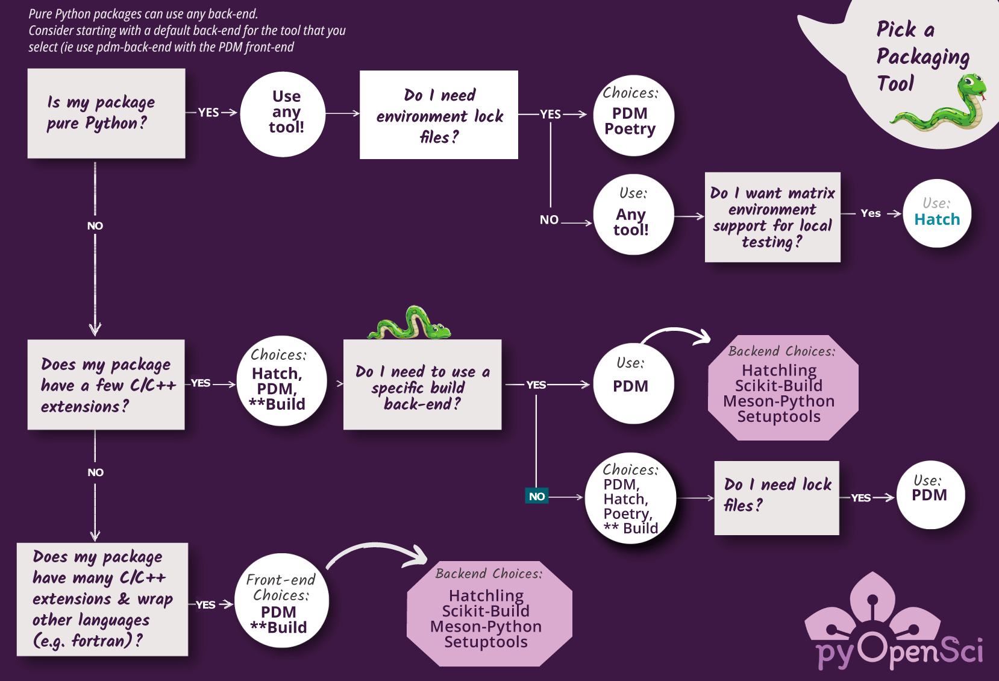
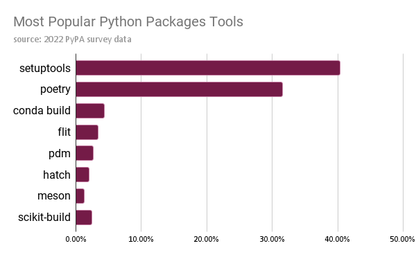

# Python Packaging Tools

## Tools for building your package

There are a several different build tools that you can use to [create your Python package's _sdist_ and _wheel_ distributions](python-package-distribution-files-sdist-wheel). Below, we discuss the features,
benefits and limitations of the most commonly used Python packaging tools.
We focus on pure-python packages in this guide. However, we also
highlight tools that currently support packages with C/C++ and other language
extensions.

:::{figure-md} package-decision-tree



Diagram showing the different front end build tools available to use in the Python package ecosystem that you can select from. We selected tools to include in this diagram based upon the PyPI survey which helped us understand the most populate tools in the ecosystem. Each tool has different features as highlighted below.
:::

If you want to know more about Python packages that have extensions written in
other languages, [check out the page on complex package builds.](complex-python-package-builds)

## Tools that we review here

In this section we have selected tools that were returned
as the most popular packaging tools in the PyPA survey.
You will learn more about the following tools on this page:

- [Twine](https://twine.readthedocs.io/en/stable/), [Build](https://pypa-build.readthedocs.io/en/stable/) + [setuptools](https://setuptools.pypa.io/en/latest/)
- [Flit](https://flit.pypa.io/en/stable/)
- [Hatch](https://hatch.pypa.io/latest/)
- [PDM](https://pdm.fming.dev/latest/)
- [Poetry](https://python-poetry.org/docs/)

## Summary of tools Hatch vs. PDM vs. Poetry (and setuptools)

If you are looking for a quick summary, read below.

- In general, any modern tool that you select from this page will be great to build your package. Selecting a tool comes down to the features that you are looking for in your workflow.
- We suggest that beginners start with a modern workflow tool like PDM as opposed to navigating the complexities of setuptools.
- If you are going to use Poetry (it is the most popular tool and does have the best documentation) beware of the upper bounds dependency additions and consider overriding dependencies when you add them. If you do that Poetry will work well for pure-python builds! Poetry also has an active discord where you can ask questions.

Below are some features that Hatch and PDM offer that Poetry does not.

PDM:

- Supports other back-ends making it ideal for builds that are not pure Python. This means PDM is a great option for both pure python and more complex Python builds as it supports meson-python and other build backends.
- Offers flexibility in dependency management which we like
- Offers lock files if you need them

Hatch:

- Offers matrix environment management that allows you to run tests across Python versions. If this feature is important to you, then Hatch is a clear winner.
- Offers a Nox / Make file like tool to streamline your
  build workflow. If you are looking to reduce the number of tools in your workflow, Hatch might be for you.

## Build front-end vs. build back-end tools

To better understand your options, when it comes to building a Python package, it's important to first understand the difference between a
build tool front-end and build back-end.

(build_backends)=

### Build back-ends

Most packaging tools have a back-end
build tool that builds you package and creates associated
[(sdist and wheel) distribution files](python-package-distribution-files-sdist-wheel). Some tools, such as **Flit**, only
support pure-Python package builds. A pure-Python build refers
to a package build that does not have extensions that are written in another
programming language (such as `C` or `C++`).

Other packages that have C and C++ extensions (or that wrap other languages such as fortran) require additional code compilation steps when built.
Back-ends such as **setuptools.build**, **meson.build**
and **scikit-build** support complex builds with custom steps. If your
build is particularly complex (i.e. you have more than a few `C`/`C++`
extensions), then we suggest you use **meson.build** or **scikit-build**.

### Python package build front-ends

A packaging front-end tool refers to a tool that makes it easier for you to
perform common packaging tasks using similar commands. These tasks include:

- [Build your packages (create the sdist and wheel distributions)](python-package-distribution-files-sdist-wheel)
- Installing your package in a development mode (so it updates when you update your code)
- Publishing to PyPI
- Running tests
- Building documentation
- Managing an environment or multiple environments in which you need to run tests and develop your package

There are several Python packaging tools that you can use for pure Python
builds. Each front-end tool discussed below supports a slightly different set of Python
packaging tasks.

For instance, you can use the packaging tools **Flit**, **Hatch** or **PDM**
to both build and publish your package to PyPI. However while **Hatch** and
**PDM** support versioning and environment management, **Flit** does not. If you want a tool that supports dependency
locking, you can use **PDM** or **Poetry** but not **Hatch**.
If you only need to build your package's sdist and wheel distribution files, then you can stick with PyPA's Build. You'd then use Twine to publish to PyPI.

```{note}
If you are using **Setuptools**, there is no default user-friendly build front-end that performs multiple tasks. You will need to use **build** to build your package and **twine** to publish to PyPI.
```

### Example build steps that can be simplified using a front-end tool

Below, you can see how a build tool streamlines your packaging experience. Example to build your package with **Hatch**:

```bash
# Build your sDist and .whl files
hatch build

# Example to publish to PyPI:
hatch publish --repo test
```

Example build steps using the **setuptools** back-end and **build**:

```bash
# Build the package
python3 -m build

# Publish to test PyPI using twine
twine upload -r testpypi dist/*
```

## Choosing a build back-end

Most front-end packaging tools have their own back-end build tool. The build
tool creates your package's (sdist and wheel) distribution files. For pure
Python packages, the main difference between the different build back-ends
discussed below is:

- How configurable they are - for example, do they allow you to add build steps that support non python extensions?
- How much you need to configure them to ensure the correct files are included in your sdist and wheel distributions.

### Build back-end support for non pure-python packages

It is important to note that some build back-ends, such as **Flit-core**, only support
pure Python builds. Other back-ends support C and C++ extensions as follows:

- setuptools supports builds using C / C++ extensions
- Hatchling (hatch's back-end) supports C / C++ extensions via plugins that the developer creates to customize a build
- PDM's back-end supports C / C++ extensions by using setuptools
- Poetry's back-end supports C/C++ extensions however this functionality is currently undocumented. As such we don't recommend using Poetry for complex or non pure Python builds until it is documented.

While we won't discuss more complex builds below, we will identify which tools
have documented support for C / C++ extensions.

## An ecosystem of Python build tools

Below we introduce several of the most commonly used Python packaging build
front-end tools. We highlight the features that each tool offers as a way to
help you decide what tool might be best for your workflow.

```{admonition} We do not suggest using setuptools
:class: note

We suggest that you pick one of the modern tools listed above rather than
setuptools because setuptools will require some additional knowledge
to set up correctly.

We review setuptools as a back-end because it is still popular. However it is
not the most user friendly option.
```

The most commonly used tools in the ecosystem are
setuptools back-end (with build) and Poetry (a front end tool with numerous
features and excellent documentation).

:::{figure-md} pypa-survey-plot



The Python developers survey results (n=>8,000 PyPI users) show setuptools and poetry as the most commonly used Python packaging tools. The core tools that we've seen being used in the scientific community are included here. [You can view the full survey results by clicking here.](https://drive.google.com/file/d/1U5d5SiXLVkzDpS0i1dJIA4Hu5Qg704T9/view) NOTE: this data represent maintainers across domains and is likely heavily represented by those in web development. So this represents a snapshot across the broader Python ecosystem.
:::

## Chose a build workflow tool

The tools that we review below include:

- Twine, Build + setuptools
- Flit
- Hatch
- PDM
- Poetry

When you are selecting a tool, you might consider this general workflow of
questions:

1. **Is your tool pure python? Yes?** You can use any tool that you wish! Pick the tool that has the features that you want to use in your build workflow. We suggest:

- Flit, Hatch, PDM or Poetry (read below for more)

1. **Does your tool have a few C or C++ extensions?** Great, we suggest using
   **PDM** for the time being. It is the only tool in the list below that has both documented
   workflow to support such extensions and support for other back-ends in the case that build hooks are not enough for your workflow. PDM supports other back-ends such as scikit-build and meson-python that will allow you to fully customize your package's build.

NOTE: You can also use Hatch for non pure python builds. Hatch, similar to PDM, allows you to write your own build hooks or plugins to support custom build steps. But currently, hatch does not support other build back ends. Many of the core scientific packages are moving to meson-python to build their packages. Thus, we appreciate that PDM can work with meson-python specifically.

## Python packaging tools summary

Below, we summarize features offered by the most popular build front end tools. It is important to keep in mind that these
front-end tools remove the need to use other core tools in your workflow. For example if you use setuptools, you will need to also use Build and Twine to build your package and publish to PyPI. But if you use Poetry, Hatch or PDM you can do all of those things using the same tool (e.g. `hatch build`, `hatch publish` or `pdm build`, `pdm publish`).

Note that because setuptools does not offer a front-end interface, it is not
included in the table.

(package-features)=
### Package tool features table

```{csv-table}
:header: Feature|Flit|Hatch|PDM|Poetry
:widths: 36, 10,10,10,10
:delim: "|"

Default Build Back-end| Flit-core| hatchling| PDM| Poetry-core
Use Other Build Backends|✖ | ✅ |✅  |✖
Dependency management| ✖|✖|✅|✅
Publish to PyPI| ✅|✅|✅|✅
Version Control based versioning (using `git tags`)|✖|✅|✅|✅
Version bumping|✖|✅| ✅| ✅
Environment Management|✖|✅| ✅| ✅
More than one maintainer? (bus factor)|✖|✖| ✖| ✅
```

Notes:

- _Hatch plans to support dependency management in the future_
- Poetry supports semantic versioning. Thus, it will support version bumping following commit messages if you use a tool such as Python Semantic Release

## PDM

[PDM is a Python packaging and dependency management tool](https://pdm.fming.dev/latest/).
PDM supports builds for pure Python projects. It also provides multiple layers of
support for projects that have C and C++ extensions.

```{admonition} PDM support for C and C++ extensions

PDM supports using the PDM-back-end and setuptools at the same time.
This means that you can run setuptools to compile and build C extensions.
PDM's build back-end receives the compiled extension files (.so, .pyd) and
packages them with the pure Python files.
```

### PDM Features

```{csv-table}
:header: Feature|PDM|Notes
:widths: 20,5,50
:delim: "|"

Use Other Build Backends| ✅| When you setup PDM it allows you to select one of several build back ends including: PDM-core, flit-core and hatchling. PDM also can work with Meson-Python which supports move complex python builds.
Dependency specifications |✅|PDM has flexible support for  managing dependencies. PDM defaults to using an open bound (e.g. `requests >=1.2`) approach to dependencies. However you can  [customize how you want to add dependencies in case you prefer another approach such as that of Poetry which uses an upper bound limit](https://pdm.fming.dev/latest/usage/dependency/#about-update-strategy).**
Environment lock files |✅|PDM and Poetry are currently the only tools that create environment lock files. Lock files are often most useful to developers creating web apps where locking the environment is critical for consistent user experience. For community-used packages, you will likely never want to use a lock file.
Environment management |✅ | PDM provides environment management support. It supports Python virtual environments, conda and a local `__pypackages__` environment which is a newer option in the Python ecosystem. No extensions are needed for this support.
Select your environment type on install |✅ | When you run `PDM init`, PDM will discover environments that are already on your system and allow you to select one to use for your project.
Publish to PyPI|✅|PDM supports publishing to both test PyPI and PyPI
Version Control based versioning|✅ | PDM has a setuptools_scm like tool built into it which allows you to use dynamic versioning that rely on git tags.
Version bumping| ✅ | PDM supports you bumping the version of your package using standard semantic version terms patch; minor; major
Follows current packaging standards|✅|PDM supports current packaging standards for adding metadata to the **pyproject.toml** file.
Install your package in editable mode|✅|PDM supports installing your package in editable mode.
Build your sdist and wheel distributions|✅| Similar to all of the other tools PDM builds your packages sdist and wheel files for you.
```

```{admonition} PDM vs. Poetry
The functionality of PDM is similar to Poetry. However, PDM also offers
additional, documented support for C extensions and version control based
versioning. As such, PDM is preferred for those working on non pure-Python packages.

If you are deciding between the Poetry and PDM, a smaller  difference is the default way that dependencies are added to your pyproject.toml file.

* Poetry by default follows strict semantic versioning adding dependencies to your pyproject.toml file [using an upper bounds constraint (`^`)](https://python-poetry.org/docs/dependency-specification/#version-constraints). Upper bounds lock means that Poetry will never bump a dependency to the next major version (i.e. from 1.2 to 2.0). However, you can tell Poetry to use an open bound approach by explicitly adding the package like this: `poetry add requests >= 1.2` rather than just using `poetry add requests` which will result in a upper bound locked (ie Upper bound locks means that requests 2.0 could never be installed even if it came out and your package could benefit from it).
* PDM defaults to open-bounds (`>=`) dependency additions which is the preferred approach in the scientific python ecosystem. However, PDM also allows you to specify the way dependencies are added by default. As such, you can also specify upper-bounds (`^`) using PDM if require that approach.

Finally there are some nuanced differences in how both tools create lock files which we will not go into detail about here.
```

### Challenges with PDM

PDM is a full-featured packaging tool. However it is not without challenges:

- Its documentation can be confusing, especially if you are new to
  packaging. For example, PDM doesn't provide an end to end beginning workflow in its documentation.
- PDM also only has one maintainer currently. We consider individual maintainer
  teams to be a potential risk. If the maintainer finds they no longer have time
  to work on the project, it leaves users with a gap in support. Hatch and Flit
  also have single maintainer teams.

[You can view an example of a package that uses PDM here](https://github.com/pyOpenSci/examplePy/tree/main/example4_pdm). The README file for this directly provides you with
an overview of what the PDM command line interface looks like when you use it.

## Flit

[Flit is a no-frills, streamlined packaging tool](https://flit.pypa.io/en/stable/) that supports modern Python packaging standards.
Flit is a great choice if you are
building a basic package to use in a local workflow that doesn't require any advanced features. And if your package structure is already created. More on that below.

### Flit Features

```{csv-table}
:header: Feature|Flit|Notes
:widths: 20,5,50
:delim: "|"

Publish to PyPI and test PyPI|✅|Flit supports publishing to both test PyPI and PyPI
Helps you add metadata to your **pyproject.toml** file|✅| Flit does support adding metadata to your **pyproject.toml** file following modern packaging standards.
Follows current packaging standards|✅|Flit supports current packaging standards for adding metadata to the **pyproject.toml** file.
Install your package in editable mode|✅| Flit supports installing your package in editable mode.**
Build your sdist and wheel distributions|✅| Flit can be used to build your packages sdist and wheel distributions.
```

NOTE: _If you are using the most current version of pip, it supports both a symlink approach `flit install -s` and `python -m pip install -e .`_

```{admonition} Learn more about flit
* [Why use flit?](https://flit.pypa.io/en/stable/rationale.html)
```

### Why you might not want to use Flit

Because Flit is no frills, it is best for basic, quick builds. If you are a
beginner you may want to select Hatch or PDM which will offer you more support
in common operations.

You may NOT want to use flit if:

- You want to setup more advanced version tracking and management (using version control for version bumping)
- You want a tool that handles dependency versions (use PDM or Poetry instead)
- You have a project that is not pure Python (Use Hatch, PDM or setuptools)
- You want environment management (use PDM, Hatch or Poetry)

(hatch)=
## Hatch

[**Hatch**](https://hatch.pypa.io/latest/), similar to Poetry and PDM, provides a
unified command line interface. To separate Hatch from Poetry and PDM, it also
provides an environment manager for testing that will make it easier for
you to run tests locally across different versions of Python. It also offers a
nox / makefile like feature that allows you to create custom build workflows such
as building your documentation locally. This means that you could potentially drop a tool like **Make** or **Nox** from your workflow and use Hatch instead.

### Hatch features

```{csv-table}
:header: Feature|Hatch|Notes
:widths: 20,5,50
:delim: "|"

Use Other Build Backends|✅ | Hatch is used with the backend Hatchling by default, but allows you to use another backend by switching the declaration in pyproject.toml.
Dependency management|✖| Currently you have to add dependencies manually with Hatch. However a feature to support dependencies management may be added in a future release.
Environment Management |✅ | Hatch supports Python virtual environments. If you wish to use other types of environments such as Conda, you will need to [install a plugin such as hatch-conda for conda support](https://github.com/OldGrumpyViking/hatch-conda).
Publish to PyPI and test PyPI|✅|Hatch supports publishing to both test PyPI and PyPI
Version Control based versioning|✅ | Hatch offers `hatch_vcs` which is a plugin that uses setuptools_scm to support versioning using git tags. The workflow with `hatch_vcs` is the same as that with `setuptools_scm`.
Version bumping| ✅ | Hatch supports you bumping the version of your package using standard semantic version terms patch; minor; major
Follows current packaging standards|✅|Hatch supports current packaging standards for adding metadata to the **pyproject.toml** file.
Install your package in editable mode|✅| Hatch will install your package into any of its environments by default in editable mode. You can install your package in editable mode manually using `python -m pip install -e .` Hatch mentions [editable installs](https://hatch.pypa.io/latest/config/build/#dev-mode) but refers to pip in its documentation.
Build your sdist and wheel distributions|✅| Hatch will build the sdist and wheel distributions
✨Matrix environment creation to support testing across Python versions✨|✅| The matrix environment creation is a feature that is unique to Hatch in the packaging ecosystem. This feature is useful if you wish to test your package locally across Python versions (instead of using a tool such as tox).
✨[Nox / MAKEFILE like functionality](https://hatch.pypa.io/latest/environment/#selection)✨| ✅| This feature is also unique to Hatch. This functionality allows you to create workflows in the **pyproject.toml** configuration to do things like serve docs locally and clean your package build directory. This means you may have one less tool in your build workflow.
✨A flexible build backend: **hatchling**✨| ✅| **The hatchling build backend offered by the maintainer of Hatch allows developers to easily build plugins to support custom build steps when packaging.

```

_There is some argument about this approach placing a burden on maintainers to create a custom build system. But others appreciate the flexibility. The Hatch build hook approach is also comparable with the features offered by PDM._

### Why you might not want to use Hatch

There are a few features that hatch is missing that may be important for some.
These include:

- Hatch doesn't support adding dependencies. You will have to add them manually.
- Hatch won't by default recognize Conda environments without a plugin.
- Similar to PDM, Hatch's documentation can difficult to work through, particularly if you are just getting started with creating a package.
- Hatch, similar to PDM and Flit currently only has one maintainer.

## Poetry

[Poetry is a full-featured build tool.](https://python-poetry.org/) It is also
the second most popular front-end packaging tool (based upon the PyPA survey).
Poetry is user-friendly and has clean and easy-to-read documentation.

```{note}
While some have used Poetry for Python builds with C/C++ extensions, this support
is currently undocumented. Thus, we don't recommend using Poetry for more complex builds.
```

### Poetry features

```{csv-table}
:header: Feature|Poetry|Notes
:widths: 20,5,50
:delim: "|"

Add dependencies to your pyproject.toml file |✅|Poetry helps you add dependencies to your `pyproject.toml` metadata.
Dependency specification |✅ |Poetry allows you to be specific about version of dependencies that you add to your package's pyproject.toml file. However, it's default upper bound approach can be problematic for some packages (We suggest you override the default setting when adding dependencies). Read below for more.
Environment management |✅ | Poetry allows you to either use its built in environment or you can select the environment type that you want to use for managing your package. [Read more about its built in environment management options](https://python-poetry.org/docs/basic-usage/#using-your-virtual-environment).
Lock files| ✅ | Poetry creates a **poetry.lock** file that you can use if you need a lock file for your build.
Publish to PyPI and test PyPI|✅|Poetry supports publishing to both test PyPI and PyPI
Version Control based versioning|✅ | The plugin [Poetry dynamic versioning](https://github.com/mtkennerly/poetry-dynamic-versioning) supports versioning using git tags with Poetry.
Version bumping| ✅ | Poetry supports you bumping the version of your package using standard semantic version terms patch; minor; major
Follows current packaging standards|✅|Since version 2.0, Poetry supports most current project metadata standards. However, not all standards are supported, and it also supports the legacy Poetry format. Read below for more.
Install your package in editable mode|✅|Poetry supports installing your package in editable mode.
Build your sdist and wheel distributions|✅|Poetry will build your sdist and wheel distributions using `poetry build`
```

<!-- TODO: responses here on poetry's future dev work: https://github.com/python-poetry/poetry/discussions/7525 -->

(challenges-with-poetry)=
### Challenges with Poetry

Some challenges of Poetry include:

- Poetry has its own concept of grouped dependencies (`poetry add --group=GROUP_NAME DEPENDENCY`). Dependencies added as grouped dependencies are not optional and there is no Python standard for this type of dependency. This should not be confused with "optional" dependencies (`poetry add --optional=GROUP_NAME DEPENDENCY`), which is standardised and lets you group your dependencies into several optional groups.
- While Poetry supports "development" dependencies (i.e. dependencies you use for development but not running the code, such as `pytest`), Poetry does not yet follow the standardised format for specifying such dependencies.
- Poetry, by default, pins dependencies using an "upper bound" limit (which is specified with the `^` symbol in the legacy format). However, this behavior can be over-written by specifying the dependency when you use `poetry add` as follows: `poetry add "requests>=2.1"` See breakout below for more discussion on issues surrounding upper-bounds pinning.

Poetry is a popular packaging tool and introduced many very useful features. However, if you decide to use it, then use caution when adding dependencies as Poetry's approach to pinning can be problematic for many builds. If you use Poetry, we strongly suggest that you override the default upper bound dependency option.

<!--https://github.com/py-pkgs/py-pkgs/issues/95#issuecomment-1035584750
discusses the slight differences in how poetry adds deps....-->

```{admonition} Challenges with Poetry dependency pinning
:class: important

By default, Poetry pins dependencies using `^` by default. This `^` symbol means that there is
an "upper bound" to the dependency. Thus poetry won't bump a dependency
version to a new major version. Thus, if your package uses a dependency that
is at version 1.2.3, Poetry will never bump the dependency to 2.0 even if
there is a new major version of the package. Poetry will instead bump up to 1.9.x.

Poetry does this because it adheres to strict semantic versioning which states
that a major version bump (from 1.0 to 2.0 for example) means there are breaking
changes in the tool. However, not all tools follow strict semantic versioning.
[This approach has been found to be problematic by many of our core scientific packages.](https://iscinumpy.dev/post/bound-version-constraints/)

This approach also won't support others ways of versioning tools, for instance,
some tools use [calver](https://calver.org/) which creates new versions based on the date.
```

## Using Setuptools Back-end for Python Packaging with Build Front-end

[Setuptools](https://setuptools.pypa.io/en/latest/) is the most
mature Python packaging build tool with [development dating back to 2009 and earlier](https://setuptools.pypa.io/en/latest/history.html#).
Setuptools also has the largest number of community users (according to the PyPA
survey). Setuptools does not offer a user
front-end like Flit, Poetry and Hatch offer. As such you will need to use other
tools such as **build** to create
your package distributions and **twine** to publish to PyPI.

While setuptools is the most commonly used tool, we encourage package maintainers
to consider using a more modern tool for packaging such as Poetry, Hatch or PDM.

We discuss setuptools here because it's commonly found in the ecosystem and
contributors may benefit from understanding it.

### Setuptools Features

Some of features of setuptools include:

- Fully customizable build workflow
- Many scientific Python packages use it.
- It offers version control based package versioning using **setuptools_scm**
- It supports modern packaging using **pyproject.toml** for metadata
- Supports backwards compatibly for older packaging approaches.

### Challenges using setuptools

<!--https://github.com/microsoft/pylance-release/blob/main/TROUBLESHOOTING.md#editable-install-modules-not-found  -->

Setuptools has a few challenges:

- Setuptools does not support interactive features such as auto / tab completion by default if you are working in an IDE like VSCODE and using an editable install for development. [See notes here about pylance support](https://github.com/microsoft/pylance-release/blob/main/TROUBLESHOOTING.md#editable-install-modules-not-found). In comparison, tools such as flit, hatch, PDM support interactive features such as tab / auto completion when using an IDE like VSCODE or pycharm (as long as your version of pip is current!).
- Because **setuptools** has to maintain backwards compatibility across a range of packages, it is
  not as flexible in its adoption of modern Python packaging
  standards.
- The above-mentioned backwards compatibility makes for a more complex code-base.
- Your experience as a user will be less streamlined and simple using setuptools compared to other tools discussed on this page.

There are also some problematic default settings that users should be aware of
when using setuptools. For instance:

- setuptools will build a project without a name or version if you are not using a **pyproject.toml** file
  to store metadata.
- setuptools also will include all of the files in your package
  repository if you do not explicitly tell it to exclude files using a
  **MANIFEST.in** file
