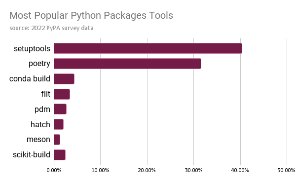

# Python Package Build Tools 

Below, we discuss some of the tools that are commonly used 
to build Python packages. This page is intended to help 
maintainers select a build tool to use. 

## Tools to build python packages 

There are a suite of build tools that you can use to create your Python 
package's **SDist** and *Wheel* distributions. 
To better understand your options, it's important to first understand the 
difference between a 
build tool front-end and build backend. 

## Build front-end vs. build backend tools for Python packaging

### Build back-ends 
Every tool has a back-end 
build tool that actually builds the package and creates associated 
(SDist and wheel) distribution files. Some of the tools below such as **Flit** 
and **PDM** only support pure Python package builds that do not have a 
compilation or other additional build step. These types of tools are ideal if 
you have a pure Python project. 

Other tools such as **Hatch** and **setuptools** support more complex builds 
with custom steps. 

### Build front-ends
Each tool discussed below has a front-end interface that you can use to perform 
different types of Python packaging tasks.
For instance, you can use **Flit**, **Hatch** and **PDM** to both build your 
package and to publish your package to PyPI (or test PyPI). Setuptools, 
on the other hand requires you to use **twine** to push to PyPI. 

Using a tool like **Flit**, **Hatch** or **PDM** can makes your workflow 
commands (and package requirements) consistent and simple. 

Example to build your package with **Flit**: 

`flit build`

Example to publish to PyPI: 
`flit publish --repository testpypi` 

Example build steps using setuptools:

```bash
# Build the package
python3 -m build
# Check build 
twine check dist/*
# Publish to test PyPI
twine upload -r testpypi dist/*
```

<!-- In the Python package build space **setuptools** is the original tool (i.e. 
the OG) of build tools. With a tool like `setuptools` you have the flexibility 
to publish python pure python packages and packages with custom build steps. 
However, you will also need to use other tools such as **twine** -->

## An ecosystem of Python build tools

Below we introduce several of the most commonly used Python packaging build 
tools (see chart below).

Each tool has different features. There is no right or wrong tool to use as far 
as pyOpenSci is concerned. We are just trying to help you find the tool that 
works best for your workflow. 


:::{figure-md} fig-target



The Python developers survey results (n=>8,000 PyPI users) show setuptools and poetry as the most commonly used Python packaging tools. The core tools that we've seen being used in the scientific community are included here. [You can view the full survey results by clicking here.](https://drive.google.com/file/d/1U5d5SiXLVkzDpS0i1dJIA4Hu5Qg704T9/view). NOTE: this data represent maintainers across domains and is likely heavily represented by those in web development. So it's just a snapshot across the broader Python ecosystem. 
:::

The tools that we review below include:

* setuptools 
* flit 
* hatch
* PDM 

````{note}
Note that we are intentionally not including Poetry in this list because

1. Poetry pins dependencies using `^`. This `^` symbol means that there is 
an "upper bound" to the dependency. Thus poetry will bump a dependency 
version to a new major version. Thus, if your package using a dependency that 
is at version 1.2.3, poetry will never bump the dependency to 2.0 even if 
there is a new major version of the package. It will bump up to 1.9.x. . 
[This approach has been found to be problematic by many of our core scientific packages.](https://iscinumpy.dev/post/bound-version-constraints/)

1. Poetry also uses approaches that do not follow current Python standards to 
adding project metadata and dependencies to the **pyproject.toml** file. 

The example below is taken from [this thread in GitHub](https://github.com/py-pkgs/py-pkgs/issues/95#issuecomment-1035584750).

```toml
[tool.poetry.dependencies]
python = ">=3.6" # This is muddled in as a dependency, while it's not like the others
numpy = ">=1.13.3"
typing_extensions = { version = ">=3.7", python = "<3.8" }

sphinx = {version = "^4.0", optional = true}
sphinx_book_theme = { version = ">=0.0.40", optional = true }
sphinx_copybutton = { version = ">=0.3.1", optional = true }
pytest = { version = ">=6", optional = true }
importlib_metadata = { version = ">=1.0", optional = true, python = "<3.8" } # TOML error to add an ending comma or new line, even if this gets long
boost-histogram = { version = ">=1.0", optional = true }

[tool.poetry.dev-dependencies]
pytest = ">=5.2"  # All the optional stuff above doesn't help here!
importlib_metadata = {version = ">=1.0", python = "<3.8" }
boost_histogram = ">=1.0"

[tool.poetry.extras]
docs = ["sphinx", "sphinx_book_theme", "sphinx_copybutton"]
test = ["pytest", "importlib_metadata", "boost_histogram" ]
```

vs PDM

```toml
[project]
requires-python = ">=3.6"
dependencies = [
  "numpy>=1.13.3",
  "typing-extensions>=3.7; python_version<'3.8'",
]

# Only needed for extras
[project.optional-dependencies]
docs = [
  "sphinx>=4.0",
  "sphinx-book-theme>=0.0.40",
  "sphinx-copybutton>=0.3.1",
]
test = [
  "pytest>=6",
  "importlib-metadata>=1.0; python_version<'3.8'",
  "boost-histogram>=1.0",
]

# Only needed for "dev" installs
[tool.pdm.dev-dependencies]
dev = [
  "pytest>=6",
  "importlib-metadata>=1.0; python_version<'3.8'",
  "boost-histogram>=1.0",
]
```

As such, we don't suggest that use of poetry for your development workflow. 
It's dependency management decisions have caused breaking changes in several large 
Python packages. PDM is a package that has similar functionality to poetry 
while also following modern Python packaging standards and conventions. 
````

## How to chose a build development tool

When deciding what tools you wish to use, there are a few basic criteria that 
you can use to help guide your decision:

### Build tools for pure Python packages 
If your package is a pure Python package and it doesn't have any additional 
build steps (such as compiling code, etc) you can use any of the tools discussed 
on this page including:

* Flit 
* Hatch 
* setuptools 
* PDM
 
<!-- TODO: create build tool selection diagram -->

### Build tools for Python packages with complex build steps 
If your package is not pure Python, or it has complex build steps (or build
steps that you need to customize), then you should consider using: 

* Setuptools 
* Hatch 

Both of these tools allow you to customize your workflow with build steps needed 
to compile code. 

**Setuptools** is the "OG" tool that has been used for Python packaging for many years. 
**Hatch** is the newer, more modern tool that supports customization of any part of your packaging steps. 

## Tools that also support version bumping 
Of the tools listed on this page, two of them support 
direct package versioning:

* setuptools has setuptools_scm
* hatch has hatch_vcs

Each tool listed above allows you to setup a release 
workflow using your version control platform of choice 
(we are using GitHub as an example here given it is 
currently the most popular platform). 

## Python packaging tools summary 
A summary of what each of the tools offers can be found in the table below:
| Feature                                                                | Setuptools            | Flit      | Hatch     | PDM |
| ---------------------------------------------------------------------- | --------------------- | --------- | --------- | --- |
| Build backend                                                          | setuptools.build_meta | flit_core | hatchling |  pdm-pep517   |
| Supports projects that aren't pure python                              | yes                   | no        | yes       | no  |
| Supports custom build steps (before creating wheel)                    | yes                   | no        | yes       | no  |
| Has built in dependency management                                     | no                    | no        | no (future feature)       | yes |
| Can be used to publish directly to pypi                                | no (use twine)        | yes       | yes       | yes |
| Has version control based (eg git based) tooling to bump version       | setuptools_scm        | no        | hatch-vcs | ?   |
| Supports automated GitHub only releases (no local command line needed) | yes                   | no        | yes       |     |

<!-- TODO: add - compatible with other build back ends eg pdm can work with hatchling-->

## Using Setuptools for Python Packaging 

* build-backend: **setuptools.build_meta** 
* build_frontend: **setuptools** 
* build_versioning: **setuptools_scm**

[Setuptools](https://setuptools.pypa.io/en/latest/) is one of the most 
mature Python packaging tools with [development dating back to 2009 and earlier](https://setuptools.pypa.io/en/latest/history.html#). 
Given this history, it has the largest user base.  

### Potential benefits of setuptools
Some of the benefits include:

* Fully customizable build workflow
* There are numerous examples on GitHub given many packages use it
* Easy to user built in package versioning using **setuptools_scm** 
* Supports modern packaging using **pyproject.toml** for metadata but also it backwards compatible with other older packaging approaches.
 
### Potential drawbacks of setuptools 

Setuptools has a few drawbacks: 

* Because **setuptools** has to maintain backwards compatibility across a range of packages, it is 
not as flexible in its adoption of modern Python packaging
standards. This backwards compatibility also makes for a more complex code-base.
* To push to PyPI you will need to use another tool, **twine**. 
* Finally is has some problematic default settings. For instance, it will build a 
project without a name or version if you are not using a pyproject.toml file to store metadata. 

## Flit 

* Build Backend: **flit_core.buildapi**
* Versioning: No, Flit uses the  version from your package's ` __version__`.
* [Why use flit?](https://flit.pypa.io/en/stable/rationale.html)
* Dependency Pinning: no 

[Flit is a modern, no-nonsense, streamlined packaging tool](https://flit.pypa.io/en/stable/) that supports modern Python packaging standards. 
If you have a pure Python project and don't need any 
additional build steps for your package, Flit could be 
a tool for you. 

* **Flit** supports **proproject.toml** files for metadata and dependency 
declarations.
* **Flit** also has a front-end command line that will help
you publish your package to both testPyPI and PyPI. 

### Potential stumbling blocks with using Flit
There are no downsides to using Flit. If you have a simple build, it might be 
the tool for you. However you may NOT want to use flit if:

* You want to setup more advanced version tracking
* You want a tool that handles dependency versions (use PDM instead)
* You have a project that is not pure Python (Use Hatch or setuptools)


## PDM 

[PDM is a Python packaging and dependency management tool](https://pdm.fming.dev/latest/). 
Similar to **Flit**, It is designed to support pure Python projects. 

Benefits of using PDM:

* PDM offers dependency management and pinning that follows Python best practices
* PDM follows modern packaging standards. 
* PDM supports using other build backends and associated backend plugins (such as hatchling / hatch_vcs)

PDM might be a great option for you if you enjoy using Poetry. As it offers 
all of the functionality of Poetry, but also follows modern Python packaging
conventions. 

## Hatch 

* Build Backend: **hatchling**
* Version control based versioning: Yes -  **hatch-vcs** 
* Push to PyPI: Yes
* Dependency "pinning": No (but this feature may come in the future)

[**Hatch**](https://hatch.pypa.io/latest/) is for you if you have a project 
that requires some custom build steps. Or if you just want a tool that has more 
features than a tool like Flit. 

Similar to Flit, it simplifies your package's build workflow using consistent 
commands. However, it also adds:

* A fully customizable build back-end 
* Full flexibility for each step of the build process. 
* Matrix environment creation to support testing across Python versions 
* [Nox / MAKEFILE like functionality](https://hatch.pypa.io/latest/environment/#selection) 
where you can create workflows in the **pyproject.toml** configuration to do things 
like serve docs locally and cleaning your package build directory. 

Hatch is an all-in-one tool that supports almost all aspects of package 
development and maintenance.

```{note}
While Hatch does have some "opinions" about how parts of the packaging build 
run, you can customize any aspect of its build. 
```


