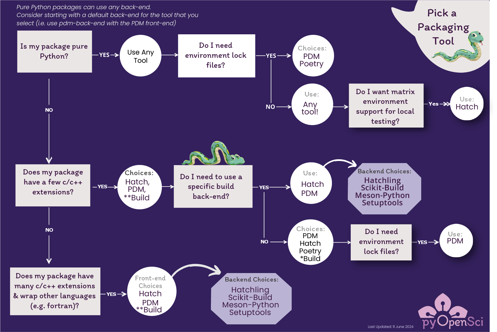

# Python Package Build Tools

<!-- TODO: add a small discussion on what pinning is?-->

There are a several different build tools that you can use to [create your Python package's _sdist_ and _wheel_ distributions](python-package-distribution-files-sdist-wheel). Below, we discuss the features,
benefits and limitations of the most commonly used Python packaging tools.
We focus on pure-python packages in this guide. However, we also
highlight tools that currently support packages with C/C++ and other language
extensions.

:::{figure-md} fig-target



Diagram showing the various from end build tools that you can select from. Each tool has different features as highlighted below.
NOTE: this is still a DRAFT so i'm not going to spend time truly cleaning it up until i get lots of feedback on the general approach!!
:::

If you want to know more about Python packages that have extensions written in
other languages, [check out the page on complex package builds.](complex-python-package-builds)

### Tools that we review here

In this section we have selected tools that were returned
as the most popular packaging tools in the PyPA survey.
You will learn more about the following tools on this page:

- [Twine](https://twine.readthedocs.io/en/stable/), [Build](https://pypa-build.readthedocs.io/en/stable/) + [setuptools](https://setuptools.pypa.io/en/latest/)
- [Flit](https://flit.pypa.io/en/stable/)
- [Hatch](https://hatch.pypa.io/latest/)
- [PDM](https://pdm.fming.dev/latest/)
- [Poetry](https://python-poetry.org/docs/)

## Build front-end vs. build back-end tools

To better understand your options, when it comes to building a Python package, it's important to first understand the difference between a
build tool front-end and build back-end.

### Build back-ends

Most packaging tools have a back-end
build tool that builds you package and creates associated
[(sdist and wheel) distribution files](python-package-distribution-files-sdist-wheel). Some tools, such as **Flit**, only
support pure-Python package builds. A pure-Python build refers
to a package build that does not have extensions that are written in another
programming language (such as `C` or `C++`).

Other packages that have C and C++ extensions (or that wrap other languages such as fortran) require additional code compilation steps when built.
Back-ends such as and **setuptools.build**, **meson.build**
and **scikit-build** support complex builds with custom steps. If your
build is particularly complex (i.e. you have more than a few `C`/`C++`
extensions), then we suggest you use **meson.build** or **scikit-build**.

### Python package build front-ends

A packaging front-end tool refers to a tool that makes it easier for you to
perform common packaging tasks using similar commands. These tasks include:

- [Build your packages (create the sdist and wheel distributions](python-package-distribution-files-sdist-wheel)
- Installing your package in a development mode (so it updates when you update your code)
- Publishing to PyPI
- Running tests
- Building documentation
- Managing an environment or multiple environments in which you need to run tests and develop your package

There are several Python packaging tools that you can use for pure Python
builds. Each front-end tool discussed below supports a slightly different set of Python
packaging tasks.

For instance, you can use the packaging tools **Flit**, **Hatch** or **PDM**
to both build and publish your package to PyPI. However while **Hatch** and
**PDM** support versioning and environment management, **Flit** does not. If you want a tool that supports dependency
locking, you can use **PDM** or **Poetry** but not **Hatch**.
If you only need to build your package's sdist and wheel distribution files, then you can stick with PyPA's Build. You'd then use Twine to publish to PyPI.

```{note}
If you are using **Setuptools**, there is no user-friendly build front-end that performs multiple tasks. You will need to use **build** to build your package and **twine** to publish to PyPI.
```

### Example build steps that can be simplified using a front-end tool

Below, you can see how a build tool streamlines your packaging experience. Example to build your package with **Hatch**:

```bash
# Build your sDist and .whl files
hatch build

# Example to publish to PyPI:
hatch publish --repository testpypi
```

Example build steps using the **setuptools** back-end and **build**:

```bash
# Build the package
python3 -m build

# Publish to test PyPI using twine
twine upload -r testpypi dist/*
```

## Choosing a build back-end

Most front-end packaging tools have their own back-end build tool. The build
tool creates your package's (sdist and wheel) distribution files. For pure
Python packages, the main difference between the different build back-ends
discussed below is:

- How configurable they are - for example, do they allow you to add build steps that support non python extensions?
- How much you need to configure them to ensure the correct files are included in your sdist and wheel distributions.

### Build back-end support for non pure-python packages

It is important to note that some build back-ends, such as **Flit-core**, only support
pure Python builds. Other back-ends support C and C++ extensions as follows:

- setuptools supports builds using C / C++ extensions
- Hatchling (hatch's back-end) supports C / C++ extensions via plugins that the developer creates to customize a build
- PDM's back-end supports C / C++ extensions by using setuptools
- Poetry's back-end supports C/C++ extensions however this functionality is currently undocumented. As such we don't recommend using Poetry for complex or non pure Python builds until it is documented.

While we won't discuss more complex builds below, we will identify which tools
have documented support for C / C++ extensions.

## An ecosystem of Python build tools

Below we introduce several of the most commonly used Python packaging build
front-end tools. We highlight the features that each tool offers as a way to
help you decide what tool might be best for your workflow.

```{admonition} We do not suggest using setuptools
:class: note

We suggest that you pick one of the modern tools listed above rather than
setuptools because setuptools will require some additional knowledge
to set up correctly.

We review setuptools as a back-end because it is still popular. However it is
not the most user friendly option.
```

The most commonly used tools in the ecosystem are
setuptools back-end (with build) and Poetry (a front end tool with numerous
features and excellent documentation).

:::{figure-md} pypa-survey-plot


The Python developers survey results (n=>8,000 PyPI users) show setuptools and poetry as the most commonly used Python packaging tools. The core tools that we've seen being used in the scientific community are included here. [You can view the full survey results by clicking here.](https://drive.google.com/file/d/1U5d5SiXLVkzDpS0i1dJIA4Hu5Qg704T9/view) NOTE: this data represent maintainers across domains and is likely heavily represented by those in web development. So this represents a snapshot across the broader Python ecosystem.
:::

## Chose a build workflow tool

The tools that we review below include:

- Twine, Build + setuptools
- Flit
- Hatch
- PDM
- Poetry

When you are selecting a tool, you might consider this general workflow of
questions:

1. **Is your tool pure python? Yes?** You can use any tool that you wish! Pick the tool that has the features that you want to use in your build workflow. We suggest:

- Flit, Hatch, PDM or Poetry (read below for more)

1. **Does your tool have a few C or C++ extensions?** Great, we suggest using
   **PDM** for the time being. It is the only tool in the list below that has documented
   workflow to support such extensions. It also supports other back-ends such as scikit-build and meson-python that will allow you to fully customize your build.

NOTE: You can also use Hatch for non pure python builds but you will need to
write your own plugin for this support.

## Python packaging tools summary

<!-- NOTE - add language around the front end means that you have less individual tools in your build - such as nox / make with hatch -->

Below, we summarize features offered by the most popular build front end tools.
Note that because setuptools does not offer a front-end interface, it is not
included in the table.

### Package tool features table

```{csv-table}
:header: Feature, Flit, Hatch, PDM, Poetry
:widths: 36, 10,10,10,10
:delim: "|"

Default Build Back-end| Flit-core| hatchling| PDM| Poetry-core
Use Other Build Backends|✖ | ✖|✅  |✖
Dependency management| ✖|✖|✅|✅
Publish to PyPI| ✅|✅|✅|✅
Version Control based versioning (using `git tags`)|✖|✅|✅|✅
Version bumping|✖|✅| ✅| ✅
More than one maintainer? (bus factor)|✖|✖| ✖| ✅
```

Notes:

- _Hatch plans to support using other back-ends and dependency management in the future_
- Poetry supports semantic versioning. Thus, it will support version bumping following commit messages if you use a tool such as Python Semantic Release

## PDM

[PDM is a Python packaging and dependency management tool](https://pdm.fming.dev/latest/).
PDM supports builds for pure Python projects. It also provides multiple layers of
support for projects that have C and C++ extensions.

```{admonition} PDM support for C and C++ extensions

PDM supports using the PDM-back-end and setuptools at the same time.
This means that you can run setuptools to compile and build C extensions.
PDM's build back-end receives the compiled extension files (.so, .pyd) and
packages them with the pure Python files.
```

### PDM Features

```{csv-table}
:header: Feature, PDM, Notes
:widths: 20,5,50
:delim: "|"

Use Other Build Backends| ✅| When you setup PDM it allows you to select from Hatch; PDM-517 and PDM-core build tools. PDM also can work with Meson-Python which supports move complex python builds.
Dependency management & lock files |✅|PDM and Poetry are currently the only tools that support creating dependency lock files. Their default dependency constraint approach to creating lock files is different: Poetry uses a default [upper bound lock](https://python-poetry.org/docs/dependency-specification/#version-constraints) `^`. This means that Poetry will always never bump a dependency to the next major version (ie from 1.2 to 2.0). PDM uses an open lock `>=` approach by default but also allows you to [customize how you want locking constraints to be implemented](https://pdm.fming.dev/latest/usage/dependency/#about-update-strategy). Thus with PDM you can explicitly tell it to lock using upper bounds like Poetry. Or you can tell it to use other strategies. This makes PDM one of the most flexible tools for creating lock files. Lock files are often most useful to developers creating web apps where locking the environment is critical for consistent user experience.
Select your environment manager of choice (conda; venv; etc)|✅ | PDM allows you to select the environment manager that you want to use for managing your package.
Publish to PyPI|✅|PDM supports publishing to both test PyPI and PyPI
Version Control based versioning|✅ | PDM has a setuptools_scm like tool built into it which allows you to use dynamic versioning that rely on git tags.
Version bumping| ✅ | PDM supports you bumping the version of your package using standard semantic version terms patch; minor; major
Follows current packaging standards|✅|PDM supports current packaging standards for adding metadata to the **pyproject.toml** file. It also supports pep 517? dependency management which relies upon a local directory containing a users environment.
Install your package in editable mode|✅|PDM supports installing your package in editable mode.
Build your sdist and wheel distributions|✅| Similar to all of the other tools PDM builds your packages sdist and wheel files for you.
✨Optional use of PEP 582 / local environment directory✨|✅| PDM is currently the only tool that optionally supports PEP 582 (having a local environment configuration stored within a `__packages__` directory in your working package directory).
```

```{admonition} PDM vs. Poetry
The functionality of PDM is similar to Poetry. However, PDM also offers
additional, documented support for C extensions and version control based
versioning. If you are deciding between the two tools, the main difference between these two tools
is that Poetry (by default) follows strict semantic versioning when creating lock files. However there are some work arounds to this if you want to use Poetry rather than PDM. Strict adherence to semantic
versioning can be problematic in some cases (more on that below).
```

### Challenges with PDM

PDM is a full-featured packaging tool. However it is not without challenges:

- Its documentation can be confusing, especially if you are new to
  packaging. For example, PDM doesn't provide an end to end beginning workflow in its documentation.
- PDM also only has one maintainer currently. We consider individual maintainer
  teams to be a potential risk. If the maintainer finds they no longer have time
  to work on the project, it leaves users with a gap in support. Hatch and Flit
  also have single maintainer teams.

[You can view an example of a package that uses PDM here](https://github.com/pyOpenSci/examplePy/tree/main/example4_pdm). The README file for this directly provides you with
an overview of what the PDM command line interface looks like when you use it.

## Flit

[Flit is a no-frills, streamlined packaging tool](https://flit.pypa.io/en/stable/) that supports modern Python packaging standards.
Flit is a great choice if you are
building a basic package to use in a local workflow that doesn't require any advanced features. And if your package structure is already created. More on that below.

### Flit Features

```{csv-table}
:header: Feature, Flit, Notes
:widths: 20,5,50
:delim: "|"

Publish to PyPI and test PyPI|✅|Flit supports publishing to both test PyPI and PyPI
Helps you add metadata to your **pyproject.toml** file|✅| .
Follows current packaging standards|✅|Flit supports current packaging standards for adding metadata to the **pyproject.toml** file.
Install your package in editable mode|✅|Flit supports installing your package in editable mode. However, it does use a slightly different syntax from the usual `pip install -e .` to do so.
Build your sdist and wheel distributions|✅| Flit can be used to build your packages sdist and wheel distributions.
```

```{admonition} Learn more about flit
* [Why use flit?](https://flit.pypa.io/en/stable/rationale.html)
```

### Why you might not want to use Flit

Because Flit is no frills, it is best for basic, quick builds. If you are a
beginner you may want to select Hatch or PDM which will offer you more support
in common operations.
You may NOT want to use flit if:

- You want to setup more advanced version tracking and management (using version control for version bumping)
- You want a tool that handles dependency versions (use PDM instead)
- You have a project that is not pure Python (Use Hatch, PDM or setuptools)
- Version Support: Flit uses the version from your package's ` __version__`.

## Hatch

[**Hatch**](https://hatch.pypa.io/latest/), similar to Poetry and PDM, provides a
unified command line interface. To separate Hatch from Poetry and PDM, it also
provides an environment manager for testing that will make it easier for
you to run tests locally across different versions of Python. It also offers a
nox / makefile like feature that allows you to create custom build workflows such
as building your documentation locally, that you may have created in the past
using a tool like **Make** or **Nox**.

### Hatch features

```{csv-table}
:header: Feature, Hatch, Notes
:widths: 20,5,50
:delim: "|"

Use Other Build Backends|✖| Switching out build back-ends is not currently an option when using Hatch. However this feature is coming to the package in the near future.
Dependency management|✅|Hatch can help you add dependencies to your **pyproject.toml** metadata.
Select your environment manager of choice (conda, venv, etc)|✅ | Hatch does allow you to select the (pip) environment that you want to use for managing and building your package. However if you want to use conda [you will need to use a plugin](https://github.com/OldGrumpyViking/hatch-conda).
Publish to PyPI and test PyPI|✅|Hatch supports publishing to both test PyPI and PyPI
Version Control based versioning|✅ | Hatch offers `hatch_vcs` which is a plugin that uses setuptools_scm to support versioning using git tags. The workflow with `hatch_vcs` is the same as that with `setuptools_scm`.
Version bumping| ✅ | Hatch supports you bumping the version of your package using standard semantic version terms patch; minor; major
Follows current packaging standards|✅|Hatch supports current packaging standards for adding metadata to the **pyproject.toml** file.
Install your package in editable mode|✖✅| You can install your package in editable mode using `pip install -e .` Hatch mentions [editable installs](https://hatch.pypa.io/latest/config/build/#dev-mode) but refers to pip in its documentation.
Build your sdist and wheel distributions|✅| Hatch will build the sdist and wheel distributions
✨Matrix environment creation to support testing across Python versions✨|✅| The matrix environment creation is a feature that is unique to Hatch in the packaging ecosystem. This feature is useful if you wish to test your package locally across Python versions (instead of using a tool such as tox).
✨[Nox / MAKEFILE like functionality](https://hatch.pypa.io/latest/environment/#selection)✨| ✅| This feature is also unique to Hatch. This functionality allows you to create workflows in the **pyproject.toml** configuration to do things like serve docs locally and clean your package build directory. This means you may have one less tool in your build workflow.
✨A flexible build back-end: **hatchling**✨| ✅| **The hatchling build back-end offered by the maintainer of Hatch allows developers to easily build plugins to support custom build steps when packaging.

```

_\*\* There is some argument about this approach placing a burden on maintainers to create a custom build system. But others appreciate the flexibility_

### Why you might not want to use Hatch

There are a few features that hatch is missing that may be important for some.
These include:

- Doesn't support dependency pinning
- Currently doesn't support use with other build back-ends. Lack of support for other build back-ends makes Hatch less desirable for users with more complex package builds. If your package is pure
  Python, this won't be an issue. NOTE: there is a plan for this feature to be added in the upcoming months.
- Doesn't allow you to select what environment manager you use. <!-- (is this right??) -->
- Hatch doesn't provide an end to end beginning workflow in it's documentation.
- Hatch, similar to PDM and Flit currently only has one maintainer.

```{note}
You can customize any aspect of the Hatch build by creating plugins.
```

## Poetry

[Poetry is a full-featured build tool.](https://python-poetry.org/) It is also
the second most popular front-end packaging tool (based upon the PyPA survey).
Poetry is user-friendly and has clean and easy-to-read documentation.

```{note}
While some have used Poetry for Python builds with C/C++ extensions, this support
is currently undocumented. Thus, we don't recommend using Poetry for more complex builds.
```

### Poetry features

```{csv-table}
:header: Feature, Poetry, Notes
:widths: 20,5,50
:delim: "|"

Dependency management|✅|Poetry helps you add dependencies to your `pyproject.toml` metadata. _NOTE: currently Poetry adds dependencies using an approach that is slightly out of alignment with current Python peps - however there is a plan to fix this in an upcoming release._ Allows you to organize dependencies in groups: docs; package; tests.
Dependency pinning|✅ |Poetry offers dependency pinning however it's default approach can be problematic for some packages. Read below for more.
Select your environment manager of choice (conda; venv; etc)|✅ | Poetry allows you to either use its simple environment management tool or select the environment manager that you want to use for managing your package. [Read more about its built in environment management options](https://python-poetry.org/docs/basic-usage/#using-your-virtual-environment).
Publish to PyPI and test PyPI|✅|Poetry supports publishing to both test PyPI and PyPI
Version Control based versioning|✅ | The plugin [Poetry dynamic versioning](https://github.com/mtkennerly/poetry-dynamic-versioning) supports versioning using git tags with Poetry.
Version bumping| ✅ | Poetry supports you bumping the version of your package using standard semantic version terms patch; minor; major
Follows current packaging standards|✖✅|Poetry does not quite support current packaging standards for adding metadata to the **pyproject.toml** file but plans to fix this in an upcoming release.
Install your package in editable mode|✅|Poetry supports installing your package in editable mode using `--editable`
Build your sdist and wheel distributions|✅|Poetry will build your sdist and wheel distributions using `poetry build`
```

<!-- TODO: responses here on poetry's future dev work: https://github.com/python-poetry/poetry/discussions/7525 -->

### Challenges with Poetry

Some challenges of Poetry include:

- Poetry, by default, pins dependencies using an "upper bound" limit specified with the `^` symbol by default. See breakout below for more regarding why this is potentially problematic.
- _Minor:_ The way Poetry currently adds metadata to your pyproject.toml file does not does not follow current Python standards. However, this is going to be addressed when they release version 2.0.

Poetry is an excellent tool. Use caution when using it to pin dependencies as
Poetry's approach to pinning can be problematic for many builds.

<!--https://github.com/py-pkgs/py-pkgs/issues/95#issuecomment-1035584750
discusses the slight differences in how poetry adds deps....-->

```{admonition} Challenges with Poetry dependency pinning
:class: important

By default, Poetry pins dependencies using `^` by default. This `^` symbol means that there is
an "upper bound" to the dependency. Thus poetry will bump a dependency
version to a new major version. Thus, if your package uses a dependency that
is at version 1.2.3, Poetry will never bump the dependency to 2.0 even if
there is a new major version of the package. Poetry will instead bump up to 1.9.x.

Poetry does this because it adheres to strict semantic versioning which states
that a major version bump (from 1.0 to 2.0 for example) means there are breaking
changes in the tool. However, not all tools follow strict semantic versioning.
[This approach has been found to be problematic by many of our core scientific packages.](https://iscinumpy.dev/post/bound-version-constraints/)

This approach also won't support others ways of versioning tools, for instance,
some tools use [calver](https://calver.org/) which creates new versions based on the date.
```

```{admonition} Hatch vs PDM vs Poetry
:class: note
There are some features that Hatch and PDM offer that Poetry does not.

Hatch: offers matrix environment management that allows you to run tests across
Python versions. It also offers a Nox / Make file like tool to streamline your
build workflow.
PDM: does not offer matrix environments of Nox / Makefile like tools. It does
offer dependency management but adheres to a >= approach when pinning (open bounds). This
avoids the issue described below with Poetry's default upper bound pinning.
```

## Using Setuptools Back-end for Python Packaging with Build Front-end

[Setuptools](https://setuptools.pypa.io/en/latest/) is the most
mature Python packaging build tool with [development dating back to 2009 and earlier](https://setuptools.pypa.io/en/latest/history.html#).
Setuptools also has the largest number of community users (according to the PyPA
survey). Setuptools does not offer a user
front-end like Flit, Poetry and Hatch offer. As such you will need to use other
tools such as **build** to create
your package distributions and **twine** to publish to PyPI.

While setuptools is the most commonly used tool, we encourage package maintainers
to consider using a more modern tool for packaging such as Poetry, Hatch or PDM.

We discuss setuptools here because it's commonly found in the ecosystem and
contributors may benefit from understanding it.

### Setuptools Features

Some of features of setuptools include:

- Fully customizable build workflow
- Many scientific Python packages use it.
- It offers version control based package versioning using **setuptools_scm**
- It supports modern packaging using **pyproject.toml** for metadata
- Supports backwards compatibly for older packaging approaches.

### Challenges using setuptools

Setuptools has a few challenges:

- Because **setuptools** has to maintain backwards compatibility across a range of packages, it is
  not as flexible in its adoption of modern Python packaging
  standards.
- The above-mentioned backwards compatibility makes for a more complex code-base.
- Your experience as a user will be less streamlined and simple using setuptools compared to other tools discussed on this page.

There are also some problematic default settings that users should be aware of
when using setuptools. For instance:

- setuptools will build a project without a name or version if you are not using a **pyproject.toml** file
  to store metadata.
  \*Setuptools also will include all of the files in your package
  repository if you do not explicitly tell it to exclude files using a
  **MANIFEST.in** file
