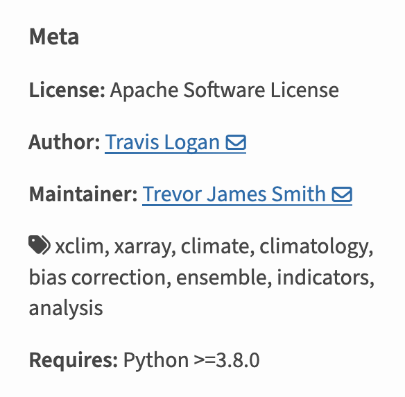
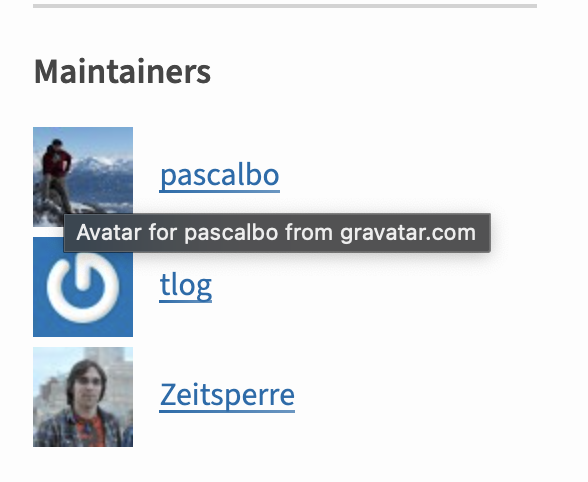

# The Python Package Source and Wheel Distributions

```{figure} ../images/python-package-development-process.png
:align: center
:alt: Image showing the left side bar of PiPy for the package xclim. The section at the top says Classifier. Below there is a list of items including Development status, intended audience, License, natural language, operating system, programming language and topic. Below each of those sections are various classifier options." width="300px">

Notice the metadata printed on the PyPI page for xclim. When you add the classifier section to your pyproject.toml
and your package is built, the build tool organizes the metadata into a format that PyPI can understand and
represent on your pypi landing page. These classifiers also allow users to sort through packages by version of python they support, categories and more.
```

## What is building a Python package?

In Python, if you want to publish your code in a way that can be
installed by both yourself and others, your code, tests and associated
metadata need to be organized in a specific way. This specific
organization and structure is important because it's the structure
that both `PyPI` and any installer that you use like `pip` can
understand and parse. This process of organizing and formatting your
code, documentation, tests and metadata into a format that both pip
and PyPI can use, is called a build step.

For instance, when you publish to PyPI, you will notice that each package has metadata listed. Let’s have a look at [xclim](https://pypi.org/project/xclim/), one of our [pyOpenSci packages](https://www.pyopensci.org/python-packages.html). Notice that on the PyPI landing page you see some metadata about the package including python, maintainer information and more. PyPI is able to populate this metadata because it was defined using correct syntax and classifiers by Xclim's maintainers, [pyproject.toml file](https://github.com/Ouranosinc/xclim/blob/master/pyproject.toml). This metadata when the xclim package is built, is translated into a distribution file that allows PyPI to read the metadata and print it out on their website.

```{figure} ../images/python-build-package/pypi-metadata-classifiers.png
:scale: 50 %
:align: center
:alt: Image showing the left side bar of PiPy for the package xclim. The section at the top says Classifier. Below there is a list of items including Development status, intended audience, License, natural language, operating system, programming language and topic. Below each of those sections are various classifier options." width="300px">

When you add the classifier section to your pyproject.toml
and your package is built, the build tool organizes the metadata into a format that PyPI can understand and
represent on your pypi landing page. These classifiers also allow users to sort through packages by version of python they support, categories and more.
```

:::{figure-md} fig-target


:::

:::{figure-md} fig-target


:::

## How to create the distribution format that PyPI and Pip expects?

You could in theory create your own scripts to organize your code the way PyPI wants it to be. However, just like there are packages that handle known structures such as Pandas for data frames and Numpy for arrays, there are packages and tools that help you create package build distribution files.

```{note}

There are a suite of packaging tools that can either help you with
the entire packaging process or just one step of the process. For instance
setuptools is a commonly used build back end that can be used to create your
SDist and wheel. Whereas tools like Hatch, PDM, Poetry and flit help with other
parts of the packaging process.

While this can cause some confusion and
complexity in the packaging ecosystem - for the most part, each tool provides
the same distribution output (with minor differences that most users may not
care about). Learn more about those tools on this page.
```

Below, you will learn about the two distribution files that PyPI expects you to publish: SDist and Wheel. You will learn about
their structure and what files belong in each.

There are two core distribution files
that you need to create to publish your Python package to
PyPI source distribution (often called an sdist) and wheel. The sdist contains the raw source
code for your package. The Wheel (.whl) contains the built / compiled files
that can be directly installed onto anyones' computer.

Learn more about both distributions below.

```{note}
If your package is a pure python package with no additional
build / compilation steps then the sdist and Wheel distributions will have
similar content. However if your package has extensions in other languages
or is more complex in its build, the two distributions will be very different.

Also note that we are not discussing conda build workflows in this section.
[You can learn more about conda builds here.](https://conda.io/projects/conda-build/en/latest/user-guide/tutorials/index.html)
```

### Source Distribution (sdist)

**Source files** are the unbuilt files needed to build your
package. These are the "raw / as-is" files that you store on GitHub or whatever
platform you use to manage your code.

**S**ource **Dist**ributions are referred to as sdist. As the name implies, a SDIST contains the source code; it has not been
built or compiled in any way. Thus, when a user installs your source
distribution using pip, pip needs to run a build step first. For this reason, you could define a source distribution as a compressed archive that contains everything required to build a wheel (except for project dependencies) without network access.

Sdist is normally stored as a `.tar.gz` archive (often called a "tarball"). Thus, when a user installs your source distribution using pip, pip needs to run a build step first.

Below is an example sdist for the stravalib Python package:

<!-- TODO: we should likely use a different pure python package with a src/ layout for
consistency -->

```
stravalib-1.1.0.post2-SDist.tar.gz file contents

├─ 📂 stravalib
│  ├─ tests
│  │  ├─ integration
│  │  │  ├─ __init__.py
│  │  │  ├─ conftest.py
│  │  │  ├─ strava_api_stub.py
│  │  │  └─ test_client.py
│  │  ├─ unit
│  │  │  ├─ __init__.py
│  │  │  ├─ test_attributes.py
│  │  │  ├─ ...
│  │  ├─ __init__.py
│  │  ├─ auth_responder.py
│  │  └─ test.ini-example
│  ├─ util
│  │  ├─ __init__.py
│  │  └─ limiter.py
│  ├─ __init__.py
│  ├─ _version.py
│  ├─ _version_generated.py
│  ├─ attributes.py
│  ├─ ...
├─ stravalib.egg-info
│  ├─ PKG-INFO
│  ├─ SOURCES.txt
│  ├─ dependency_links.txt
│  ├─ requires.txt
│  └─ top_level.txt
├─ CODE_OF_CONDUCT.md
├─ CONTRIBUTING.md
├─ LICENSE.txt
├─ MANIFEST.in
├─ Makefile
├─ PKG-INFO
├─ README.md
├─ changelog.md
├─ environment.yml
├─ pyproject.toml
├─ requirements-build.txt
├─ requirements.txt
└─ setup.cfg

```

```{admonition} GitHub archive vs SDist
:class: tip
When you make a release on GitHub, it creates a `git archive` that contains all
of the files in your GitHub repository. While these files are similar to an
SDist, these two archives are not the same. The SDist contains a few other
items including a metadata directory and if you use `setuptools_scm` or `hatch_vcs`
the SDist may also contain a file that stores the version.
```

### Wheel (.whl files):

A wheel file is a ZIP-format archive whose filename follows a specific format
(below) and has the extension `.whl`. The `.whl` archive contains a specific
set of files, including metadata that are generated from your project's
pyproject.toml file. The pyproject.toml and other files that may be included in
source distributions are not included in wheels because it is a built
distribution.

The wheel (.whl) is your built binary distribution. **Binary files** are the built / compiled source files. These files are ready to be installed. A wheel (**.whl**) is a **zip** file containing all of the files needed to directly install your package. All of the files in a wheel are binaries - this means that code is already compiled / built. Wheels are thus faster to install - particularly if you have a package that requires build steps.

The wheel does not contain any of your
package's configuration files such as **setup.cfg** or **pyproject.toml**. This
distribution is already built so it's ready to install.

Because it is built, the wheel file will be faster to install for pure Python
projects and can lead to consistent installs across machines.

<!-- TODO - i need to clarify this as i've gotten mixed feedback on the
real security issues with this IF the whl is already built and that file isn't
included what is the issue? i need more input here-->

```{tip}
Wheels are also useful in the case that a package
needs a **setup.py** file to support a more complex build.
In this case, because the files in the wheel bundle
are pre built, the user installing doesn't have to
worry about malicious code injections when it is installed.
```

The filename of a wheel contains important metadata about your package.

Example: **stravalib-1.1.0.post2-py3-none.whl**

- name: stravalib
- version: 1.1.0
- build-number: 2 (post2) [(read more about post here)](https://peps.python.org/pep-0440/#post-release-separators)
- py3: supports Python 3.x
- none: is not operating system specific (runs on windows, mac, linux)
- any: runs on any computer processor / architecture

What a wheel file looks like when unpacked (unzipped):

```
stravalib-1.1.0.post2-py3-none.whl file contents:

├─ 📂 stravalib
│  ├─ tests
│  │  ├─ functional
│  │  │  ├─ __init__.py
│  │  │  ├─ test_client.py
│  │  ├─ unit
│  │  │  ├─ __init__.py
│  │  │  ├─ test_attributes.py
│  │  ├─ __init__.py
│  │  ├─ auth_responder.py
│  │  └─ test.ini-example
│  ├─ util
│  │  ├─ __init__.py
│  │  └─ limiter.py
│  ├─ __init__.py
│  ├─ _version.py
│  ├─ _version_generated.py
│  ├─ attributes.py
│  ├─ client.py
└─ stravalib-1.1.0.post2.dist-info  # Package metadata are stored here
   ├─ LICENSE.txt
   ├─ METADATA
   ├─ RECORD
   ├─ WHEEL
   └─ top_level.txt

```

```{tip}
[Read more about the wheel format here](https://pythonwheels.com/)
```
