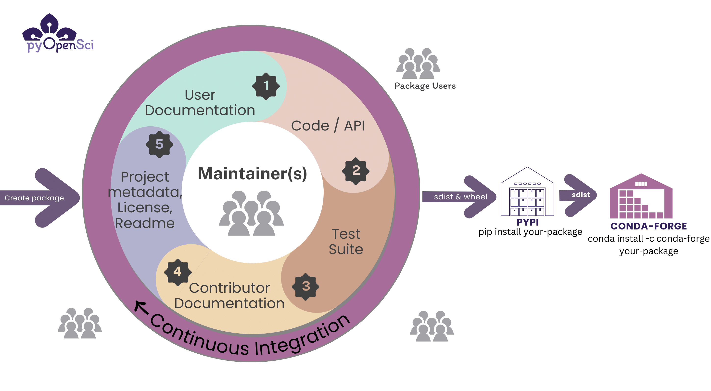

(tests-intro)=
# Tests and data for your Python package

Tests are an important part of your Python package because they
provide a set of checks that ensure that your package is
functioning how you expect it to.

In this section, you will learn more about the importance of writing
tests for your Python package and how you can set up infrastructure
to run your tests both locally and on GitHub.


:::::{grid} 1 1 3 2
:class-container: text-center
:gutter: 3

::::{grid-item}
:::{card} ✨ Why write tests ✨
:link: write-tests
:link-type: doc
:class-card: left-aligned

Learn more about the art of writing tests for your Python package.
Learn about why you should write tests and how they can help you and
potential contributors to your project.
:::
::::

::::{grid-item}
:::{card} ✨ Types of tests ✨
:link: test-types
:link-type: doc
:class-card: left-aligned

There are three general types of tests that you can write for your Python
package: unit tests, integration tests and end-to-end (or functional) tests. Learn about all three.
:::
::::

::::{grid-item}
:::{card} ✨ Run tests locally ✨
:link: run-tests
:link-type: doc
:class-card: left-aligned

If you expect your users to use your package across different versions
of Python, then using an automation tool such as nox to run your tests is useful. Learn about the various tools that you can use to run your tests across python versions here.
:::
::::

::::{grid-item}
:::{card} ✨ Run tests online (using CI) ✨
:link: tests-ci
:link-type: doc
:class-card: left-aligned

Continuous integration platforms such as GitHub Actions can be
useful for running your tests across both different Python versions
and different operating systems. Learn about setting up tests to run in Continuous Integration here.
:::
::::

:::::


:::{figure-md} fig-target



Graphic showing the elements of the packaging process.
:::

```{toctree}
:hidden:
:maxdepth: 2
:caption: Create & Run Tests

Intro <self>
Write tests <write-tests>
Test types <test-types>
Run tests locally <run-tests>
Run tests online (using CI) <tests-ci>
Code coverage <code-cov>
```
