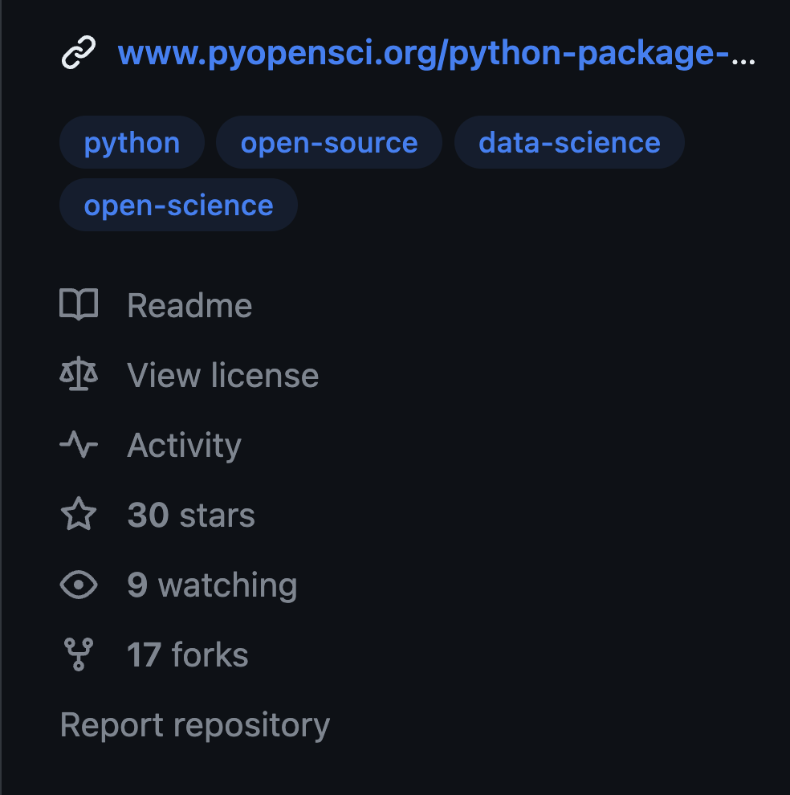

# Add a README file to your Python package

<!--
TODO:
* add link -

* add a screenshot of the pyospackage readme rendered in GitHub
* this series would be great if there was a graphic with all of the steps. and each was highlighted at the top of the page.
*  **TODO:** we didn't ask them to put code into a src dir in the previous lesson? probably good to do that.

 -->


In the [previous lesson](1-installable-code.md) you:

1. Learned how create the basic structure of a Python package and
2. How to make your code `pip` installable.

:::{admonition} Learning objectives

In this lesson you will learn:

1. How to add a **README.md** file to your package.
2. What the core elements of a **README.md** file are.

:::


::::{grid} 2

:::{grid-item}
:columns: 4
:class: sd-m-auto

```{button-link} https://www.pyopensci.org/python-package-guide/documentation/repository-files/readme-file-best-practices.html
:color: secondary
:class: sd-rounded-pill float-left

<i class="fa-solid fa-clover"></i> pyOpenSci README file overview guide.
```

:::

:::{grid-item}
:columns: 4
:class: sd-m-auto

```{button-link} https://docs.github.com/en/repositories/managing-your-repositorys-settings-and-features/customizing-your-repository/about-readmes
:color: secondary
:class: sd-rounded-pill float-left

<i class="fa-brands fa-github"></i> Guide: about `README.md` files
```
:::


:::{grid-item}
:columns: 4
:class: sd-m-auto

empty
:::
::::


## What is a README file?

The `README.md` file is a file located at the root of your GitHub or GitLab repo that helps
a user understand:

- You package's name and what it does
- The current development "state" of the package (through badges)
- How to use your package: this might include a short get started demo that shows someone how to import and quickly use your package. Or it could be a set of links to get started tutorials in your documentation.
- How to contribute to your package: normally you would link to a `CONTRIBUTING.md` and `CODE_OF_CONDUCT.md` file in this part of the readme
- How to cite your package

Your **README.md** file is important as it is often the first thing that someone sees before they install your package. The README file also will be used to populate your PyPI landing page. So it's good to create this file before you publish to PyPI.

### GitHub highlights your README file as a core file

Every GitHub repository landing page has a right hand side bar that lists and links to elements of your package including:

- A link to your Readme file
- Your license
- Number of Stars and
- Number of Forks

:::{figure-md} github-sidebar


The README.md file is not only the landing page for your package, it also is listed as one of the core elements describing your package repository on GitHub.
:::

## Create a README.md file for your package

- To get started if it doesn't already exist, create a file called `README.md` in your local GitHub repository.

- At the top of the `README.md` file, add the name of your package (and a logo if you have one). It's fine if you don't have a logo.

- Next add the following sections to your `README.md` file

1. **Badges:** Add any badges below the name of your file. if you don't have badges yet, that is ok. you'll have at least one once you [publish your package to PyPI](6-publish-pypi) in lesson 4.
2. **Package overview:** Below the badges, add a section that provides an easy-to-understand overview of what your package does. Keep this section short and if you can avoid jargon or define technical words to make the description accessible to more people.
3. **Installation Instructions:** Below the description add installation instructions. this might tell people how to install your package `pip install packagename` or `conda install`... You can come back and add this information after you publish to PyPI in lesson 4.
4. **Additional Setup Information** In this section also briefly document (or link to documentation for) any additional setup that is required to use your package. This might include tokens or authentication information if it is applicable to your package. Or additional installations of tools such as GDAL, etc. Note: many packages won't need any additional information here!
5. **How to use your package:** Next add a brief demo of how to use your package. this might include a small code chunk that demonstrates importing and a quick call to functionality in your package.
6. **Descriptive links to docs:** Unless you already have your documentation online, you can leave this section empty for now. this section would include links to tutorials or documentation get-started pages that will help your users understand how to use your package.
7. **Community section:** this is where you'll add links to your contributing guide and `CODE_OF_CONDUCT.md` once you create those. You can also leave this empty for now. You will add a [`CODE_OF_CONDUCT.md` file in the next lesson](4-add-license-file.md).
8. **Citation information:** also leave this empty for now. You can learn how to setup your repository with zenodo to make it citable in [this lesson](extras/2-connect-repo-to-zenodo.md).

Your finished `README.md` file should look something like this:

```markdown
# pyOpenSci-package

[](https://doi.org/10.5281/zenodo.8365068)
[](https://github.com/pyOpenSci/software-review/issues/115)

## What packagename does

Short description here using non technical language that describes what your package does.

## How to install

<todo - when i add more to the pyos package this can use that readme>
To install this package... use:

`pip install packagename`

## OPTIONAL - if you have additional setup instructions add them here. if not, skip this section.

## Get started using packagename

Here add a quick code demo showing a user how to use the package after it is installed.

`
from packagename.module import xmethod

a = xmethod.dosomething(var1, var2)

`

You can also add any links to this section to tutorials in your documentation.

## Community

Add information here about contributing to your package. Be sure to add links to your `CODE_OF_CONDUCT` file and your development guide. For now this section might be empty. You can go back and fill it in later.

## How to cite packagename

citation information here
```

## Wrapping up

It's important to consider the information that a new user or contributor might
need when creating your `README.md` file. Above is a set of recommendations as you are just getting
started. You may find the need for other elements to be added to this file
as you further develop your package and as a community begins to use your
package.

For instance, as you add get-started tutorials to your documentation, you can
link directly to those in the README file.

In the [next lesson](4-add-license-file.md), you will add a LICENSE file to
your Python package repository. A license file is critical as it tells users how they legally can (and can't use your package). It also:

* Builds trust with your users
* Discourages misuse of your package and associated code
