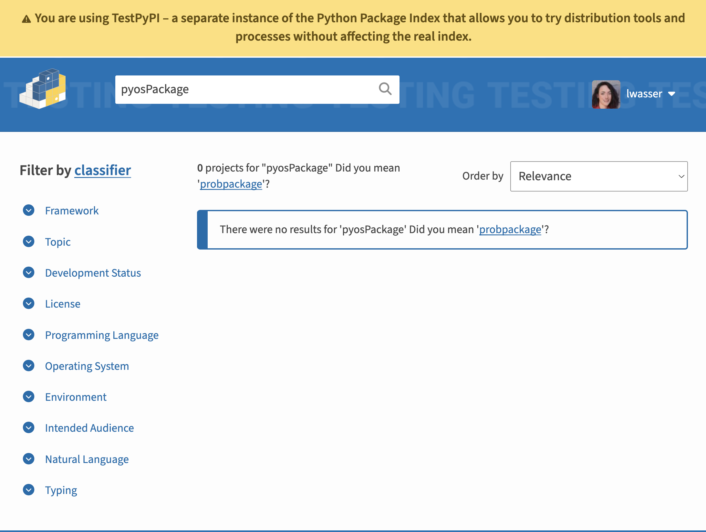
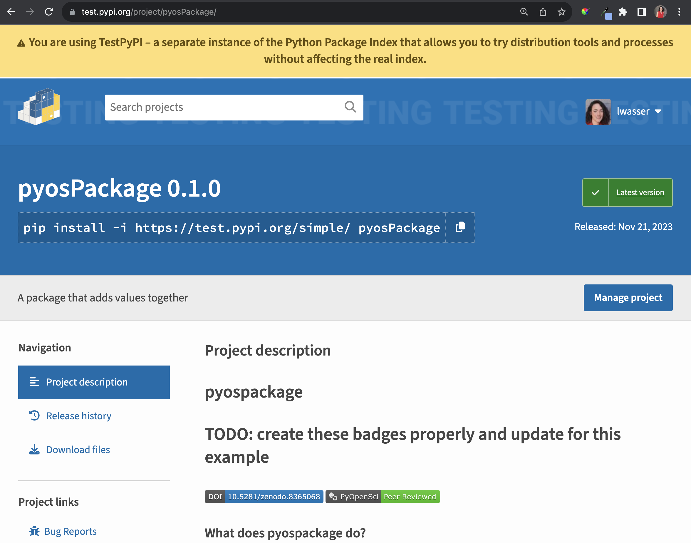

# Publish your Python package to PyPI

<!-- TODOs:

* mention twine keyring - - https://twine.readthedocs.io/en/stable/#keyring-support
* emphasize that we recommended the trusted publisher github action for most maintainers

TODO: Go back to pyproj toml lesson and add a dev dependencies section with build and twine so they can just pip install -e .[dev] into their environment and be done

`pip install build`
-->


In the previous lessons, you've learned:

1. How to make your code pip installable.
2. How to add a `README`, `LICENSE` & `CODE of CONDUCT` file file to your package
3. How to setup your `pyproject.toml` file to support publishing on PyPI.

:::{admonition} Learning Objectives
:class: tip

In this lesson you will learn how to:

- How to build your package's source (sdist) and wheel distributions
- Setup an account on testPyPI (the process is similar for the real PyPI)
- Publish your package to testPyPI using [twine](https://twine.readthedocs.io/en/stable/)

Once your package is on PyPI you can then easily publish it to conda-forge
using the [grayskull](https://conda.github.io/grayskull/) tool. You do not need to build the package specifically
for conda, conda-forge will build from your PyPI source distribution file (sdist). You will learn how to publish to conda-forge in the [next lesson](7-publish-conda-forge.md).

In a followup lesson, you will learn how to automate publishing to PyPI using GitHub actions.
:::

:::{figure-md} build-workflow-tutorial


You need to build your Python package in order to publish it to PyPI (or Conda). The build process organizes your code and metadata into a distribution format that can be uploaded to PyPI and subsequently downloaded and installed by users. NOTE: you need to publish a sdist to PyPI in order for conda-forge to properly build your package automatically.
:::

<!-- Pypa resource: https://packaging.python.org/en/latest/tutorials/packaging-projects/#uploading-the-distribution-archives
https://spdx.org/licenses/PSF-2.0.html (double check that we can use language from pypa tutorial??

https://packaging.python.org/en/latest/guides/using-testpypi/
-->

## Test PyPI.org vs PyPI

There are two "warehouses" that you can use to publish your package.

1. **Test PyPI (https://test.pypi.org):** Test PyPI is a version of the PyPI repository that can be used for testing. This is a great place to practice and learn how to publish a package without taking up space on the real PyPI servers.
2. **Real PyPI (https://pypi.org):** This is the PyPI "warehouse" where you can officially publish your Python package. IMPORTANT: only publish your package to PyPI when you are ready for it to be used by others and/or confident that it will become a package that you maintain. PyPI is not a place to practice learning how to publish a Python package.

The steps for publishing on test PyPI vs. real PyPI are the same with the
exception of a different url. Thus, in this lesson you will use testPyPI
to practice and learn.

<!-- Add when this lesson is created - in xx lesson, you will learn how to setup an automated release workflow on GitHub
using GitHub actions that will automate the PyPI publication process whenever
you create a new software release. -->


## 3 Steps for publishing a Python package on PyPI

There are 3 things that you need to do to publish your Python package
to PyPI. You need to:

1. [**Build your package**](../package-structure-code/python-package-distribution-files-sdist-wheel). Building a package is the process of turning your code into 2 distribution files: an sdist and a wheel. The wheel distribution file is particularly important for users who will `pip install` your package.
2. **Create an account on (test) PyPI**: You will need to create a PyPI account and associated token which provides permissions for you to upload your package.
3. **Publish to PyPI using `twine`**: Once you have completed the above two steps, you are ready to use `twine` to publish your package!

The first time you publish your package to PyPI you will do it manually.
After that you can opt to create a automated workflow that publishes an updated
version of your package to PyPI every time you create a release on GitHub.

:::{admonition} Learn more about building Python packages in our guide
:class: tip
- [Learn more about building here](../package-structure-code/python-package-distribution-files-sdist-wheel)
- [Learn more about the wheel](#python-wheel)
- [Learn more about the sdist (source distribution)](#python-source-distribution)

:::

## Step 1: Build your package's sdist and wheel distributions

To begin you will need to create your package's sdist and wheel distribution
files. This process is known as building your package.

1. Activate your development environment if it is not already active.
2. Install your package requirements if you haven't already. based on the `pyproject.toml` (do i need this if they just install twine manually below? )

### **If you are using conda for your environment manager:**

```bash
> conda activate pyospackage-dev
> conda list
> pip install -e .[dev]
```

### If you are using venv:

::::{tab-set}

:::{tab-item} Linux/Mac
```bash
> source pyospackage-dev /bin/activate
> pip list
> pip install -e .[dev]
```

:::

:::{tab-item} Windows

```bash
> pyospackage-dev\Scripts\activate
> pip list
> pip install -e .[dev]
```
:::

::::


3. You are now ready to build your package! Note that here you are using the [PyPA build tool](https://github.com/pypa/build) as a "Front end" tool that builds
your package's sdist and wheel using the hatchling build back end. Remember that you defined your build backend here in the build system table of your `pyproject.toml` file. So build knows to use [hatchling](https://hatch.pypa.io/latest/).

To build your package run:

`python -m build`

```bash
❯ python -m build

* Creating virtualenv isolated environment...
* Installing packages in isolated environment... (hatchling)
* Getting build dependencies for sdist...
* Building sdist...
* Building wheel from sdist
* Creating virtualenv isolated environment...
* Installing packages in isolated environment... (hatchling)
* Getting build dependencies for wheel...
* Building wheel...
Successfully built pyospackage-0.1.0.tar.gz and pyospackage-0.1.0-py3-none-any.whl
```
When you build your package, it will create two output "files":

1. [.whl or wheel file](/package-structure-code/python-package-distribution-files-sdist-wheel.html#wheel-whl-files) and
2. a [sdist (source distribution)](../package-structure-code/python-package-distribution-files-sdist-wheel.html#source-distribution-sdist) stored in a `.tar.gz` compressed format.


```
dist/pyospackage-0.1.0-py3-none-any.whl
dist/pyospackage-0.1.0.tar.gz
```
:::{admonition} Learn more about the wheel and sdist formats
:class: tip
You can learn more about both of these distribution files and package
building in general in the [build page of our packaging guide](../package-structure-code/python-package-distribution-files-sdist-wheel).
:::

The above two files are what you will need to publish your package to
PyPI. The tar.gz file is particularly important if you wish to [publish
your package to conda-forge](7-publish-conda-forge). You'll learn more about that in this
lesson.

### Congratulations - you've created your package distribution files

You've now created your package distribution. You're officially on
your way to publishing your package on PyPI.

## Step 2. Setup your testPyPI account

Next, you'll setup an account on `testPyPI`. Remember that you
are using testPyPI here instead of the real PyPI as a way to
safely learn how to publish a package without stressing the
real PyPI's servers up with lots of "test" packages.

:::{admonition} Test vs. real PyPI
If you have a package that you are confident belongs on the real PyPI. All of the steps below will also work for you with slight modifications which will be noted below.
:::

1. [Open up a web browser and go to the test PyPI website](https://test.pypi.org/).
2. [Create an account](https://test.pypi.org/account/register/) if you don't already have one. Be sure to store your password in a safe place!
3. Once you have an account setup, login to it.
4. Search on [https://test.pypi.org/](https://test.pypi.org/) (or pypi.org) to ensure that the package name that you have selected doesn't already exist. If you are using our test pyosPackage, then we suggest that you add your name or GitHub username to the end of the package name to ensure it's unique.

Example: `pyosPackage_yourNameHere`.

:::{figure-md} build-workflow-tutorial


Before you try to upload to (test) PyPI, check to see if the name of your package is already taken. You can do that using
the search box at the top of the (test) PyPI website.
:::


:::{admonition} Setup 2-factor (2FA) authentication

2-factor authentication is a secure login process that allows you to
use a backup device that only you can access to validate that the person logging in is really you. It addresses the issue of password phishing where someone else gains access to a password and can login to your account.

This matters on PyPI because someone could login to your account and upload a version of your package that has security issues. These issues will then impact all of your users when they download and install that version of the package.

While you don't have to setup 2-factor authentication, we strongly
suggest that you do so.
:::

## Step 3. Create a package upload token

To upload your package to PyPI, you will need to create a token. Ideally
this token is specific to the package that you are publishing.

However, if your package isn’t already on PyPI, then you will need to create a token for your account first and then create a package-specific token.

:::{admonition} Why create package-specific tokens?

It's ideal to create a package-specific token. When you create an account wide token this allows anyone with access to then access all of your PyPI projects. By creating a package specific token, you are limiting the scope of the token to only your specific package. This is just a safe way to set things up for you particularly if you are collaborating with others on package development.
:::


## Create a secure PyPI token

Follow the steps below to create your token.

* First login and go to your account settings in testPyPI
* Scroll down to the **API tokens** section
* Click on the **Add API Token** button
* If you are new to using PyPI and don't have any packages there yet, OR if you have other packages on PyPI but are uploading a new package, you will need to create an account-wide token.


:::{admonition} Tool options for publishing to PyPI

In this lesson you use twine to upload to PyPI. Note that other tools such as Flit, Hatch and PDM use slightly different approaches to storing and accessing your token to support uploading your package to PyPI. All of those tools are great ways to publish your package and provide a more end-to-end packaging solution.
:::


### Using a PyPI token

To use your API token, you do the following:

* Set your username to `__token__`
* Set your password to the token value, including the pypi- prefix

### Upload to PyPI using twine

It can be challenging to always have to type in your username
and token value for PyPI. Twin allows  you to store both your
username and token value in a `.pypirc` file stored in your
computer's `$HOME` directory. This file is then used every
time you upload to PyPI so you don't have to find and enter
the long token each time.

```toml
[pypi]
username = __token__
password = <the token value, including the `pypi-` prefix>
```

:::{admonition}
:class: note
NOTE: the `.pypirc` file stores your token in plain text format. Thus, in another lesson you will learn how to store your PyPI authentication information in a GitHub secret / or trusted publisher ...
:::


:::{admonition} using a .pypirc file if your always publishing manually
### Create your `.pypirc` file with authentication information

To create your `.pypirc` file, do the following.

1. open up bash / your terminal
2. Create a new file using touch
3. Open the file in your favorite text editor. Below you use vscode but any text editor will work.

The commands for the above steps are below:

```bash
$ touch ~/.pypirc
$ code .pypirc # open with vscode
```
Once you open up the file in vscode or whatever text editor you prefer, you can add a toml table containing your testPyPI username and token information stored in a password key.

```toml
[testpypi]
  username = __token__
  password = pypi-rest-of-your-token-here
```
Save the file and then check that it looks correct in bash using the `cat` command:

```bash
# view the file printed in your terminal
$ cat ~/.pypirc
```

:::

Now, install twine:

::::{tab-set}

:::{tab-item} Linux/Mac

```bash
python3 -m pip install --upgrade twine
```
:::

:::{tab-item} Windows
```bash
py -m pip install --upgrade twine
```
:::
::::

### Upload your package

Once you have stored your PyPI authentication information you
can upload your package to PyPI.

::::{tab-set}

:::{tab-item} Linux/Mac

```bash

❯ python3 -m twine upload --repository testpypi dist/*

Uploading distributions to https://test.pypi.org/legacy/
Uploading pyospackage-0.1.0-py3-none-any.whl
100% ━━━━━━━━━━━━━━━━━━━━━━━━━ 8.8/8.8 kB • 00:00 • 6.6 MB/s
Uploading pyospackage-0.1.0.tar.gz
100% ━━━━━━━━━━━━━━━━━━━━━━━━━ 8.6/8.6 kB • 00:00 • 3.1 MB/s

View at:
https://test.pypi.org/project/pyosPackage/0.1.0/
```

:::

:::{tab-item} Windows

```bash

❯ py -m twine upload --repository testpypi dist/*

Uploading distributions to https://test.pypi.org/legacy/
Uploading pyospackage-0.1.0-py3-none-any.whl
100% ━━━━━━━━━━━━━━━━━━━━━━━━━ 8.8/8.8 kB • 00:00 • 6.6 MB/s
Uploading pyospackage-0.1.0.tar.gz
100% ━━━━━━━━━━━━━━━━━━━━━━━━━ 8.6/8.6 kB • 00:00 • 3.1 MB/s

View at:
https://test.pypi.org/project/pyosPackage/0.1.0/
```
:::

::::


<!-- TODO: Add windows instructions for each of the above -->

:::{admonition} Two factor authentication and PyPI

If you have 2FA setup and try to upload to PyPI using a username and
password, you will get an error similar to the one below. To
upload to PyPI you will need to setup a token authentication.
You will learn how to do that below.

```bash
➜ python3 -m twine upload --repository testpypi dist/*
Uploading distributions to https://test.pypi.org/legacy/
Enter your username: your-pypi-username-here
Enter your password: your-password-here
Uploading pyospackage-0.1.0-py3-none-any.whl
100% ━━━━━━━━━━━━━━━━━━━━━━━━━━━━━━━━━━━━━━━━ 8.8/8.8 kB • 00:00 • 4.0 MB/s
WARNING  Error during upload. Retry with the --verbose option for more details.
ERROR    HTTPError: 401 Unauthorized from https://test.pypi.org/legacy/
         User lwasser has two factor auth enabled, an API Token or Trusted Publisher must
         be used to upload in place of password.
```

:::


## Install your package from TestPyPI

Once your package is uploaded to test PyPI, you can install it from testPYPI.
You can find the installation instructions on the testPyPI landing page for your newly uploaded package.

:::{figure-md} testpypi-landing-page


This is an example landing page for the pyosPackage that was just uploaded. Notice at the top of the page there is instructions for how to install the package from test PyPI. You can simply copy that code and use it to install your package from testPyPi locally.
:::


[Check out our pyOpenSci test package landing page here](https://test.pypi.org/project/pyosPackage/) for an example. NOtice at the top there is the package name and version. Below are installation instructions:

`pip install -i https://test.pypi.org/simple/ pyosPackage`

### Time to install your package

* On your computer, activate the development environment that
you wish to install your newly published package in.
* Run the installation instructions for your package from test PyPI.

::::{tab-set}

:::{tab-item} Conda

```bash
> conda activate pyospkg-dev
> pip install -i https://test.pypi.org/simple/ youPackageNameHere
> conda list
```
:::

:::{tab-item} venv mac / Linux
```bash
> source pyospackage-dev /bin/activate
> pip install -i https://test.pypi.org/simple/ youPackageNameHere
> pip list
```
:::

:::{tab-item} venv windows
```bash
> source pyospackage-dev /bin/activate
> pip install -i https://test.pypi.org/simple/ youPackageNameHere
> pip list
```
:::
::::


:::{admonition} The value of end-to-end tools like hatch, flit and poetry
In this lesson we are using core tools including:

* hatchling
* PyPA's build
* twine

to build and publish your package to PyPI.

End-to-end packaging tools such as Hatch, PDM, Poetry and
Flit can manage all of the above steps but have to be
configured.

For example, while twine users a `.pypirc` file, Hatch will cache your PyPI token information to make publishing to PyPI from your computer easier. Be sure the read the documentation for any end-to-end publication tool that you chose to use.
:::


<!-- TODO: venv will always be different for windows - do we need a third tab?? Also is conda different on windows? i forget -->

<!--TODO: teach them to setup trusted publisher for actions... in the actions lesson
https://pypi.org/help/#twofa

from PyPI: https://pypi.org/help/#apitoken - You can create a token for an entire PyPI account, in which case, the token will work for all projects associated with that account. Alternatively, you can limit a token's scope to a specific project.
 -->

## Package-specific token vs trusted publisher

For long run maintenance of your package, you have two options
related to PyPI publication.

1. You can create a package-specific token which you will use to publish your package (manually) to PyPI. This is a great option if you don't wish to automate your PyPI publication workflow.
2. You can also create an automated publication workflow on GitHub using GitHub actions. This is a great way to make the publication process easier and it also supports a growing maintainer team. In this case we suggest you don't worry about the token and instead setup a specific GitHub action that publishes your package when you make a release. You can then create a "trusted publisher" workflow on PyPI.

You will learn how to create the automated trusted publisher workflow in a followup lesson.


### OPTIONAL: If you want to use a manual token-based publication workflow

If you plan to use your token regularly to publish to PyPI, we strongly recommend going through the above steps again to create
a token specific to your new package.

To do this:
1. Go to testPyPI
1. Navigate to the "Your Projects" section of your account
2. Click on the manage button for the project that ou wish to add a token for
3. Go to settings
4. Click on "Create a token for your-package-name-here"
5. Create the token and follow the steps above to open up the `.pypirc` file
6. Replace the old account wide token with your new package token.

And you're all done!

## You have published your package to (test) PyPI!

Congratulations. You have now successfully published your package to testPyPI. If you have a package that is ready for real-world use on the real pyPi, then you can follow the same steps to publish it on PyPI.org .

Once you publish on PyPI.org, you can then easily add your package to the conda-forge ecosystem using the [grayskull](https://conda-forge.org/blog/posts/2020-03-05-grayskull/) tool.

`__init__.py`

You will learn how to do that in the next lesson.
