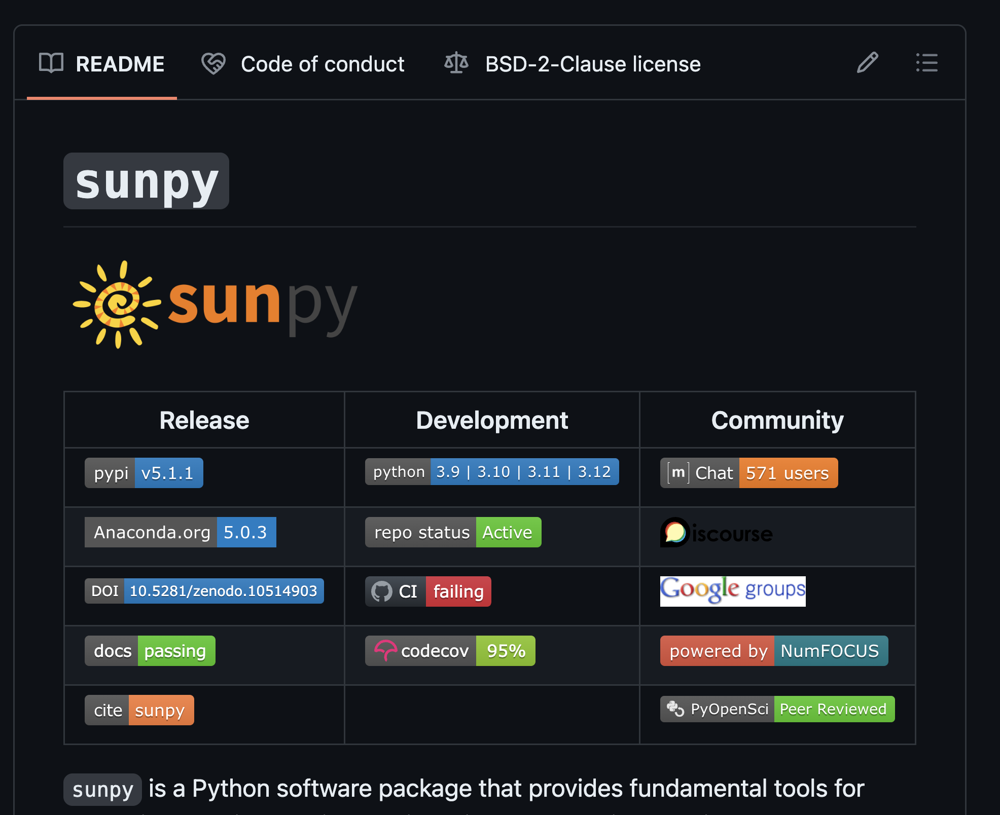
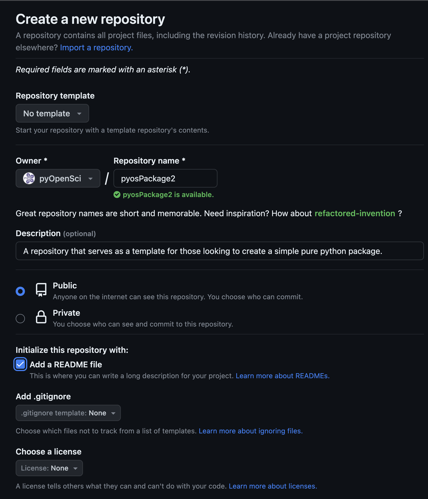
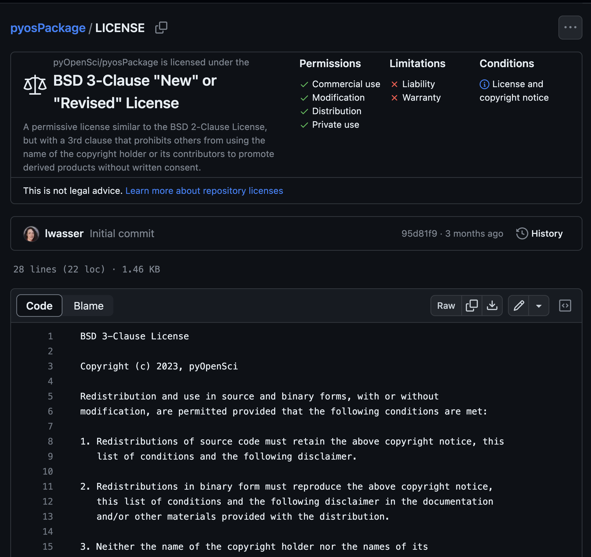

# Add a `LICENSE` & `CODE_OF_CONDUCT` to your Python package

In the [previous lesson](add-readme) you:

<i class="fa-solid fa-circle-check" style="color: #703c87;"></i> Created a basic `README.md` file for your scientific Python package

<i class="fa-solid fa-circle-check" style="color: #703c87;"></i> Learned about the core components that are useful to have in a `README` file.

:::{admonition} Learning objectives
:class: tip

In this lesson you will learn:

1. How to select a license and add a `LICENSE` file to your package repository, with a focus on the GitHub interface.
2. How to add a `CODE_OF_CONDUCT` file to your package repository.
3. How you can use the Contributors Covenant website to add generic language as a starting place for your `CODE_OF_CONDUCT`.
:::

## What is a license?

A license contains legal language about how users can use and reuse your software. To set the `LICENSE` for your project, you:

1. Create a `LICENSE` file in your project directory that specifies the license that you choose for your package.
2. Reference that file in your `pyproject.toml` data where metadata are set.

By adding the `LICENSE` file to your `pyproject.toml` file, the `LICENSE` will be included in your package's metadata which is used to populate your package's PyPI landing page. The `LICENSE` is also used in your GitHub repository's landing page interface.

### What license should you use?

We suggest that you use a permissive license that accommodates the other most commonly used licenses in the scientific Python ecosystem (MIT[^mit] and BSD-3[^bsd3]). If you are unsure, use MIT given it's the generally recommended
license on [choosealicense.com](https://choosealicense.com/).

:::{admonition} Licenses for the scientific Python ecosystem
[We discuss licenses for the scientific Python ecosystem in more detail here in our guidebook.](../documentation/repository-files/license-files)
:::

### Where should the `LICENSE` file live

Your `LICENSE` file should be placed at the root of your package's repository.
When you add the `LICENSE` at the root, GitHub will automagically discover it and
provide users with a direct link to your `LICENSE` file within your GitHub
repository.

:::{figure-md} github-coc-readme-license-tabs


Notice at the top of the
README portion of the GitHub landing page, there are three tabs directly linking to the `README` file which is visible, the `CODE_OF_CONDUCT` file and one that specifies
the license that SunPy uses. These files are discovered by GitHub because they
are placed in the root of the project directory using standard naming conventions.
:::


### How to add a `LICENSE` file to your package directory

There are several ways to add a `LICENSE` file:

1. When you create a new repository on GitHub, it will ask you if you wish to add a `LICENSE` file at that time. If you select yes, it will create the file for you.
2. You can add a `LICENSE` through the GitHub gui following the [<i class="fa-brands fa-github"></i> instructions here](https://docs.github.com/en/communities/setting-up-your-project-for-healthy-contributions/adding-a-license-to-a-repository).
3. You can add the file manually as we are doing in this lesson.

:::{tip}
If you completed the past lessons including

1. [Making your code installable](create-python-package.md) and
2. [publishing your package to PyPI](publish-pypi.md)

then you already have a `LICENSE` file containing text for the MIT license in your Python package. Thus you can skip to the next section of this tutorial which walks you through adding a `CODE_OF_CONDUCT`.

If you don't yet have a `LICENSE` file in your directory, then continue reading.
:::

### How to add a `LICENSE` to your package - the manual way

If you don't already have a `LICENSE` file, and you are not yet using a platform such as GitHub or GitLab, then you can create a `LICENSE` file by

1. Create a new file called `LICENSE`. If you are using shell you can type:

```
# Create a `LICENSE` file in your shell
> touch LICENSE
```

1. Go to [choosealicense.com](https://choosealicense.com/)
2. Select permissive license
3. It will suggest that you use the [MIT license](https://choosealicense.com/licenses/mit/).
4. Copy the license text that it provides into your `LICENSE` file that you created above.
5. Save your file. You're all done!

:::{admonition} An overview of licenses in the scientific Python ecosystem
:class: note

In the pyOpenSci [packaging guidebook](../documentation/repository-files/license-files), we provide an overview of licenses in the scientific Python ecosystem. We review why license files are important, which ones are most commonly used for scientific software and how to select the correct license.

If you want a broad overview of why licenses are important for protecting open source software, [check out this blog post that overviews the legal side of things.](https://opensource.guide/legal/#just-give-me-the-tldr-on-what-i-need-to-protect-my-project)
:::

::::::{dropdown} Instructions for adding a `LICENSE` file within the GitHub interface
:color: primary

:::::{tab-set}

::::{tab-item} Add license: new GitHub repository

When you create a new GitHub repository you can add a `LICENSE` file
through the GitHub interface.

:::{figure-md} github-new-repo



Image showing the GitHub interface that allows you to add a `LICENSE` and `README` file when you create a new repository.
:::
::::

::::{tab-item} Add `LICENSE`: Existing GitHub repository

If you already have a GitHub repository for your package, then you can add a `LICENSE` using the GitHub interface by adding a new file to the repository.

- Follow the instructions to select and add a license to your repository on the [GitHub LICENSE page](https://docs.github.com/en/communities/setting-up-your-project-for-healthy-contributions/adding-a-license-to-a-repository) .
- Once you have added your `LICENSE` file, be sure to sync your git local repository with the repository on GitHub.com. This means running `git pull` to update your local branch.

:::{figure-md} view-license


You can view a summary of the `LICENSE` chosen on your project's
GitHub landing page.
:::
::::

:::::
::::::

Now you know how to add a `LICENSE` to your project. Next, you'll learn
about the `CODE_OF_CONDUCT.md` file and how to add it to your
package directory.

(add-coc)=
## What is a code of conduct file?

A `CODE_OF_CONDUCT` file is used to establish guidelines for how people in your community interact.

This file is critical to supporting your community as it
grows. The `CODE_OF_CONDUCT`:

1. Establishes guidelines for how users and contributors interact with each other and you in your software repository.
2. Identifies negative behaviors that you don't want in your interactions.

You can use your code of conduct as a tool that can be referenced when moderating challenging conversations.

### What to put in your `CODE_OF_CONDUCT` file

If you are unsure of what language to add to your `CODE_OF_CONDUCT`
file, we suggest that you adopt the [contributor covenant language](https://www.contributor-covenant.org/version/2/1/code_of_conduct/) as a starting place.


The `CODE_OF_CONDUCT.md` should be placed at the root of your project directory, similar to the `LICENSE` file.

### How to add a `CODE_OF_CONDUCT` file to your package directory

- Add a `CODE_OF_CONDUCT.md` file to the root of your repository if it doesn't already exist.

```bash
> touch CODE_OF_CONDUCT.md
```

- Visit the [contributor covenant website](https://www.contributor-covenant.org/) and add [the markdown version of their code of conduct](https://www.contributor-covenant.org/version/2/1/code_of_conduct/code_of_conduct.md) to your `CODE_OF_CONDUCT.md` file. Be sure to fill in any placeholder information. Read the text closely to ensure you both understand it and also agree with its contents!

That's it - you've now added a code of conduct to your package directory.

:::{admonition} Additional Code of Conduct resources
:class: note

- [<i class="fa-brands fa-github"></i> Guide: `CODE_OF_CONDUCT.md` files](https://docs.github.com/en/communities/setting-up-your-project-for-healthy-contributions/adding-a-code-of-conduct-to-your-project)
- [pyOpenSci package guide `CODE_OF_CONDUCT.md` overview](https://www.pyopensci.org/python-package-guide/documentation/repository-files/code-of-conduct-file.html)
:::

## <i class="fa-solid fa-hands-bubbles"></i> Wrap up

In this lesson and the [last lesson](add-readme), you have added a:

- `README` file;
- `LICENSE` file and a
- `CODE_OF_CONDUCT` file.

These are fundamental files needed for every scientific Python package
repository. These files help users understand how to use your package and
interact with package maintainers.

In the upcoming lessons, you will:

- [Add more metadata to your `pyproject.toml` file](pyproject-toml) to support building and publishing your package on PyPI.
- Publish a new version of your Python package to the test PyPI to preview the
  updated metadata landing page.

---

## Footnotes

[^mit]: https://opensource.org/license/mit/
[^bsd3]: https://opensource.org/license/bsd-3-clause/
