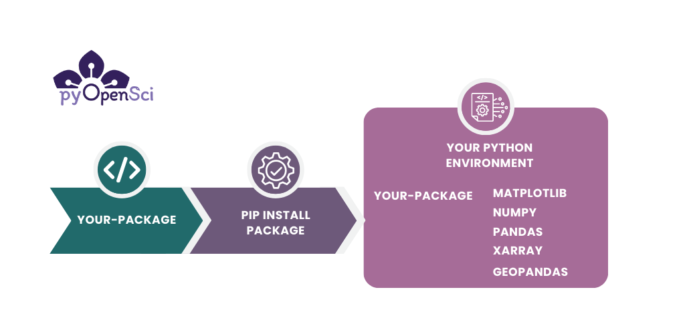
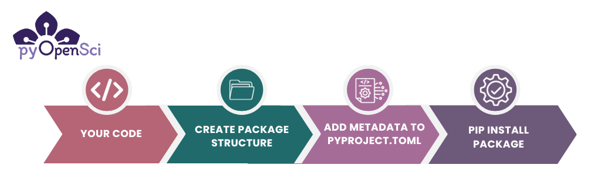

(create-pure-python-package)=
# Create a pure Python package

:::{admonition} About this lesson
:class: tip

This lesson uses the pyOpenSci Python package copier template to create a Python package quickly. Your package will be installable both locally and remotely from a website such as
GitHub (or GitLab) into a Python environment.

In this lesson, you will learn:

- How to make your code installable into any Python environment, both locally and from GitHub
- How to update a `pyproject.toml` file, which contains the metadata needed to build, install, and publish your package.
- How to declare a [build backend](build_backends) which will be used to [build](build-package) and install your package
- How to install your package in editable mode for interactive development


**What you need to complete this lesson**

To complete this lesson, you will need a local Python
environment and shell on your computer.
 You will need to have [Copier](https://copier.readthedocs.io/en/stable/) and [Hatch installed](get-to-know-hatch) to complete the lesson successfully.

If you are using Windows or are not familiar with Shell, you may want to check out the Carpentries shell lesson[^shell-lesson]. Windows users will likely need to configure a tool such as [gitbash](https://gitforwindows.org/) for any Shell and git-related steps.

:::


:::{figure-md} packages-environment



In a [previous lesson, you learned what a Python package is](intro). Creating a Python package allows you to install your code into any Python environment on your computer. You can then import it into workflows in the same way that you might import a package such as Pandas or GeoPandas. If you push your code to GitHub or GitLab, you can also install it directly from there. [Scroll to the bottom of the page to learn more about the basic elements of a Python package.](package-overview).
:::


## Create your Python package

Below, you will create a pure Python package using the [pyOpenSci copier template](https://github.com/pyOpenSci/pyos-package-template). Our template uses Hatch as the default packaging tool. At the bottom of this lesson, you'll learn more about the basics of the Python package directory structure, and associated key files (`__init__.py` and `pyproject.toml`).

## Step 1: Set Up the Package Directory Structure

* Open your shell or preferred terminal.
* Use the shell `cd` command to navigate in your shell to the location where you'd like your package to live. Our template will create the package directory structure for you
* Choose a name for your package. The name should:
    * Have no spaces (*Required*)
    * Use all lowercase characters (*Recommended*). For this tutorial, we will use `pyospackage`.
    * Only use letters and the characters _ or - in the name. This means that the name `pyos*package` is not an acceptable name. However, the names `pyos_package` or `pyos-package` are both OK.

In your terminal, **run the command below**. This will begin a series of prompts that will ask you questions and help you to customize your Python package.

```bash
copier copy gh:pyopensci/pyos-package-template .
```

After running the command above, the template will walk you through a series of questions.

Note that when you reach the prompt "Do you want to answer one more question, and skip the rest, using the default values?" you can choose <kbd>Yes, but with a minimal setup</kbd> to create the most basic version of your package that contains documentation, tests and a example module for you to use.

After this question, the template will ask you for your preferred GitHub username and will then create a package with basic tests, documentation, and GitHub configuration setup for you.

```console

➜ copier copy gh:pyopensci/pyos-package-template .
🎤 "Welcome to the pyOpenSci package template.
Please select the type of template that you want to create today."
 >> MINIMAL: I want a minimal setup (package, tests and docs; typing); linting not included).
    FULL DEFAULT: I want to use the default settings but I want it setup for me.
    FULL CUSTOM: I want it all but I want to fully customize all template elements.
🎤 What is the name of the project? Used as the README.md title, in the
   pyospackage_juno
🎤 Please provide a short description for the package.
    (Finish with 'Alt+Enter' or 'Esc then Enter')
> A great package that adds and subtracts numbers.
🎤 Who is the author of the package? Used in the package description.
   juno dawg
🎤 Provide you or your organization's GitHub username. Used to generate
   pyopensci

```
The template will then begin to copy files into the directory that used above. (`.` means current working directory

```console
...Copying from template version 0.6.4.1
    create  CODE_OF_CONDUCT.md
    ...The template will continue to copy files...
```

The final package structure will look like this:

```console
└── .github/ # a hidden directory with templates for github and actions to run your tests
├── CHANGELOG.md
├── CODE_OF_CONDUCT.md
├── CONTRIBUTING.md
├── LICENSE
├── README.md
├── pyproject.toml
└── src/  # This is your package directory where your code lives
└── docs/ # this is where your documentation lives
└── tests/ # Your tests are here
```

:::{dropdown} A full package with tests, docs, and GitHub infrastructure
:animate: fade-in-slide-down

If you use the "bells and whistles" default option when working through the template prompts,
our template will create a complete package setup with GitHub CI actions, typing, tests, environments
, and more using Hatch. If you customize the entire package, then you can select what platform you wish to host it on (GitHub vs GitLab), whether you want typing, what documentation engine you want to use, and more.

The resulting package directory looks like this

```console
├── CHANGELOG.md
├── CODE_OF_CONDUCT.md
├── CONTRIBUTING.md
├── LICENSE
├── README.md
├── docs # This defaults to sphinx docs
│   ├── conf.py
│   └── index.md
├── pyproject.toml
├── src/   # This is your package directory where your code lives
│   └── pyospackage_pyopensci/
|       ├── __init__.py
|       └── example.py
└── tests/   # This is where your tests live, you don't need subdirectories, but they are nice to have
    ├── integration/
    ├── system/
    └── unit/
        └── test_example.py
```

The default tools that your package uses are:

* [Sphinx](https://www.pyopensci.org/python-package-guide/documentation/hosting-tools/sphinx-python-package-documentation-tools.html) with the pydata_sphinx_theme for documentation
* pytest for testing
* Hatch for environment setup

**Full customization**
If you want to customize any elements of your package setup, choose `No, I want to fully customize the template.`.  This will allow you to select:

* sphinx vs [mkdocs](https://www.mkdocs.org/) vs no documentation
* GitHub vs GitLab
* VCS versioning
* and more
:::

## Step 2: Explore the existing module in your package

A Python module refers to a `.py` file containing the code that you want your package to access and run. Within the `pyospackage` subdirectory, you have an example.py module that you can use to test out your package quickly.

Notice that the code in the example.py module, has a few features:

1. It has a [numpy-style docstring](numpy-docstring)
2. It uses [typing](type-hints)
3. At the top of the module, there is a docstring explaining what the module does.

Python supports different docstring formats. The most popular formats for documenting Python objects are NumPy Style Docstring[^numpydoc], Google Style Docstring[^googledoc], and the Epytext Style Docstrings[^epytextdoc].

**pyOpenSci recommends using the NumPy Docstring convention.**

[Learn more about docstrings here](api-docstrings) for an overview of both topics.

```python
def add_num(a: int, b: int) -> int:
    """
    Add two numbers.

    Parameters
    ----------
    a : int
        The first number to be added.
    b : int
        The second number to be added.

    Returns
    -------
    int
        The sum of the two input numbers (a + b).

    Examples
    --------
    >>> add_num(3, 5)
    8
    >>> add_num(-2, 7)
    5
    """
    return a + b
```

:::{admonition} Python modules and the `__init__.py` file
:class: tip

The word module refers to a `.py` file containing Python code.

The `__init__.py`  allows Python to recognize that a directory contains at least one module that may be imported and used in your code.
A package can have multiple modules[^python-modules].

:::


## Step 3: Optional -- Add code to your module

If you want, add a second function to the `example.py` module. It can be a simple function.
For example, write a second function that multiplies numbers.

## Step 4: Check out the metadata in your `pyproject.toml` file

A `pyproject.toml` file stores metadata that provides instructions to various tools interacting with it, including Hatch, which will build your package. You can also specify metadata for your package.

You will learn more about the `pyproject.toml` format in the
[next lesson when you add additional metadata/information to this file.](pyproject-toml.md)

The metadata in your generated pyproject.toml is already setup for you using the information you provided the copier template above.

:::{admonition} Brief overview of the TOML file
:class: tip

[The TOML format](https://toml.io/en/) consists of tables and variables. Tables are sections of information denoted by square brackets:

`[this-is-a-table]`.

Tables can contain variables within them defined by a variable name and an `=` sign.
For instance, a `build-system` table most often holds two (2) variables:

1. `requires = `, which tells a build tool what tools it needs to install prior to building your package. In this case
   [hatchling](https://pypi.org/project/hatchling/)
2. `build-backend = `, which is used to define the specific build-backend name, (in this example we are using `hatchling.build`).

```toml
# An example of the build-system table which contains two variables - requires and build-backend
[build-system]
requires = ["hatchling"]
build-backend = "hatchling.build"
```

TOML organizes data structures, defining relationships within a configuration
file.

[Learn more about the pyproject.toml format here.](pyprojecttoml-metadata)
:::

- Open up the `pyproject.toml` file that Hatch created in your favorite text editor. It should look something like the example below.
- Make sure the package version, package name, and author name look correct. The email is optional.

```toml
[project]
name = "pyospackage"
version = "0.1.0"
description = "A small template package that does cool things."
authors = [
    { name = "pyOpenSci", email = "pyopensci@pyopensci.org" },
]
license = "MIT"
readme = {"file" = "README.md", "content-type" = "text/markdown"}
# Please consult https://pypi.org/classifiers/ for a full list.
classifiers = [
    "Development Status :: 2 - Pre-Alpha",
    "Intended Audience :: Science/Research",
    "License :: OSI Approved :: MIT License",
    "Operating System :: OS Independent",
    "Programming Language :: Python :: 3 :: Only",
]
# TODO: add keywords
keywords = []
# TODO: add dependencies
dependencies = []

[project.urls]
Homepage = "https://github.com/pyopensci/pyospackage"
"Source Code" = "https://github.com/pyopensci/pyospackage"
"Bug Tracker" = "https://github.com/pyopensci/pyospackage/issues"
Documentation = "https://pyospackage.readthedocs.io"
Download = "https://pypi.org/project/pyospackage/#files"

[project.optional-dependencies]
dev = [
    "hatch",
    "pre-commit",
]
```

At the bottom of the template-generated `pyproject.toml` file, you will see a section that defines Hatch environments. We will cover Hatch environments in a later lesson.

:::{admonition} The bare minimum needed in a pyproject.toml file
:class: tip

The core information that you need in a `pyproject.toml` file to publish on PyPI is your **package's name**  and the **version**. However, we suggest that you flesh out your metadata early on in the `pyproject.toml` file.

Once you have your project metadata in the `pyproject.toml` file, you will
rarely update it.
:::

## Step 5: Install your package locally

At this point, you should have:

1. A project directory structure with a `pyproject.toml` file at the root
2. A package directory containing an empty `__init__.py` file and
3. At least one Python module (e.g. `example.py`)

You are now ready to install (and build) your Python package!

While you can do this using Hatch, we will use pip for this lesson, so you can see how to install your tool into your preferred environment.

First, open your preferred shell (Windows users may use something like GitBash) and `cd` into your project directory if you are not already there.
- Activate the Python environment that you wish to use.
- Run `python -m pip install -e .`

:::{todo}
Add this back in when the lesson is published
- Activate the Python environment that you wish to use. If you need help with working with virtual environments check out this lesson (add link).
:::

```bash
# Activate your environment using conda or venv
# Below we use conda but you can do the same thing with venv!
> conda activate pyosdev
(pyosdev)
> conda info
    active environment : pyosdev
    active env location : /Users/your-path/mambaforge/envs/pyosdev
# Cd into your project directory
> cd pyospackage
# Install your package
> python -m pip install -e .

Obtaining file:///Users/leahawasser/Documents/GitHub/pyos/pyosPackage
  Installing build dependencies ... done
  Checking if build backend supports build_editable ... done
  Getting requirements to build editable ... done

# Check to see if the package is installed
> conda list
# use pip list instead of conda list here if you are working in an venv environment rather than a conda envt
```

:::{admonition}  What does `python -m pip install -e .` do?
:class: tip

`python -m pip install -e .` installs your package into the current active
Python environment in **editable mode** (`-e`). Installing your package in
editable mode, allows you to work on your code and then test the updates
interactively in your favorite Python interface. One important caveat of editable mode is that every time you update your code, you need to restart Python.

If you wish to install the package regularly (not in editable
mode) you can use:

- `python -m pip install . `

**Using `python -m` when calling `pip`**

Above, you use`python -m` to call the version of pip installed into your
current active environment. `python -m` is important to ensure that you are
calling the version of pip installed in your current environment.

IMPORTANT: pip can also be used to install packages from PyPI. However, in this case, you are telling pip to install your package from a local folder by using the `.`. You could also specify a path to the project directory on your computer instead of the `.` which tells pip to use the current working directory.
:::

### Look for pyospackage in your environment

Once you have installed your package, you can view it in your current
environment. If you are using `venv` or `conda`, `pip` list will return
a list of packages in the current active environment.

Note that because `pyospackage` is installed in editable mode (`-e`), pip will show you the directory path to your project's code

```bash
$ pip list

➜ pip list
Package                       Version        Editable project location
----------------------------- -------------- --------------------------------------------------------------
...
arrow                         1.2.3
...
...
mamba                         1.1.0
markdown-it-py                2.2.0
MarkupSafe                    2.1.2
matplotlib                    3.7.1
msgpack                       1.0.5
mypy                          1.4.1
nox                           2021.10.1
numpy                         1.24.2
packaging                     23.0
pandas                        1.5.3
pyosPackage                   0.1            /Users/yourusername/path/here/pyosPackage
...
...
...
```

## Step 6: Test out your new package

After installing your package, type “python” at the command prompt in your chosen terminal to start
a Python session in your active Python environment.

You can now import your package and access the `add_numbers` function.

```bash
➜ python
Python 3.11.4 | packaged by conda-forge
Type "help", "copyright", "credits" or "license" for more information.
>>> from pyospackage.example import add_numbers
>>> add_numbers(1, 2)
3
```


:::{admonition} Installing packages from GitHub

If you wish to share your code without publishing to PyPI you can
always install packages directly from GitHub using the syntax:

```bash
python -m pip install git+https://github.com/user/repo.git@branch_or_tag
```

To make your package GitHub installable, you can:

1. Create a new GitHub repository
2. Push the contents of the project directory that you created above, to GitHub
3. Finally install the package from GitHub using the command above. When you use the command above, don't forget to substitute the user, repo, and branch_or_tag with your specific values.

For instance below you install the pyospackage from the main branch of the
pyOpenSci repository.

`python -m pip install git+https://github.com/user/repo.git@branch_or_tag`

:::

## Congratulations! You created your first Python package

You have now created a Python package that you can install
into any Python environment.

In the upcoming lessons, you will:

* Add a [README file](add-readme.md) and [LICENSE](add-license-coc.md) to your package
* [Add more metadata to your `pyproject.toml`](pyproject-toml.md) file to support PyPI publication.
* [Learn how to build your package distribution](publish-pypi) files (**sdist** and **wheel**) and publish to **test PyPI**.
* Finally you will learn how to [publish to **conda-forge**](publish-conda-forge) from **PyPI**.


(package-overview)=
## About the Python package directory structure

To make your Python code installable you need to create a specific directory structure with the following elements:

- A `pyproject.toml` file.
- A specific directory structure.
- Some code.
- An `__init__.py` file in your code directory.

The directory structure you'll create in this lesson will look like this:

```bash
pyospackage/  # Your project directory
 └─ pyproject.toml
 └─ src/  # The source (src) directory ensures your tests always run on the installed version of your code
    └── pyospackage/  # Package directory where code lives
        ├── __init__.py
        ├── add_numbers.py
        └── # Add any other .py modules that you want here
```


:::{figure-md} code-to-python-package



Once you have the basic items of a Python package (code, metadata and a file structure), you can `pip install` your package into any Python environment on your computer.
:::

### About the basic package directory structure

Notice a few things about the above layout:

1. Your package code lives within a `src/packagename` directory. We suggest that you use `src` (short for **source code**) directory as it [ensures that you are running tests on the installed version of your code](https://www.pyopensci.org/python-package-guide/package-structure-code/python-package-structure.html#the-src-layout-and-testing).
1. Within the `src` directory you have a package directory called `pyospackage`. Use the name of your package for that directory name. This will be the name for importing your package in Python code once installed.
1. In your package directory, you have an `__init__.py` file and all of your Python modules. You will learn more about the `__init__.py` file below.
1. The `pyproject.toml` file lives at the root directory of your package.
1. The name of the root directory for the package is **pyospackage** which is the name of the package. This is not a requirement but you will often see that the GitHub / GitLab repository and the root directory name are the same as the package name.

### What is an `__init__.py` file?

The `__init__.py` file tells Python that a directory
should be treated as a Python package. As such, a directory with an `__init__.py` file can be imported
directly into Python. The `__init__.py` file does not need to contain any code in order for Python to recognize it; it can be empty.

For example, following the file structure example above which has an `__init__.py` file within it, you can run:

```python
import pyospackage
```

### What is a pyproject.toml file?

The **pyproject.toml** file is:

- Where you define your project's metadata (including its name, authors, license, etc)
- Where you define dependencies (the packages that it depends on)
- Used to specify and configure what build backend you want to use to [build your package](../package-structure-code/python-package-distribution-files-sdist-wheel).

After the `__init__.py` and `pyproject.toml` files have been added,
your package can be built and distributed as an installable Python
package using tools such as pip. Note that the `pyproject.toml` file
needs to have a few basic items defined for the package to be
installable including:

- The `build-backend` that you want to use,
- The project `name` and `version`.

:::{admonition} Why the pyproject.toml file is important
:class: tip

The `pyproject.toml` file replaces some of the functionality of both the
`setup.py` file and `setup.cfg` files.
If you try to pip install a package with no `pyproject.toml`, you will get the following error:

```bash
GitHub/pyospackage/testme
➜ python -m pip install .
ERROR: Directory '.' is not installable.
Neither 'setup.py' nor 'pyproject.toml' found.
```
If your project already has a `setup.py` file, Hatch can be used to automatically create a `pyproject.toml`.
* See [Using Hatch to Migrate setup.py to a pyproject.toml](setup-py-to-pyproject-toml.md)
:::


## Footnotes

[^shell-lesson]: [Carpentries shell lesson](https://swcarpentry.github.io/shell-novice/)

[^python-modules]: [Python module docs](https://docs.python.org/3/tutorial/modules.html#packages)
[^googledoc]:[Google docstring style](https://google.github.io/styleguide/pyguide.html)
[^numpydoc]: [Numpy style docs](https://numpydoc.readthedocs.io/en/latest/format.html)
[^epytextdoc]: [epydoc](https://epydoc.sourceforge.net/epytext.html)


:::{todo}
1. Is it clear where to add commands? Bash vs. Python console
Bash vs. Zsh is different
3. ADD: note about what makes something "package worthy", with a common misconception being that a package should be production-ready code that's valuable to a broad audience. This may not be a pervasive misconception in Python, but a quick break-out with an explanation of what a package can consist of would be helpful.
* They can use a codespace to complete this lesson too.
:::

:::{todo}
When this lesson exists, uncomment this admonition
You will learn how to automate defining a package
version using git tags in the version and release your package lesson.
:::
