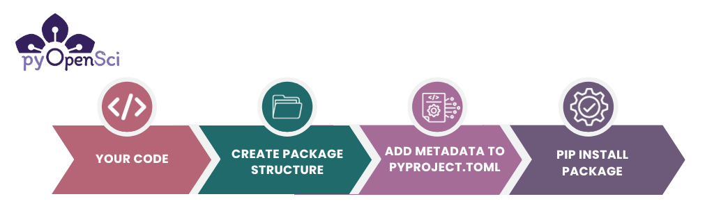

# Make your Python code installable

:::{admonition} What we previously covered
[In the previous lesson](intro), you learned about what a Python package is. You also learned about the [benefits of creating a Python
package](package-benefits).
:::

Your next step in our packaging tutorial series is to create a Python package
that is installable both locally and remotely from a website such as
GitHub (or GitLab). The package that you create in this lesson will have the
bare minimum elements needed to be installable into a Python environment.

Making your code installable is an important steps towards creating a full
Python package that is directly installable from PyPI.


:::{todo}
1. Is it clear where to add commands? Bash vs. Python console
Bash vs. Zsh is different
2. Does this lesson run as expected on windows and mac?
3. ADD: note about what makes something "package worthy", with a common misconception being that a package should be production-ready code that's valuable to a broad audience. This may not be a pervasive misconception in Python, but a quick break-out with an explanation of what a package can consist of would be helpful.
:::

:::{figure-md} code-to-python-package



A basic installable package needs a few things: code, a [specific package file structure](https://www.pyopensci.org/python-package-guide/package-structure-code/python-package-structure.html) and a `pyproject.toml` containing your package's name and version. Once you have these items in the correct directory structure, you can pip install your package into any environment on your computer. You will learn how to create a basic installable package in this lesson.

:::

:::{admonition} About this lesson
:class: tip

In this lesson you will learn:

- How to make your code installable into any Python environment both locally and from GitHub
- How to create a basic `pyproject.toml` file that includes package dependencies and metadata. This file is required to make your package installable.
- How to declare a [build backend](build_backends) which will be used to [build](build-package) and install your package
- How to install your package in editable mode for interactive development

**What you need to complete this lesson**

To complete this lesson you will need a local Python
environment and shell on your computer. You will also need to have [Hatch installed](get-to-know-hatch).

If you are using Windows or are not familiar with Shell, you may want to check out the Carpentries shell lesson[^shell-lesson]. Windows users will likely need to configure a tool for any Shell and git related steps.

**What comes next**

In the upcoming lessons you will learn how to:

* [Publish your package to PyPI](publish-pypi)
* Add a README file to your package to support community use
* Add additional project metadata to your package to support PyPI publication

:::


:::{figure-md} packages-environment


Making your code installable is the first step towards creating a publishable Python package. Once your code is installable, it is a Python package and can be added to any Python environment on your computer and imported in the same way that you might import a package such as Pandas or GeoPandas.
If your code is on GitHub or GitLab you can also install it directly from there.
:::


## About the Python package directory structure

To make your Python code installable you need to create a specific directory structure with the following elements:

- A `pyproject.toml` file.
- A specific directory structure.
- Some code.
- An `__init__.py` file in your code directory.

The directory structure you'll create in this lesson will look like this:

```bash
pyospackage/  # Your project directory
 └─ pyproject.toml
 └─ src/  # The source (src) directory ensures your tests always run on the installed version of your code
    └── pyospackage/  # Package directory where code lives
        ├── __init__.py
        ├── add_numbers.py
        └── # Add any other .py modules that you want here
```

### About the basic package directory structure

Notice a few things about the above layout:

1. Your package code lives within a `src/packagename` directory. We suggest that you use `src` (short for **source code**) directory as it [ensures that you are running tests on the installed version of your code](https://www.pyopensci.org/python-package-guide/package-structure-code/python-package-structure.html#the-src-layout-and-testing).
1. Within the `src` directory you have a package directory called `pyospackage`. Use the name of your package for that directory name. This will be the name for importing your package in Python code once installed.
1. In your package directory, you have an `__init__.py` file and all of your Python modules. You will learn more about the `__init__.py` file below.
1. The `pyproject.toml` file lives at the root directory of your package.
1. The name of the root directory for the package is **pyospackage** which is the name of the package. This is not a requirement but you will often see that the GitHub / GitLab repository and the root directory name are the same as the package name.

### What is an `__init__.py` file?

The `__init__.py` file tells Python that a directory
should be treated as a Python package. As such, a directory with an `__init__.py` file can be imported
directly into Python. The `__init__.py` file does not need to contain any code in order for Python to recognize it; it can be empty.

For example, following the file structure example above which has an `__init__.py` file within it, you can run:

```python
import pyospackage
```

### What is a pyproject.toml file?

The **pyproject.toml** file is:

- Where you define your project's metadata (including its name, authors, license, etc)
- Where you define dependencies (the packages that it depends on)
- Used to specify and configure what build backend you want to use to [build your package](../package-structure-code/python-package-distribution-files-sdist-wheel).

After the `__init__.py` and `pyproject.toml` files have been added,
your package can be built and distributed as an installable Python
package using tools such as pip. Note that the `pyproject.toml` file
needs to have a few basic items defined for the package to be
installable including:

- The `build-backend` that you want to use,
- The project `name` and `version`.

:::{admonition} Why the pyproject.toml file is important
:class: tip

The `pyproject.toml` file replaces some of the functionality of both the
`setup.py` file and `setup.cfg` files.
If you try to pip install a package with no `pyproject.toml` you will get the following error:

```bash
GitHub/pyospackage/testme
➜ python -m pip install .
ERROR: Directory '.' is not installable.
Neither 'setup.py' nor 'pyproject.toml' found.
```

:::

:::{admonition} Note about `setup.py`
:class: tip

If your project already defines a `setup.py` file, Hatch can be used to automatically create the `pyproject.toml`.
* See [Using Hatch to Migrate setup.py to a pyproject.toml
](setup-py-to-pyproject-toml.md)

:::


## Time to create your Python package!

Now that you understand the basics of the Python package directory structure, and associated key files (`__init__.py` and `pyproject.toml`), it's time to create your Python package!
Below you will create a directory structure similar to the structure described above using Hatch.


## Step 1: Set Up the Package Directory Structure

* Open your shell or preferred terminal.
* Use the shell `cd` command to navigate in your shell to the location where you'd like your package directory to live. Hatch will create the package directory for you
* Choose a name for your package. The name should:
    * Have no spaces (*Required*)
    * Use all lowercase characters (*Recommended*). For this tutorial we will use `pyospackage`.
    * Only use letter and the characters _ or - in the name. This means that the name `pyos*package` is not an acceptable name. However, the names `pyos_package` or `pyos-package` both are ok

:::{admonition} Hatch and project names
Hatch makes some decisions for your project's name when you run `hatch new`

These include using:
* dashes for the top level directory
* dashes for the project name in the pyproject.toml
* underscores for the package directory name

```bash
❯ hatch new pyos-package
pyos-package
├── src
│   └── pyos_package
│       ├── __about__.py
│       └── __init__.py
├── LICENSE.txt
├── README.md
└── pyproject.toml

```
If you use a name with underscores, Hatch will return the same thing:

```bash
➜ hatch new pyos_package
pyos-package
├── src
│   └── pyos_package
│       ├── __about__.py
│       └── __init__.py
├── LICENSE.txt
├── README.md
└── pyproject.toml
```
In both of the examples above the project name in the pyproject.toml file that hatch creates is `pyos-package`.
:::


Next run:

```console
➜ hatch new pyospackage
pyospackage
├── src
│   └── pyospackage
│       ├── __about__.py
│       └── __init__.py
├── LICENSE.txt
├── README.md
└── pyproject.toml
```


Your final project directory structure should look like this:

```bash

pyospackage # This is your project directory
├── src
│   └── pyospackage # This is your package directory where your code lives
│       ├── __about__.py
│       └── __init__.py
├── LICENSE.txt
├── README.md
└── pyproject.toml # this file contains package metadata

```

## Step 2: Add module to your package

A Python module refers to a `.py` file containing the code that you want your package to access and run. Within the `pyospackage` subdirectory, add at least one Python modules (.py files).

If you don't have code already and are just learning how to create a Python package, then create an empty `add_numbers.py` file. You will
populate the `add_numbers.py` file with code provided below.

:::{admonition} Python modules and the `__init__.py` file
:class: tip

When you see the word module, we are referring to a `.py` file containing Python
code.

The `__init__.py`  allows Python to recognize that a directory contains at least one module that may be imported and used in your code.
A package can have multiple modules[^python-modules].

:::

Your project directory should now look like this:
```
pyospackage/
└─ pyproject.toml
└─ src/
   └── pyospackage/
       ├── __init__.py
       ├── add_numbers.py
```

## Step 3: Add code to your module

If you are following along and making a Python package from scratch then you can add the code below to your `add_numbers.py` module. The function below adds two integers together and returns the result. Notice that the code below has a few features that we will review in future tutorials:

1. It has a [numpy-style docstring](numpy-docstring)
2. It uses [typing](type-hints)

Python can support many different docstrings formats depending on the documentation build system you wish to use. The most popular supported formats for documenting Python objects are NumPy Style Docstring[^numpydoc], Google Style Docstring[^googledoc], and the Epytext Style Docstrings[^epytextdoc].

**pyOpenSci recommends using the NumPy Docstring convention.**

If you aren't familiar with docstrings or typing yet, that is ok. You can review [this page in the pyOpenSci packaging guide](https://www.pyopensci.org/python-package-guide/documentation/write-user-documentation/document-your-code-api-docstrings.html) for an overview of both topics.

```python
def add_num(a: int, b: int) -> int:
    """
    Add two numbers.

    Parameters
    ----------
    a : int
        The first number to be added.
    b : int
        The second number to be added.

    Returns
    -------
    int
        The sum of the two input numbers (a + b).

    Examples
    --------
    >>> add_num(3, 5)
    8
    >>> add_num(-2, 7)
    5
    """
    return a + b
```

## Step 4: Modify metadata in your `pyproject.toml` file

Next, you will modify some of the metadata (information) that
Hatch adds to your `pyproject.toml` file. You are
are welcome to copy the file we have in our [example pyospackage GitHub repository](https://github.com/pyOpenSci/pyosPackage).

:::{admonition} Brief overview of the TOML file
:class: tip

[The TOML format](https://toml.io/en/) consists of tables and variables. Tables are sections of information denoted by square brackets:

`[this-is-a-table]`.

Tables can contain variables within them defined by an variable name and an `=` sign.
For instance, a `build-system` table most often holds two (2) variables:

1. `requires = `, which tells a build tool what tools it needs to install prior to building your package. In this case
   [hatchling](https://pypi.org/project/hatchling/)
2. `build-backend = `, which is used to define the specific build-backend name, (in this example we are using `hatchling.build`).

```toml
# An example of the build-system table which contains two variables - requires and build-backend
[build-system]
requires = ["hatchling"]
build-backend = "hatchling.build"
```

TOML organizes data structures, defining relationships within a configuration
file.

[Learn more about the pyproject.toml format here.](../package-structure-code/pyproject-toml-python-package-metadata)
:::


You will learn more about the `pyproject.toml` format in the
[next lesson when you add additional metadata / information to this file.](pyproject-toml.md)

- Open up the `pyproject.toml` file that Hatch created in your favorite text editor. It should look something like the example below.


```toml
[build-system]
requires = ["hatchling"]
build-backend = "hatchling.build"

[project]
name = "pyospackage"
dynamic = ["version"]
description = ''
readme = "README.md"
requires-python = ">=3.8"
license = "MIT"
keywords = []
authors = [
  { name = "Leah Wasser", email = "leah@pyopensci.org" },
]
classifiers = [
  "Development Status :: 4 - Beta",
  "Programming Language :: Python",
  "Programming Language :: Python :: 3.8",
  "Programming Language :: Python :: 3.9",
  "Programming Language :: Python :: 3.10",
  "Programming Language :: Python :: 3.11",
  "Programming Language :: Python :: 3.12",
  "Programming Language :: Python :: Implementation :: CPython",
  "Programming Language :: Python :: Implementation :: PyPy",
]
dependencies = []

[project.urls]
Documentation = "https://github.com/unknown/pyospackage#readme"
Issues = "https://github.com/unknown/pyospackage/issues"
Source = "https://github.com/unknown/pyospackage"

[tool.hatch.version]
path = "src/pyospackage/__about__.py"

```

Edit the file as follows:

1. Delete `dynamic = ["version"]`: This sets up dynamic versioning based on tags stored in your git commit history. We will walk through implementing this in a later lesson.
2. Add `version = "0.1"` in the place of  `dynamic = ["version"]` which you just deleted. This sets up manual versioning.
3. Fill in the description if it doesn't already exist.

```toml
[project]
name = "pyospackage"
# dynamic = ["version"] <- replace this...
version = "0.1" # with this
description = 'A simple Python package that adds numbers together' # Add a description of your package if that is not already populated
```

3. Remove the `[tool.hatch.version]` table from the bottom of the file.

```toml
[tool.hatch.version]
path = "src/pyospackage/__about__.py"
```

:::{todo}
When this lesson exists, uncomment this admonition
You will learn how to automate defining a package
version using git tags in the version and release your package lesson.
:::

### OPTIONAL: Adjust project classifiers

Hatch by default provides a list of classifiers that define what
Python versions your package supports. These classifiers do not
in any way impact your package's build and are primarily
intended to be used when you publish your package to PyPI.

If you don't plan on publishing to PyPI, you can skip this section.
However, if you wish, you can clean it up a bit.

To begin:

* Remove support for Python 3.8
* Within the `[project]` table, update `requires-python = ">3.8"` to `requires-python = ">3.9"`

Since you are creating a pure Python package in this lesson,
you can remove the following classifiers:

```toml
classifiers = [
"Programming Language :: Python :: Implementation :: CPython",
"Programming Language :: Python :: Implementation :: PyPy",
]
```

Your new pyproject.toml file should now look something like this:


```toml
[build-system]
requires = ["hatchling"]
build-backend = "hatchling.build"

[project]
name = "pyospackage"
version = "0.1"
description = 'A python package that adds numbers together.'
readme = "README.md"
requires-python = ">=3.9"
license = "MIT"
keywords = []
authors = [
  { name = "FirstName LastName", email = "youremail@youremail.org" },
]
classifiers = [
  "Development Status :: 4 - Beta",
  "Programming Language :: Python",
  "Programming Language :: Python :: 3.9",
  "Programming Language :: Python :: 3.10",
  "Programming Language :: Python :: 3.11",
  "Programming Language :: Python :: 3.12",
]
dependencies = []

[project.urls]
Documentation = "https://github.com/unknown/pyospackage#readme"
Issues = "https://github.com/unknown/pyospackage/issues"
Source = "https://github.com/unknown/pyospackage"

```
:::{admonition} The bare minimum needed in a pyproject.toml file
:class: tip

The core information that you need in a `pyproject.toml` file in order to publish on PyPI is your **package's name**  and the **version**. However, we suggest that you flesh out your metadata early on in the `pyproject.toml` file.

Once you have your project metadata in the pyproject.toml file, you will
rarely update it. In the next lesson you'll add more metadata and structure to this file.
:::

## Step 5: Install your package locally

At this point you should have:

1. A project directory structure with a `pyproject.toml` file at the root
2. A package directory containing an empty `__init__.py` file and
3. At least one Python module (e.g. `add_numbers.py`)

You are now ready to install (and build) your Python package!

While you can do this using hatch, we are going to use pip for this lesson, so you can see how to install your tool into your preferred environment.

- First open your preferred shell (Windows users may be using something like gitbash) and `cd` into your project directory if you are not already there.
- Activate the Python environment that you wish to use.
- Run `python -m pip install -e .`

:::{todo}
Add this back in when the lesson is published
- Activate the Python environment that you wish to use. If you need help with working with virtual environments check out this lesson (add link).
:::

```bash
# Activate your environment using conda or venv
# Below we use conda but you can do the same thing with venv!
> conda activate pyosdev
(pyosdev)
> conda info
    active environment : pyosdev
    active env location : /Users/your-path/mambaforge/envs/pyosdev
# Cd into your project directory
> cd pyospackage
# Install your package
> python -m pip install -e .

Obtaining file:///Users/leahawasser/Documents/GitHub/pyos/pyosPackage
  Installing build dependencies ... done
  Checking if build backend supports build_editable ... done
  Getting requirements to build editable ... done

# Check to see if the package is installed
> conda list
# use pip list instead of conda list here if you are working in an venv environment rather than a conda envt
```

:::{admonition}  What does `python -m pip install -e .` do?
:class: tip

Let's break down `python -m pip install -e .`

`python -m pip install -e .` installs your package into the current active
Python environment in **editable mode** (`-e`). Installing your package in
editable mode, allows you to work on your code and then test the updates
interactively in your favorite Python interface. One important caveat of editable mode is that every time you update your code, you may need to restart Python.

If you wish to install the package regularly (not in editable
mode) you can use:

- `python -m pip install . `

**Using `python -m` when calling `pip`**

Above, you use`python -m` to call the version of pip installed into your
current active environment. `python -m` is important to ensure that you are
calling the version of pip installed in your current environment.
:::

### Look for pyospackage in your environment

Once you have installed your package, you can view it in your current
environment. If you are using `venv` or `conda`, `pip` list will allow you
to see your current package installations.

Note that because pyospackage is installed in editable mode (`-e`) pip will show you the directory path to your project's code

```bash
$ pip list

➜ pip list
Package                       Version        Editable project location
----------------------------- -------------- --------------------------------------------------------------
...
arrow                         1.2.3
...
...
mamba                         1.1.0
markdown-it-py                2.2.0
MarkupSafe                    2.1.2
matplotlib                    3.7.1
msgpack                       1.0.5
mypy                          1.4.1
nox                           2021.10.1
numpy                         1.24.2
packaging                     23.0
pandas                        1.5.3
pyosPackage                   0.1            /Users/yourusername/path/here/pyosPackage
...
...
...
```

## Step 6: Test out your new package

After installing your package, type “python” at the command prompt in your chosen terminal to start
a Python session in your active Python environment.

You can now import your package and access the `add_num` function.

```bash
➜ python
Python 3.11.4 | packaged by conda-forge
Type "help", "copyright", "credits" or "license" for more information.
>>> from pyospackage.add_numbers import add_num
>>> add_num(1, 2)
3
```


:::{admonition} Installing packages from GitHub

If you wish to share your code without publishing to PyPI you can
always install packages directly from GitHub using the syntax:

```bash
python -m pip install git+https://github.com/user/repo.git@branch_or_tag
```

To make your package GitHub installable, you can:

1. Create a new GitHub repository
2. Push the contents of the project directory that you created above, to GitHub
3. Finally install the package from GitHub using the command above. When you use the command above, don't forget to substitute the user, repo, and branch_or_tag with your specific values.

For instance below you install the pyospackage from the main branch of the
pyOpenSci repository.

`python -m pip install git+https://github.com/user/repo.git@branch_or_tag`

:::

## Congratulations! You created your first Python package

You did it! You have now created a Python package that you can install
into any Python environment.

In the upcoming lessons you will:

* Learn how to [build and publish your Python package to (test) PyPI](publish-pypi)
* Add a README file and LICENSE to your package
* Add more metadata to your `pyproject.toml` file to support PyPI publication.
* learn how to publish to **conda-forge** from **PyPI**.

* Add a [README file](add-readme.md) and [LICENSE](add-license-coc.md) to your package
* [Add more metadata to your `pyproject.toml`](pyproject-toml.md) file to support PyPI publication.
* [Learn how to build your package distribution](publish-pypi) files (**sdist** and **wheel**) and publish to **test PyPI**.
* Finally you will learn how to [publish to **conda-forge**](publish-conda-forge) from **PyPI**.

## Footnotes

[^shell-lesson]: [Carpentries shell lesson](https://swcarpentry.github.io/shell-novice/)

[^python-modules]: [Python module docs](https://docs.python.org/3/tutorial/modules.html#packages)
[^googledoc]:[Google docstring style](https://google.github.io/styleguide/pyguide.html)
[^numpydoc]: [Numpy style docs](https://numpydoc.readthedocs.io/en/latest/format.html)
[^epytextdoc]: [epydoc](https://epydoc.sourceforge.net/epytext.html)
