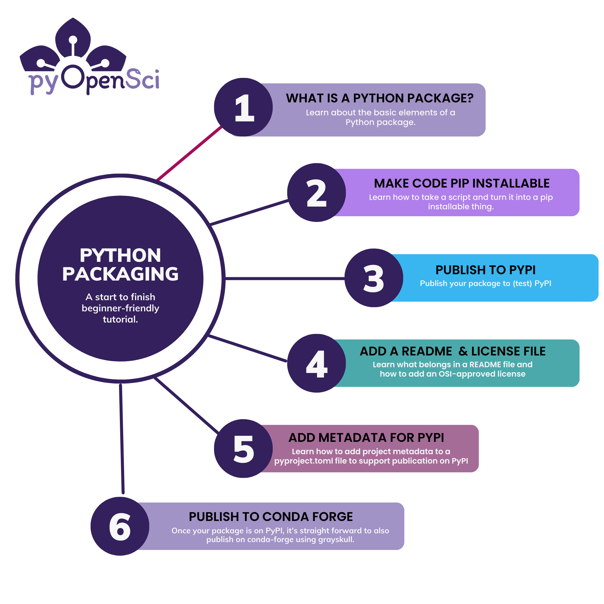
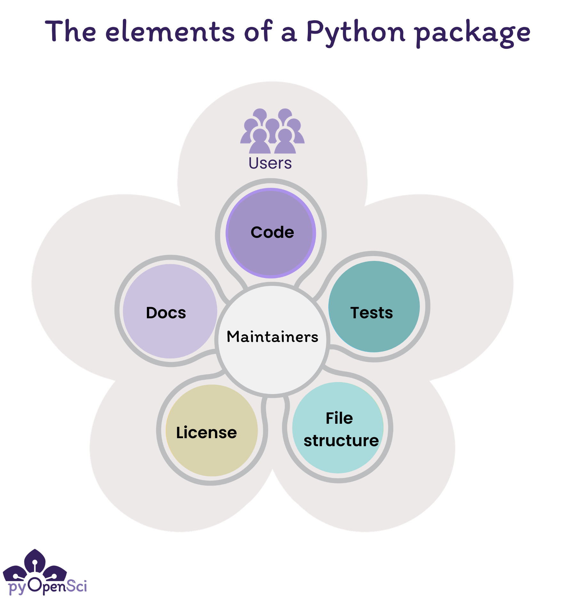
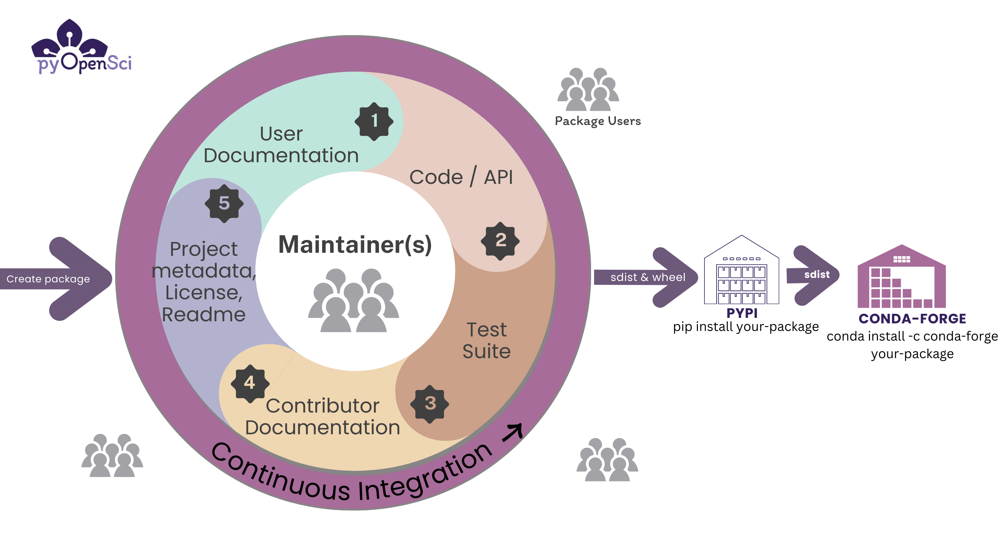

(packaging-101)=
# Python packaging 101

_A start to finish beginner-friendly tutorial_

Welcome to the pyOpenSci Python packaging tutorial series. The lessons
on the upcoming pages walk you through the core steps needed to
create a Python package.

:::{figure-md} packaging-outline



This lesson is the first in a series of lessons to help you get started with Python packaging.
:::

## Who are these tutorials for?

The content in this tutorial series is beginner friendly and assumes
that you have not created a Python package before. However, the
content will still be valuable if you are interested in better
understanding the steps involved in creating a Python package.

- In this series you will learn about the core elements that you need to publish your package to the [Python Package Index (PyPI)](https://pypi.org/).

- In the second series, you will learn about infrastructure and documentation needed to support package maintenance.

:::{toctree}
:hidden:
:caption: Python Packaging Tutorial Setup

Get to know Hatch <get-to-know-hatch>
:::

:::{toctree}
:hidden:
:caption: Create and publish a Python Package

What is a Python package? <self>
Create a Python package <create-python-package>
Publish to PyPI <publish-pypi>
Publish to conda-forge <publish-conda-forge>
:::

:::{toctree}
:hidden:
:caption: Project information files & metadata

Develop package (Hatch environments) <develop-python-package-hatch>
Add README file <add-readme>
Add a license & code of conduct <add-license-coc>
Update metadata in pyproject.toml <pyproject-toml>
:::

:::{toctree}
:hidden:
:caption: Reference Guides

Command Line Reference Guide <command-line-reference>
:::

:::{toctree}
:hidden:
:caption: Hatch for Existing Packages

Migrate setup.py to a pyproject.toml using Hatch <setup-py-to-pyproject-toml>
:::

:::{admonition} Learning Objectives

This lesson introduces you to the basic components of a Python package.
After reading this lesson you will:

- Understand what a Python package is
- Be able to list the 5 core components of a Python package
- Be able to explain the difference between generalizable code and code that supports a specific scientific application

:::

(what-is-a-package)=
## What is a Python package?

At a high level, you can think about a Python package as a toolbox
that you can use to perform various tasks.

A Python package is basically a directory with a specific
file structure. Within the package directory structure, there are
modules which are files that end in `.py` (the same extension you'd
see in a Python script). These modules allow you to group and
structure your Python code. Each module contains functions and classes,
that you can think about as the tools in your toolbox.

:::{figure-md} python-toolbox


You can think about a package as a toolbox filled with coding tools.
A tool may be a function or a class. Each tool does a specific thing
well.
:::

### Python packages are installable

A package is installable, which means that you can add the
functionality within the package's code to any Python environment and
import that functionality like you would import core scientific Python packages such
as NumPy or Matplotlib.

```python
import numpy
```

Installing a package into an environment makes it easier
to manage and reuse your code across different projects.
Structuring your code as a package is the first step you need to take so you can share the tools in the toolbox you've created and let others build with it.

(package-benefits)=
## Why create a Python package?

You might create a Python package because you want to:

- **Use your code across different projects:** At its most basic level, creating a package allows you to install your code into a Python environment. This allows you to then import functions and classes into any workflows both locally and in the cloud.
- **Share your code:** If you publish a package on a public repository such as PyPI or conda, your package can be installed on any machine using pip or conda with a single command.
- **Build community around your code:** Packages make it easier for multiple people to work on the same project (particularly when published on GitHub). A version control system such as git (the system used by GitHub), further makes it easier to track changes to the codebase over time. Tools such as issues and pull requests make it easier for outside users to contribute bug fixes and to establish review processes for accepting changes to the code base.
- **Organize your code:** Packages can be used to organize large code projects, dividing them into smaller, more manageable components. This structure can help with both maintaining the codebase and with making it easier to understand.

### What to consider before you create a package

Creating a Python package that others use takes considerable
time and effort. Before you begin, think about your goals including:

- Who you think will use your package
- How people might use your package and on what data (if data are relevant)
- Whether you have time to add things such as documentation and tests
- How long you might be able to maintain it: remember that once people begin using your package they will depend on your maintainer team to update it, fix bugs and answer questions.

Before creating a user-facing package, it's important to consider all of the above.

## The elements of a Python package

:::{figure-md} package-components



The elements of a Python package include code, documentation, tests,
an OSI-approved license and infrastructure.
Maintainers are at the core making sure everything works and is up to
date while fixing bugs and addressing user concerns.
:::

The core elements of Python package include:

- **Code:** Functions and classes that provide functionality for a user of your package
- **Documentation:** Installation instructions, tutorials, and examples that both help users get started using your package and contributors and maintainers fix bugs and maintain the package.
  - Contributor Documentation in the form of a **CONTRIBUTING.md** file is useful to help people to contribute to your package.
  - Development Documentation helps both maintainers and contributors understand how to maintain a package's infrastructure.
- **Tests:** that make sure your code works as it should and makes it easier for you and others to contribute to, modify and update the code in the future
- **License:** An open source license, or license that is [OSI approved](https://opensource.org/licenses/), refers to an license that allows others to use your package. It also provides legal direction regarding how elements of the package can and can't be reused.
- **Infrastructure** that automates updates, publication workflows and runs test suites. Infrastructure includes a suite of things such as platforms like GitHub and GitLab, tools to run tests and tools locally such as nox and tox and continuous integration that automates package maintenance steps.

:::{admonition} What pyOpenSci looks for in a package
:class: tip

pyOpenSci performs an [initial set of editor checks](https://www.pyopensci.org/software-peer-review/how-to/editor-in-chief-guide.html#editor-checklist-template) for any package submitted
to us for peer review.
You may find these checks useful as you create your package as a baseline for
things that you package should have.
:::

## Packages are more than just code - Infrastructure

A package in any language is more than just code. If you expect other
people to use your package, besides yourself, you should consider not
only writing high quality code, but also the various elements of a
package that make it a useful community resource.

### Version control and storing your package on GitHub or GitLab

Most Python packages live in an online version control platform such as GitHub
or GitLab. GitHub and GitLab both
run [git](https://git-scm.com/) for version control. Having your software
under version control is important because it allows you to both track changes over time while also going back in history and undoing changes in the case that a change to the code base unexpectedly breaks something.

By publishing your package on GitHub or GitLab, you are making your code public facing. This means that others can both see your code and also make contributions using a pull request (GitHub) / merge request (GitLab) / code review workflow.

:::{admonition} GitHub & GitLab vs. Git
:class: tip

GitHub and GitLab are online (cloud) platforms that run `git` (version control
software) on the backend. Running git locally on your computer allows you to
upload (`git push`) and download (`git pull`) files to GitHub and GitLab.
:::

### Issues or Ticket Trackers

GitHub and GitLab also both offer community features such as issues that allow:

- you to communicate with your maintainers and contributor community
- users to report bugs, ask questions and request new features
- you to publicly keep track of enhancements and features you want to work on for your package.

### Continuous integration and continuous deployment

GitHub and GitLab also provide continuous integration and continuous deployment (CI/CD). Continuous integration (CI) refers to a platform that automatically runs a specific job when a certain event occurs, whereas continuous deployment (CD) is an extension of CI that refers to not only running or building but also to publishing the final outputs somewhere.

**An example of Continuous integration:**

- When someone submits a change to your code, your tests will run across different operating systems and the code will be checked for format issues.

**An example of Continuous deployment:**

- When you are ready to release your package to PyPI, a continuous deployment operation might be triggered on release to publish your package to PyPI.

Integrated CI/CD will help you maintain your software, ensuring that
changes to the code don't break things unexpectedly. They can also
help you maintain code style and format consistency for every new
change to your code.

:::{figure-md} packaging-workflow



The lifecycle of a scientific Python package.
:::

## When should you turn your code into a Python package?

You may be wondering, what types of code should become a Python package that is both on GitHub and published to PyPI and/or conda-forge.

There are a few use cases to consider:

1. **Creating a basic package for yourself:** Sometimes you want create a package for your own personal use. This might mean making your code locally pip installable and you may also want to publish it to GitHub. In that case you don't expect others to use your code, and as such you may only have documentation for you and your future self if you need to update the package.

> An example of this type of package might be a set of functions that you write that are useful across several of your projects. It could be useful to have those functions available to all of your projects.

:::{todo}
LINK to pip installable lesson when it's published - it's in review now
:::

2. **Creating a package for the community:** In other cases, you may create some code that you soon realize might also be useful to not just you, but to other people as well.
   In that case, you might consider both creating the package, publishing it on GitHub, and because other users may be using it, you may make use of GitHub's infrastructure including CI/CD pipelines and issue trackers. Because you want other people to use your package, you will want to also include LICENSE information, documentation for users and contributors and tests. This type of package is most often published to PyPI.

For example, all of the [pyOpenSci packages](https://www.pyopensci.org/python-packages.html) are public facing with an intended audience beyond just the maintainers.

### Packages that you expect others to use should be well-scoped

Ideally the code in your Python package is focused on a specific theme or use case. This theme is important as it's a way to scope the content of your package.

It can be tricky to decide when your code becomes something that might be more broadly useful to others. But one question you can ask yourself is - is your code written specifically for a single research project? Or could it have a broader application across multiple projects in your domain?

:::{admonition} How does this relate to code for a research project?
:class: note

A [Research Compendium](https://the-turing-way.netlify.app/reproducible-research/compendia.html) is an organized set of code, data and documentation that
supports a specific research project. It aims to enhance the reproducibility and
transparency of research by providing a comprehensive record of the methods,
data, and analyses used in a study.

A Python package is a collection of modules that can be used to perform a
specific set of tasks. These tasks should be applicable to numerous workflows.
As such a Python package is more generalizable than a Research Compendium
which supports a specific project.

- [Read about `Good enough practices in scientific computing`](https://journals.plos.org/ploscompbiol/article?id=10.1371/journal.pcbi.1005510)
- [Learn more about research compendia (also called repo-packs) in this blog post.](https://lorenabarba.com/blog/how-repro-packs-can-save-your-future-self/)
  :::

Below are a few examples well scoped pyOpenSci packages:

- [Crowsetta](https://crowsetta.readthedocs.io/en/latest/): is a package designed to work with annotating animal vocalizations and bioacoustics data. This package helps scientists process different types of bioacoustic data rather than focusing on a specific individual research application associated with a user-specific research workflow.
- [Pandera](https://www.union.ai/pandera) is another more broadly used Python package. Pandera supports data testing and thus also has a broader research application.

:::{admonition} Matplotlib as an example

At the larger end of the user spectrum, Matplotlib is a great example.
Matplotlib does one thing really well:

_It creates visual plots of data._

Thousands of people use Matplotlib for different plotting applications
using different types of data. While few scientific packages will have the same
broad application and large user base that Matplotlib has, the
idea of scoping out what your package does is still important.
:::

### Code should also be clean & readable & documented

The code in your package should also be clean, readable, and well documented.

**Clean code:** Clean code refers to code that uses expressive variable names,
is concise and doesn't repeat itself. You can learn about best practices
for clean code in future pyOpenSci tutorials.

**Readable code:** readable code is code written with a consistent style.
You can use linters and code formatters such as black and flake8 to ensure
this consistency throughout your entire package. [Learn more about code formatters here.](../package-structure-code/code-style-linting-format)

**Documented code:** documented code is written using docstrings that help a
user understand both what the functions and methods in your code do and also
what the input and output elements of each function are. [You can learn more about docstrings in our guide, here.](../documentation/write-user-documentation/document-your-code-api-docstrings)

## Making your package installable - publishing to PyPI & conda-forge

### Python packages and environments

You can install a Python package into a Python environment in the same way
you might install NumPy or Pandas. Installing your package into an environment
allows you to access it from any code run with that specific Python environment activated.

:::{figure-md} packages-environment-install


You don't have to publish to PyPI to make your code installable.
With the correct file structure and project metadata you can make your code
installable locally on your computer and use it for projects that you are working
on without having to ever publish to PyPI. Publishing to PyPI is useful when you
want to make your code public-facing and share it with others.
:::

### Publishing a package to PyPI / Conda-Forge

If you want to make your package directly installable without having
to download the code to your computer locally then you need to
publish it in a repository such as **PyPI** or **conda-forge**.

Learn [how to publish your package to PyPI in this tutorial.](publish-pypi.md)

Then you can create a conda-forge recipe using the [Grayskull](https://github.com/conda/grayskull) tool. You can then submit this recipe to conda-forge.

[You will learn more about the conda-forge publication process here.](publish-conda-forge.md)

:::{figure-md} publish-package-pypi-conda-overview


In the image above, you can see the steps associated with publishing
your package on PyPI and conda-forge. Note that the distribution files that PyPI requires are the [sdist](#python-source-distribution) and [wheel](#python-wheel) files. Once you are ready to make your code publicly installable, you can publish it on PyPI. Once your code is on PyPI it is straight forward to then publish to conda-forge. You create a recipe using the Grayskull package and then you open a pr in the conda-forge recipe repository. You will learn more about this process in the [conda-forge lesson](/tutorials/publish-conda-forge).
:::

## Yay, your package has users! Now what?

As the community using your package grows, you may also find yourself managing users, contributors, and others who want to interact with your package. It’s important to consider all this before you dive into development. Once you have a user base in the community, people will depend upon your code to work and will need direction regarding how to use it.

To support your community, you'll want to add things like:

- [a development guide that documents your maintainer workflow process ](/documentation/repository-files/development-guide.md)
- [a code of conduct to defines community interaction standards and expectations](/documentation/repository-files/code-of-conduct-file.md)
- [a contributing guide that helps users understand expectations associated with making contributions to your project](/documentation/repository-files/contributing-file.md)

:::{admonition} Support for contributors and maintainers

If you intend for others to use and contribute to your code, consider who will maintain it over time. You will want a **contributing and development** guide to help new potential contributors get started with contributing to your package, as well as a **code of conduct** to ensure community interactions remain healthy both for you and your contributors and maintainer team.

The elements above are also important for future maintenance of your package. In the case that you are no long able to maintain it or simply want extra help, development, and contributing documentation will help you onboard new maintainers.
:::

---

## What's next?

In future lessons you will learn more about the infrastructure around a published Python package that makes it both easier to maintain, easier for others to contribute to and easier for other scientists to use. However, first we want to get you to your initial goal of publishing a Python package.

In this next lesson you will learn how to create a basic installable Python package.
Make your code pip installable <create-python-package>
:::
