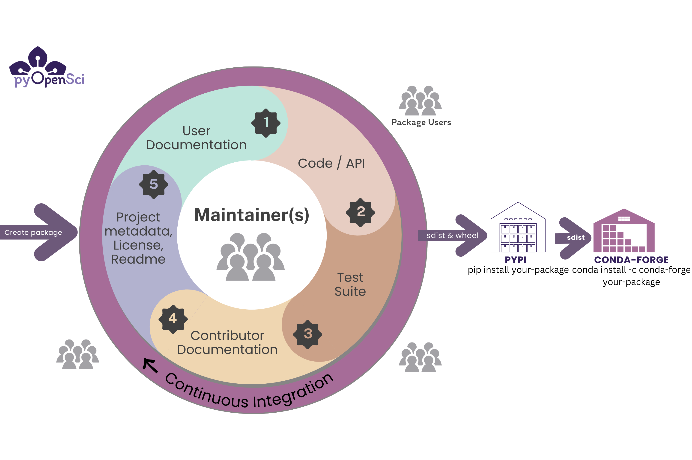

# Python packaging 101
*A start to finish beginner-friendly tutorial*

<!-- This is the start at making the graphic below using css
<div class="container-fluid">
    <div class="row">
        <div class="col-md-6 left-div">
            Python Packaging 101
        </div>
        <div class="col-md-6 right-div">
            <div class="lesson-div">
                <a href="#">What is a python package? </a>
            </div>
            <div class="lesson-div">
                <a href="1-installable-code.html">Make your code installable</a>
            </div>
            <div class="lesson-div">
                <a href="2-add-readme.html">Add a README file</a>
            </div>
            <div class="lesson-div">
                <a href="#link4">Add a LICENSE and Code of Conduct file</a>
            </div>
            <div class="lesson-div">
                <a href="#link5">Add metadata (pyproject.toml)</a>
            </div>

            <div class="lesson-div">
                <a href="#link6">Publish to PyPI</a>
            </div>

            <div class="lesson-div">
                <a href="#link7">Publish to conda-forge</a>
            </div>
        </div>
    </div>
</div>
-->


<!--

TODO: whatever graphic we use we can then add it to the top of each page to show the user where they are in the progression
* Work on the create a license lesson next?? that is the most incomplete
* then start the conda one and place the pyos package on conda-forge??
* Below i have an image overview of the lessons and a list of links. i'm thinking a visual html / css block that is clickable would be a more powerful "graphic". it could still have colors.
-->


Welcome to the pyOpenSci Python packaging tutorial series. The lessons on the upcoming pages walk you through the core steps needed to
create a Python package.


:::{figure-md} packaging-outline


TODO: This will be replaced with a interactive CSS element that walks users through lessons
:::

## Who are these tutorials for?

The content in this tutorial series is beginner friendly and assumes
that you have not created a Python package before. However, the
content will still be valuable if you are interested in better
understand the steps for creating a Python package.

<!-- it might be interesting to make the above graphic a css
set of blocks that are colored. then you could hover over each on to get to the lesson of choice. this would make it easier to also
customize each page with that block at the top -->

In this series you will learn about the core elements that you need to publish your package to PyPI.

In the second series, you will learn about infrastructure and documentation needed to support package maintenance.

```{toctree}
:hidden:
:caption: Python Packaging 101

What is a Python package? <self>
Make your code pip installable <1-installable-code>
Add README file <2-add-readme>
Add LICENSE & CODE of CONDUCT <4-add-license-file>
Add pyproject.toml <5-pyproject-toml>
Publish to PyPI <6-publish-pypi>
Publish to conda-forge <7-publish-conda-forge>

```

## What is a Python package?

:::{admonition} Learning Objectives

This lesson introduces you to the basic components of a Python package.
After reading this lesson you will:

- Understand what a Python package is
- Be able to list the 5 core components of a Python package
- You will be able to explain the difference between generalizable code and code that supports a specific scientific application

:::

A Python package is a collection of related modules / code containing
functions, classes and methods that are organized together in a directory.
Packages allow you to group and structure your Python code, making it easier
to manage and reuse code across different projects.

A package is installable which means that you can add the functionality within
the package code to any Python environment and import that functionality like
you would import numpy or matplotlib.

At a high level, you can think about each package as a toolbox filled with
different tools that perform specific actions in your code when imported and
called.

:::{figure-md} python-toolbox


You can think about a package as a toolbox filled with coding tools. A tool may be a function or a
class. Each tool does a specific thing well.
:::


<!--
:::{admonition} TODOS
:class: todo
TODOs:
* Create a nice graphic for this landing page that introduces the pieces of a python package and also how these tutorials are organized ... maybe even that step box diagram?

- sometimes people might start by creating a new repo and cloning it.
* It would be good to have them add development requirements up front in their pyproject.toml file
* Other times they might start by working locally and then pushing the repo content to github / gitlab. in any case the readme and license lessons may or may not be relevant. so we should have a pregame for setting up a fresh repo, creating an initial .gitignore, readme and license. and then link to the chose a license lesson.

::: -->


## The elements of a Python package

:::{figure-md} package-components


The elements of a Python package include code, documentation, tests a OSI-approved license and a specific directory structure. Maintainers are at the core making sure everything works and is up to date while fixing bugs and addressing user concerns.
:::

The core elements of Python package include:

- **Code:** Generalized code that performs operations that you may need to complete multiple times
- **Documentation:** documentation with tutorials / examples that help users get started using your tool
  - Documentation also helps people to contribute to your package.
- **Tests:** that makes sure your code works as it should and makes it easier for you and others to contribute to, modify and update the code in the future
- **License:** An open source license …. - link to choose a license…
- **Infrastructure** that automates updates, publication workflows and runs test suites

If you intend for others to use and contribute to your code, consider who will maintain it over time. You will want a **contributing / development** guide to help new potential contributors get started with contributing to your package. And a **code of conduct** to ensure community interactions remain healthy both for you and your contributors / maintainer team

:::{admonition} What pyOpenSci looks for in a package
:class: tip

pyOpenSci performs an [initial set of editor checks](https://www.pyopensci.org/software-peer-review/how-to/editor-in-chief-guide.html#editor-checklist-template) for any package submitted
to us for peer review.
You may find these checks useful as you create your package as a baseline for
things that you package should have.

:::

## Packages are more than just code

A package in any language is more than just code. If your package is public facing, meaning people besides yourself will use it, you should consider the various elements of a package that make it a useful community resource.

### Version control and storing your package on GitHub or GitLab

Most Python packages live in an online version control platform such as GitHub
or GitLab. GitHub and GitLab are both online platforms that
run [git](https://git-scm.com/) for version control. Have your software
under version control is important because it allows you to both track changes over time while also going back in history and undoing changes in the case that a change to the code base unexpectedly breaks something.

By publishing your package on GitHub or GitLab, you are now making your code public facing. this means that others can both see your code and also make contributions using a pull request - review workflow.

:::{admonition} GitHub & GitLab vs. Git
:class: tip

GitHub and GitLab are online (cloud) platforms that run git (version control
software) on the backend. Running git locally on your computer allows you to
upload (`git push`) and download (`git pull`) files to GitHub and GitLab.
:::

### Continuous integration and continuous deployment help you maintain your package

Platforms such as GitHub and GitLab also provide continuous integration and continuous deployment (CI/CD). Continuous integration (CI) refers to a platform that automatically runs a specific job when a certain event occurs.

**An example of Continuous integration:**
* When someone submits a change to your code, your tests will run across different operating systems and the code will be checked for format issues.

**An example of Continuous deployment:**
* When you are ready to release your package to PyPI, a continuous deployment operation might be triggered on release to publish your package to PyPI.

Integrated CI/CD will help you maintain  your software ensuing that changes to the code don't break things unexpectedly and also maintain a style and format consistency.

:::{figure-md} packaging-workflow



The lifecycle of a scientific Python package.
:::

<!-- >then in the publish section below we can add the arrow with that structure being
>built into distributions that get published on PyPI and conda...

>then in the community part we add another section that is the github repo with users contributing... very simple diagrams... -->


```{toctree}
:hidden:
:caption: Pre game
:glob:
extras/*

```


## What should code in a Python package look like?

Ideally the code in your Python package is general. This means it
can be used on different data or for different scientific applications. An example
of a package that is written in a generalized way is `matplotlib`.

`matplotlib` does
one (big important) thing really well:

*It creates visual plots of data.*

`Matplotlib` is used by thousands of users for different plotting applications
using different types of data. While few scientific packages will have the same
broad application as tools like `matplotlib` or `numpy`, the
idea of code being used for something more than a single workflow still applies
to package development if you want other people to use your package.

### Code should also be clean & readable & documented

The code in your package should also be clean, readable and well documented.

**Clean code:** Clean code refers to code that uses expressive variable names,
is concise and does not repeat itself. We will dive deeper into best practices
for clean code in future pyOpenSci tutorials.

**Readable code:** Readable code is code written with a consistent style.
You can use linters and code formatters such as black and flake8 to ensure
this consistency throughout your entire package. [Learn more about code formatters here.](../package-structure-code/code-style-linting-format.html)

**Documented code:** documented code is written using docstrings that help a
user understand both what the functions and methods in your code does and also
what the input and output elements of each function is. [You can learn more about docstrings in our guide, here.](../documentation/write-user-documentation/document-your-code-api-docstrings)

:::{admonition} Where do research compendia fit in?
:class: note

A Research Compendium is an organized set of code, data and documentation that
supports a specific research project. It aims to enhance the reproducibility and
transparency of research by providing a comprehensive record of the methods,
data, and analyses used in a study.

A Python package however is a collection of modules that are focused on a
specific set of tasks that can be applied across numerous research projects.
As such a Python package is more generalizable than a research Compendium
which supports a specific project.

:::

## Making your package installable - publishing to PyPI & conda-forge

### Python packages and environments

A Python package can be installed into a Python environment in the same way
you might install `numpy` or `pandas`. Installing your package into an environment
allows you to access it from any code run with that specific Python environment activated.

:::{figure-md} packages-environment


You don't have to publish to PyPI in order to make your code installable.
WIth the correct file structure and project metadata you can make your code
installable locally on your computer and use it for projects that you are working
on without having to ever publish to PyPI. Publishing to PyPI is useful when you
want to make your code public facing and share it with others.
:::

### Publishing a package

If you want to make your package installable using `pip` you need to
publish it in a repository such as PyPI or conda-forge. If you package is a
pure python package, then publishing to both PyPI and conda-forge only takes just a few steps.

In these tutorials, you will learn [how to publish to PyPI using twine.](6-publish-pypi.md)

Then you can create a conda-forge recipe using the grayskull tool. This recipe can then be submitted to conda-forge. [You will learn more about the conda-forge publication process here.](7-publish-conda-forge.md)


:::{figure-md} build-workflow-tutorial


Once you are ready to make your code public, you can publish it on PyPI. Once the code is on PyPI it's a simple set of steps to publish to conda forge. You create a recipe using the grayskull package and then you open a pr in the conda-forge recipe repo. You will learn more about this process in the [conda-forge lesson](#).
:::

## Yay, your package has users! Now what?

As the community using your package grows, you may also find yourself managing users, contributors and others who want to interact with your package. It’s important to consider all this before you dive into development. Once you have a user base in the community, people will depend upon your code to work and will need direction regarding how to use it.

To support your community, you'll want to add things like:

* development guide
* code of conduct
* contributing guide


<!--
Are the sections below useful??

*********
## Why create a package?

There are numerous reasons why you might create a Python package:

- **Use your code across multiple projects:** At its most basic level, creating a package allows you to install your code into a Python environment. This allows you to then import functions and classes into any workflows both locally and in the cloud..
- **Share your code:** Sharing your code with others is often a common reason to create a package.If you publish a package on a public repository such as PyPI or conda, immediately your package can be installed on any machine using pip or conda with a single command.
- **Build community around your code:** Packages make it easier for multiple people to work on the same project (particularly when published on Github). A version platform such as git (the version control system used by GitHub), further makes it easier to track changes to the codebase over time. Tools such as issues and pull requests make it easier for outside users to contribute bug fixes and to establish review processes for accepting changes to the code base..
- **Organize your code:** Packages can be used to organize large code projects, dividing them into smaller, more manageable components. This structure can help with both maintaining the codebase and with making it easier to understand.

## What to consider before you create a package

Creating a Python package that others use takes considerable time and effort.
Before you begin, think about your goals including:

- Who you think will use your package
- Whether you have time to add things such as documentation and tests
- How long you might be able to maintain it -->


*****


<!--
### Development guidelines

This feels really out of place here...

_TODO: I suspect nick murphy has something in this space that we can rif off of. Essentially I'm thinking here we have a SHORT section on development best practices and then link to another resource (be it on the pyos website or elsewhere). This would include things like:_

- _Defining the scope of your package and scope creep_
- _Keeping functions focused on doing a single thing well._
- _Broad generalizable get started guidelines and then we can link to more in depth resources in this space._ -->

## What's next?

In future lessons we will talk more about the infrastructure around a published Python package that makes it both easier to maintain, easier for others to contribute to and easier for other scientists to use. However, first we want to get you to your initial goal of publishing a Python package.

In this next lesson you will learn how to create a basic installable Python package.
