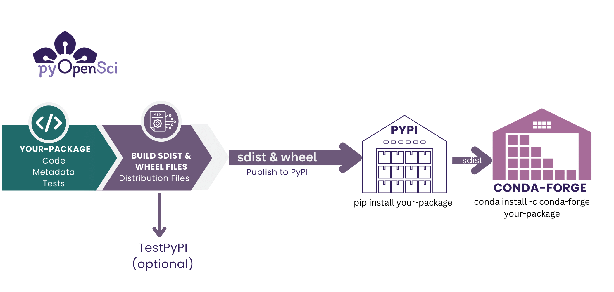

# Publish your Python package that is on PyPI to conda-forge

In the previous lessons, you've learned:

1. How to [create the most basic version of a Python package](1-installable-code.md). This entailed making your code installable.
2. [How to publish your Python package to PyPI](publish-pypi)
2. How to add a `README` and `LICENSE` file to your package
3. How to setup your `pyproject.toml` file with all of the metadata that PyPI requires and also metadata that will be helpful for users to find your package.

If you have gone through all of the above lessons, you are now ready to
publish your package on conda-forge.

**IMPORTANT:** Please do not practice publishing your package to conda-forge. You should only publish to conda-forge when you have a package on pypi.org that you plan to maintain.


:::{admonition} Learning Objectives
:class: tip

In this lesson you will learn how to:

- How to build your package's sdist and wheel distributions
- Setup an account on testPyPI (the process is similar for the real PyPI)
- Publish your package to PyPI

Once your package is on PyPI you can then easily publish it to conda-forge
using the [grayskull](https://conda.github.io/grayskull/) tool. You do not need to build the package specifically
for conda, conda-forge will build from your PyPI source distribution file (sdist).

:::


:::{figure-md} pypi-conda-channels



Once you have published both package distributions (the source distribution and the wheel) to PyPI, you can then publish to conda-forge. Conda forge requires an source distribution on PyPI in order to build your package on conda-forge. You do not need to rebuild your package to publish to conda-forge.
:::

## What is conda forge?
conda is an open source package and environment management tool that
can be used to install tools from the different channels within the Anaconda Cloud repository.

You can think about a channel as a specific location where a group of packages are stored and can be installed from using a command such as `conda install packagename`. In the case of the Anaconda cloud channels, some of these channels such as the default channel, is managed by Anaconda. Only Anaconda can decide what packages are available in the default channel. However, the conda-forge (and bioconda) channel are community-managed channels.
Anyone can upload a package to these channels.

[Learn more about conda channels here.](#about-conda)

:::{todo}
Make a graphic to replace that geohackweek graphic that is also more specific.
:::

:::{figure-md} pypi-conda-channels


Conda channels represent various repositories that you can install packages from. Because conda-forge is community maintained, anyone can submit a recipe there. PiPY is also a community maintained repository. Anyone can submit a package to PyPI and test PyPI. Unlike conda-forge there are no manual checks of packages submitted to PyPI.
:::


## Why publish to conda forge

There are many users, especially in the scientific Python ecosystem that use conda as their primary package manager / environment tool. Thus, having packages available to these users on the conda-forge channel is useful. In some cases packages on conda-forge can minimize dependency conflicts that can occur when mixing installations using pip and conda. This is particularly important for the spatial ecosystem.

## How publishing to conda-forge works

Once you have built and published your package to PyPI, you have everything that you need to publish to conda-forge. There is no additional build step needed to publish to conda-forge.

Conda-forge will build your package from the source distribution which you [published to PyPI in the previous lesson](publish-pypi) using the recipe that you will create below.

:::{todo}
<graphic for this???>
:::


### Conda-forge publication steps

:::{figure-md} publish-pypi-conda-forge


Caption
:::

The steps to publish to conda-forge are:

1. Publish your Python package distribution files (sdist & wheel) to PyPI
2. Create a conda-forge recipe, which is a yaml file with instructions on how to build your package on conda-forge, using the grayskull[^grayskull] package.
3. Submit the recipe (yaml file) to the conda-forge staged recipes repository as a pull request for review. [Click here for an example submission from pyOpenSci.](https://github.com/conda-forge/staged-recipes/pull/25173)

4. Once someone from the conda-forge team reviews your pull request, you may need to make some changes. Eventually the pull request will be approved and merged.


Now your package is on conda-forge.

You only create the recipe once. Then you just maintain the repository.


## Maintaining a conda-forge package

Once your package is on conda-forge, the repository will track activity on your PyPI repository for that package. Any time you make a new release to PyPI with a new source distribution, conda-forge will build and update your conda-forge repository.

When that happens, conda-forge will create a new pull request with an updated distribution recipe.

You can review that pull request and then merge it once all of the tests pass.

## Publish your package to conda-forge

It's time to add your package to the conda-forge channel.
Remember that your package needs to be on PyPI before the steps below will work. And also remember that the team managing conda-forge are all volunteers.

* Please only submit your package to conda-forge if you intend to maintain it over time.
* Be sure that your package is on PyPI.org (not test.pypi.org) before you attempt to publish to PyPI.

### Step 1 - Install grayskull

To begin this process you need to [install grayskull](https://conda.github.io/grayskull/user_guide.html). You can install it using either pip

```
pip install grayskull
```

or conda

```
conda install -c conda-forge grayskull
```

Use the shell / terminal that you have been using to run hatch
commands in the previous tutorials.

### Step 2: Create your recipe from PyPI

Next, you can run grayskull on your package.

Grayskull will pull information from PyPI
You don't need to work about what directory you are in when you run grayskull. Grayskull will look for your package on PyPI and will generate your recipe from the PyPI distribution.

Because it is pull from pypi.org, an internet connection is needed for this step.

Run the command below in your favorite shell.

```bash
➜ grayskull pypi pyospackage

#### Initializing recipe for pyospackage (pypi) ####

Recovering metadata from pypi...
Starting the download of the sdist package pyospackage
pyospackage 100% Time:  0:00:00   1.2 MiB/s|###########################|
Checking for pyproject.toml
pyproject.toml found in /var/folders/r8/3vljpqb55psbgb1ghc2qsn700000gn/T/grayskull-pyospackage-du0sf_a4/pyospackage-0.0.1/pyproject.toml
Recovering information from setup.py
Executing injected distutils...
Checking >> -- 100% |#                          |[Elapsed Time: 0:00:00]
Matching license file with database from Grayskull...
Match percentage of the license is 97%. Low match percentage could mean that the license was modified.
License type: MIT
License file: ['LICENSE']
Build requirements:
  <none>
Host requirements:
  - python
  - hatchling
  - pip
Run requirements:
  - python

RED: Missing packages
GREEN: Packages available on conda-forge

Maintainers:
   - lwasser

#### Recipe generated on /your/file/package/here/pyosPackage for pyospackage ####
```

When you run grayskull, it will grab the latest distribution of your package from PyPI and will use that to create a new recipe.

The recipe will be saved in a directory named after your package's name, wherever you run the command.

`packagename/meta.yaml`

At the very bottom of the grayskull output, it will also tell you
where it saved the recipe file.

This will create a meta.yaml file that looks like the example below:

```yaml



package:
  name: {{ name|lower }}
  version: {{ version }}

source:
  url: https://pypi.io/packages/source/{{ name[0] }}/{{ name }}/pyospackage-{{ version }}.tar.gz
  sha256: 43ec82da3a10752a5dbf2f0ef742e357803a3ddb400005f87e86534685bfb8a7

build:
  noarch: python
  script: {{ PYTHON }} -m pip install . -vv --no-deps --no-build-isolation
  number: 0

requirements:
  host:
    - python
    - hatchling
    - pip
  run:
    - python

test:
  imports:
    - pyospackage
  commands:
    - pip check
  requires:
    - pip

about:
  license: MIT
  license_file: LICENSE

extra:
  recipe-maintainers:
    - lwasser

```

### Step 3: tests for conda-forge

Next, have a look at the tests section in your meta.yaml file. At a minimum you should import your package and run `pip check`.

`pip check` will ensure that your package installs properly with all of the proper dependencies.

```yaml
test:
  imports:
    - pyospackage # Test importing the package into a python environment
  commands:
    - pip check # check the package
  requires:
    - pip
```

### Step 4: Submit a pull request to the staged-recipes repository

Finally, create a pull request in the staged-recipes GitHub repository.

To create your pull request:

1. Fork and clone this repo: https://github.com/conda-forge/staged-recipes
1. Create a branch in your fork rather than submitting from the main branch of your fork.
1. Within your fork's branch, create a new directory with the name of your package,
1. Add the meta.yaml file  that you generated using grayskull to that directory.

`staged-recipes/recipes/pyospackage/meta.yaml`

1. Submit a pull request from your fork/branch of the staged-recipes repository.
1. Remember that the conda-forge maintainers are volunteers. Be patient for someone to respond and supportive in your communication with them.

When you do this, a suite of CI actions will run that build and test the build of your package. A conda-forge maintainer will work with you to get your recipe in good shape and merged.

You can follow the [instructions here](https://conda-forge.org/docs/maintainer/adding_pkgs.html) to submit your package


## Conda-forge pull request checklist

When you submit your package to conda forge, the pull request template includes a list of checks that you want to ensure you have covered.

Below we break down each element of that list.


## Conda-forge Staged-recipes Pull Request Checklist

When you submit a pull request for your package's recipe to conda-forge you will notice a checklist of items that you need to ensure you have covered.

A brief explanation of each is below.

::::{admonition} Pull request template checklist tips
:class: note

> -[x] Title of this PR is meaningful: e.g. "Adding my_nifty_package", not "updated meta.yaml".

**Translation:** Make sure that your pull request title is specific. We suggest something like:
`Add: conda-forge recipe for <your package name>`

> -[x] License file is packaged (see [here](https://github.com/conda-forge/staged-recipes/blob/5eddbd7fc9d1502169089da06c3688d9759be978/recipes/example/meta.yaml#L64-L73) for an example).

**Translation:** You should have a LICENSE file included in your package's source distribution. If you have followed the pyOpenSci tutorials then you already have a LICENSE file and are likely using the MIT license. When you run `hatch build`, it will bundle that file into the output [source distribution file (which is the tar.gz file)](python-source-distribution) that conda-forge will use to build your package.

> - [x] Source is from official source.

**Translation:** If your package is on PyPI as you learned in the [previous lesson on publishing your Python package](publish-pypi) then you are in good shape. conda-forge prefers that your distribution is published to a known repository.

> -[x] Package does not vendor other packages. (If a package uses the source of another package, they should be separate packages or the licenses of all packages need to be packaged).

**Translation:**  If the code base in your package is your own and it all shares the same LICENSE then you are in good shape. If you have code taken from other packages then you may need to declare that and include licenses for that code if it is different. If you followed these tutorials then you do not have any vendored code.


> -[x] If static libraries are linked in, the license of the static library is packaged.
>
> -[x] Package does not ship static libraries. If static libraries are needed, [follow CFEP-18](https://github.com/conda-forge/cfep/blob/main/cfep-18.md).


:::{todo}
From leah - Can someone validate that this description is accurate or suggest alternative language please? i don't fully understand static library links
:::

 **Translation:**  The pyOpenSci tutorials did not include any static libraries in a linked or shipped format. If your package is pure Python you likely don't need to worry about this. However, some packages with more complex builds may include links to extensions written in other languages such as C++. If your package does have such extensions you will need to include the LICENSE(s) for those extensions.

> -[ ] Build number is 0.

 **Translation:** The build number in your recipe is right below the source location of your package's source distribution. `number: 0` is what you should see in that section of your recipe.

 ```bash
 source:
  url: https://pypi.io/packages/source/{{ name[0] }}/{{ name }}/pyospackage-{{ version }}.tar.gz
  sha256: 01e31f5521973710d0d91b15a94491d4f8f8f54566322110098c0f2381dd09ab

build:
  noarch: python
  script: {{ PYTHON }} -m pip install . -vv --no-deps --no-build-isolation
  number: 0
  ```

> - [x] A tarball (`url`) rather than a repo (e.g. `git_url`) is used in your recipe (see [here](https://conda-forge.org/docs/maintainer/adding_pkgs.html#build-from-tarballs-not-repos) for more details).

**Translation:** Here conda wants you to provide a link to the source distribution on PyPI rather than a link to your GitHub repository distribution. Notice above in the Source section of your recipe there is a `url:` section that provides a PyPI url that ends in tar.gz. That is a link to your source distribution that conda-forge will use.

```yaml
url: https://pypi.io/packages/source/{{ name[0] }}/{{ name }}/pyospackage-{{ version }}.tar.gz
```
> - [x] GitHub users listed in the maintainer section have posted a comment confirming they are willing to be listed there.

**Translation** Once you have submitted your recipe, be sure that all maintainers listed in your recipe respond acknowledging that they are ok with being listed as a maintainer for the conda-forge version of your package.

> - [x] When in trouble, please check our [knowledge base documentation](https://conda-forge.org/docs/maintainer/knowledge_base.html) before pinging a team.

**Translation** The conda team are volunteers who spend their time supporting our community. Please try to troubleshoot on your own first before tagging one of them for help.

This is also why we don't suggest you publish to conda-forge as a practice run.
::::

Once you have submitted your recipe, you can wait for the CI build to pass. If it's not passing, and you aren't sure why, a conda-forge maintainer can likely help you figure things out.

Once your recipe is built and merged, the conda team will create a new package repository for you similar to [this one for the GemGIS package](https://github.com/conda-forge/gemgis-feedstock).

### <i class="fa-solid fa-wand-magic-sparkles"></i> Congratulations - you have added your package to conda-forge.<i class="fa-solid fa-wand-magic-sparkles"></i>

The last part of this process is maintaining the repository.
We cover that next.

## Maintaining your conda-forge feedstock

Every time you create a new release on PyPI, the conda-forge bots will recognize the release and will rebuild the newly released version of your package. This process may take a day or two to complete so be patient.

Once the conda-forge build it complete, all of the maintainers of your conda-forge feedstock will get a ping on GitHub that a new pull request has been opened.

Review the pull request. If all tests are passing, you can merge it. within the next day the conda-forge release will be available for users to install:

`conda install -c conda-forge yourpackage`

:::{todo}
pr for our tutorial package is up as a draft. right now i'm the only maintainer.

<Create a pr on conda-forge - tag filipe (as it is a test package) and add screenshots here so people understand what maintaining a conda recipe entails >


Questions:

Pandas has this for their recipe  -
about:
  home: http://pandas.pydata.org
  license: BSD-3-Clause
  license_file: LICENSE
  summary: >-
    Powerful data structures for data analysis, time series, and statistics
  doc_url: https://pandas.pydata.org/docs/
  dev_url: https://github.com/pandas-dev/pandas

their pyprojec.toml is like This:
[project.urls]
homepage = 'https://pandas.pydata.org'
documentation = 'https://pandas.pydata.org/docs/'
repository = 'https://github.com/pandas-dev/pandas'

Should we have users add a homepage or can they add a homepage at a later time??
:::

## <i class="fa-solid fa-hands-bubbles"></i> Wrap up

If you have walked through this entire tutorial series you have now:

1. Understand [what a Python package is ](intro.md)
2. Know how to [make your code installable](1-installable-code.md) into Python environments
3. Know how to create a pyproject.toml file, a README file, and a License and code of conduct.
4. Know how to [publish your package to PyPI](publish-pypi.md) and
5. Know how to publish your package to conda-forge

The above are the basic steps that you need to take to create and publish a Python package. In a future tutorial series we will cover that basics of maintaining your package.

## Footnotes

[^grayskull]: [Grayskull blogpost](https://conda-forge.org/blog/2020/03/05/grayskull/)
