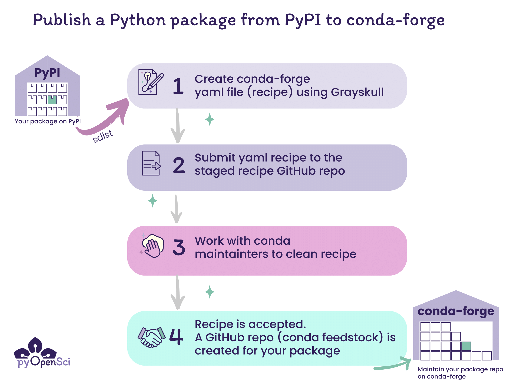

# Publish your Python package that is on PyPI to conda-forge

In the previous lessons, you've learned:

1. How to [create the most basic version of a Python package](create-python-package.md). This entailed making your code installable.
2. [How to publish your Python package to PyPI](publish-pypi)
3. How to add a `README` and `LICENSE` file to your package
4. How to setup your `pyproject.toml` file with all of the metadata that PyPI requires and also metadata that will be helpful for users to find your package.

If you have gone through all of the above lessons, you are now ready to
publish your package on conda-forge.

**IMPORTANT:** Please do not practice publishing your package to conda-forge. You should only publish to conda-forge when you have a package on pypi.org that you plan to maintain.

:::{admonition} Learning Objectives
:class: tip

In this lesson you will learn how to:

- Create a conda-forge yaml recipe for your package using Grayskull
- Submit the recipe (yaml file) to the conda-forge staged recipes repository as a pull request
- Maintain your conda-forge package by creating new releases for your package on PyPI


Once your package is on PyPI you can then easily publish it to conda-forge
using the [grayskull](https://conda.github.io/grayskull/) tool. You do not need to build the package specifically
for conda, conda-forge will build from your PyPI source distribution file (sdist).

:::

:::{figure-md} pypi-conda-publication


Once you have published both package distributions (the source distribution and the wheel) to PyPI, you can then publish to conda-forge. Conda-forge requires a source distribution on PyPI in order to build your package on conda-forge. You do not need to rebuild your package to publish to conda-forge.
:::

## What is conda-forge?

conda is an open source package and environment management tool that
can be used to install tools from the different channels on Anaconda.org.

You can think about a channel as a specific location where a group of packages are stored and can be installed from using a command such as `conda install packagename`. In the case of conda channels, some of these channels such as the `defaults` channel, is managed by Anaconda (the company). Only Anaconda can decide what packages are available in the `defaults` channel. However, the conda-forge (and bioconda) channel are community-managed channels.
Anyone can submit a package to these channels however they must pass a technical review in the [staged-recipes GitHub repository](https://github.com/conda-forge/staged-recipes) to be published.

[Learn more about conda channels here.](#about-conda)

:::{figure-md} pypi-conda-channels-2


Conda channels represent various repositories that you can install packages from. Because conda-forge is community maintained, anyone can submit a recipe there. PyPI is also a community maintained repository. Anyone can submit a package to PyPI and test PyPI. Unlike conda-forge there are no manual checks of packages submitted to PyPI.
:::

## Why publish to conda-forge

There are many users, especially in the scientific Python ecosystem that use conda as their primary package manager / environment tool. Thus, having packages available to these users on the conda-forge channel is useful. In some cases packages on conda-forge can minimize dependency conflicts that can occur when mixing installations using pip and conda. This is particularly important for the spatial ecosystem.

## How publishing to conda-forge works

Once you have built and published your package to PyPI, you have everything that you need to publish to conda-forge. There is no additional build step needed to publish to conda-forge.

Conda-forge will build your package from the source distribution which you [published to PyPI in the previous lesson](publish-pypi) using the recipe that you will create below.

### Conda-forge publication steps

:::{figure-md} publish-pypi-conda-forge


The steps for publishing to conda-forge begin with publishing your Python package to PyPI. Once you have published to PyPI you can then create a yaml file recipe that can be submitted to the conda-forge staged recipes repository for review. Once that recipe is accepted, your package will get it's on repository (known as a feedstock) on conda-forge.
:::

The steps to publish to conda-forge are:

1. Publish your Python package distribution files (sdist & wheel) to PyPI
2. Create a conda-forge recipe, which is a yaml file with instructions on how to build your package on conda-forge, using the grayskull[^grayskull] package.
3. Submit the recipe (yaml file) to the conda-forge staged recipes repository as a pull request for review. [Click here for an example submission from pyOpenSci.](https://github.com/conda-forge/staged-recipes/pull/25173)

4. Once someone from the conda-forge team reviews your pull request, you may need to make some changes. Eventually the pull request will be approved and merged.

Once your recipe is accepted and merged on conda-forge, users can install your package using:

`conda install -c conda-forge your-package`

You only create the recipe once. Once the recipe is accepted and merged, you only need to maintain the repository.

## Maintaining a conda-forge package

Once your package is on conda-forge, the repository will track release activity on the package's PyPI repository. Any time you make a new PyPI release with a new source distribution, conda-forge will build and update your conda-forge repository (also known as a feedstock).

When the update is processed, the friendly conda-forge bot will create a new pull request with an updated distribution recipe in your feedstock.

You can review that pull request and then merge it once all of the continuous integration tests pass.

## <i class="fa-regular fa-pen-to-square"></i> How to Publish your package on conda-forge

It's time to add your package to the conda-forge channel.
Remember that your package needs to be on PyPI before the steps below will work. And also remember that the team managing conda-forge are all volunteers.

- Be sure that your package is on PyPI.org (not test.pypi.org) before you attempt to publish to conda-forge.

:::{important}
Only submit your package to conda-forge if you intend to maintain it over time.
:::

Note - this is a tutorial aimed to help you get your package onto conda-forge. The official conda documentation for this processed [is here](https://conda-forge.org/docs/maintainer/adding_pkgs.html).

### Step 1: Install grayskull

First, [install grayskull](https://conda.github.io/grayskull/user_guide.html). You can install it using either pip:

```bash
> python -m pip install grayskull
```

or conda

```bash
> conda install -c conda-forge grayskull
```

To run this command, use the same shell / terminal
that you have been using to run hatch
commands in the previous tutorials.

:::{note}
You can also install grayskull using pipx[^pipx]. pipx is a tool that allows you to install commonly used tools that you might want to have available across multiple Python environments rather than installing the package into every Python environment that you create.
:::

### Step 2: Fork and clone the conda-forge staged-recipes repository

- Next, open your shell and `cd` to a location where you want to clone the **conda-forge/staged-recipes** repository.
- fork and clone the [conda-forge/staged-recipes GitHub repository](https://github.com/conda-forge/staged-recipes).
- Create a new branch in your fork rather than submitting from the main branch of your fork. We suggest naming the branch your package's name.

`git checkout -b your-package-name `

- In bash, `cd` into the `staged-recipes/recipes` folder

```bash
staged-recipes/recipes (☊ pyospackage)
# Clone the repository
➜ git clone git@github.com:conda-forge/staged-recipes.git
```

Next, create a new branch in your `conda-forge/staged-recipes` cloned repository. You might want to make that branch the same name as your package.

```bash
# Create a new branch called pyospackage
➜ git checkout -b pyospackage
➜ cd staged-recipes/recipes
➜ git branch
  main
* pyospackage
```

### Step 3: Create your conda-forge recipe

- Next, navigate to the recipes directory

If you run `ls` here, you will notice there is an example directory with an example recipe for you to look at.

```bash
staged-recipes (☊ pyospackage) via 🐍 pyenv
➜ cd recipes

staged-recipes/recipes (☊ pyospackage)
➜ ls
example

```

- Next, run `grayskull pypi your-package-name` to generate a recipe.

```bash
➜ grayskull pypi pyospackage

#### Initializing recipe for pyospackage (pypi) ####

Recovering metadata from pypi...
Starting the download of the sdist package pyospackage
pyospackage 100% Time:  0:00:00   1.2 MiB/s|###########################|
Checking for pyproject.toml
pyproject.toml found in /var/folders/r8/3vljpqb55psbgb1ghc2qsn700000gn/T/grayskull-pyospackage-du0sf_a4/pyospackage-0.0.1/pyproject.toml
Recovering information from setup.py
Executing injected distutils...
Checking >> -- 100% |#                          |[Elapsed Time: 0:00:00]
Matching license file with database from Grayskull...
Match percentage of the license is 97%. Low match percentage could mean that the license was modified.
License type: MIT
License file: ['LICENSE']
Build requirements:
  <none>
Host requirements:
  - python
  - hatchling
  - pip
Run requirements:
  - python

RED: Missing packages
GREEN: Packages available on conda-forge

Maintainers:
   - lwasser

#### Recipe generated on /your/file/package/here/pyosPackage for pyospackage ####

# You should see a new directory created by grayskull after this run is completed.
staged-recipes/recipes (☊ pyospackage)
➜ ls
example         pyospackage
```

:::{tip}

- Grayskull will pull metadata about your package from PyPI. It does not use your local installation of the package.
- An internet connection is needed to run the `grayskull pypi your-package-name` step.
  :::

When you run grayskull, it will grab the latest distribution of your package from PyPI and will use that to create a new recipe.

The recipe will be saved in a directory named after your package's name, wherever you run the command.

`recipes/packagename/meta.yaml`

At the very bottom of the grayskull output, it will also tell you
where it saved the recipe file.

Open the meta.yaml file. The finished `meta.yaml` file that grayskull creates should look like the example below:

```yaml+jinja



package:
  name: {{ name|lower }}
  version: {{ version }}

source:
  url: https://pypi.org/packages/source/{{ name[0] }}/{{ name }}/{{ name.replace('-', '_') }}-{{ version }}.tar.gz
  sha256: 43ec82da3a10752a5dbf2f0ef742e357803a3ddb400005f87e86534685bfb8a7

build:
  noarch: python
  script: {{ PYTHON }} -m pip install . -vv --no-deps --no-build-isolation
  number: 0

requirements:
  host:
    - python
    - hatchling
    - pip
  run:
    - python

test:
  imports:
    - pyospackage
  commands:
    - pip check
  requires:
    - pip

about:
  summary: A package that adds numbers together
  dev_url: https://github.com/pyopensci/pyospackage
  license: BSD-3-Clause
  license_file: LICENSE

extra:
  recipe-maintainers:
    - lwasser

```

### Step 3b: Bug fix - add a home url to the about: section

There is currently a small bug in Grayskull where it doesn't populate the home: element of the recipe. If you don't include this, [you will receive an error message](https://github.com/conda-forge/staged-recipes/pull/25173#issuecomment-1917916528) from the friendly conda-forge linter bot.

```
Hi! This is the friendly automated conda-forge-linting service.

I wanted to let you know that I linted all conda-recipes in your PR (recipes/pyospackage) and found some lint.

Here's what I've got...

For recipes/pyospackage:

The home item is expected in the about section.
```

- to fix this, open your meta.yaml file in your favorite text editor.
- and add a home: element to the about section

The about section will look like this after you create your recipe.

```yaml
about:
  summary: A package that adds numbers together
  dev_url: https://github.com/pyopensci/pyospackage
  license: BSD-3-Clause
  license_file: LICENSE
```

Below you add a home: element. If you have a project home page / website you can use that url. Otherwise, you can also use your PyPI landing page.

```yaml
about:
  home: https://pypi.org/project/pyospackage/
  summary: A package that adds numbers together
  dev_url: https://github.com/pyopensci/pyospackage
  license: BSD-3-Clause
  license_file: LICENSE
```

### Step 4: tests for conda-forge

Next, have a look at the tests section in your **meta.yaml** file. At a minimum you should import your package or the main modules associated with your package and run `pip check`.

`pip check` will ensure that your package installs properly with all of the proper dependencies.

```yaml
test:
  imports:
    - pyospackage # Test importing the package into a python environment
  commands:
    - pip check # check the package
  requires:
    - pip
```

If you have more advanced tests that you wish to run, you can add them here. However, you can also simply leave the tests section as it is.

### Step 4: Submit a pull request to the staged-recipes repository

Once you have completed all of the above, you are ready to open up a pull request in the `conda-forge/staged-recipes repository`.

1. Submit a pull request from your fork/branch of the staged-recipes repository.
1. Remember that the conda-forge maintainers are volunteers. Be patient for someone to respond and supportive in your communication with them.

:::::{dropdown} Conda-forge checklist help
:icon: unlock
:color: secondary

### Conda-forge Staged-recipes Pull Request Checklist

When you submit your package to conda-forge, the pull request template includes a list of checks that you want to ensure you have covered.

Below we break down each element of that list.

::::{admonition} Pull request template checklist tips
:class: note

> -[x] Title of this PR is meaningful: e.g. "Adding my_nifty_package", not "updated meta.yaml".

**Translation:** Make sure that your pull request title is specific. We suggest something like:
`Add recipe for <your package name>`

> -[x] License file is packaged (see [here](https://github.com/conda-forge/staged-recipes/blob/5eddbd7fc9d1502169089da06c3688d9759be978/recipes/example/meta.yaml#L64-L73) for an example).

**Translation:** You should have a LICENSE file included in your package's source distribution. If you have followed the pyOpenSci tutorials then you already have a LICENSE file and are likely using the MIT license. When you run `hatch build`, it will bundle that file into the output [source distribution file (which is the tar.gz file)](python-source-distribution) that conda-forge will use to build your package.

> - [x] Source is from official source.

**Translation:** If your package is on PyPI as you learned in the [previous lesson on publishing your Python package](publish-pypi) then you are in good shape. conda-forge prefers that your distribution is published to a known repository.

> -[x] Package does not vendor other packages. (If a package uses the source of another package, they should be separate packages or the licenses of all packages need to be packaged).

**Translation:** If the code base in your package is your own and it all shares the same LICENSE then you are in good shape. If you have code taken from other packages then you may need to declare that and include licenses for that code if it is different. If you followed these tutorials then you do not have any vendored code.

> -[x] If static libraries are linked in, the license of the static library is packaged.
>
> -[x] Package does not ship static libraries. If static libraries are needed, [follow CFEP-18](https://github.com/conda-forge/cfep/blob/main/cfep-18.md).

**Translation:** A static library refers to a copy of a package built into your package. If your package is a pure Python package, then you can check that your package does not ship static libraries as this does not apply to you.

The pyOpenSci tutorials are all pure Python and as such do not use static libraries in a linked or shipped (included in the package distribution) format.

If your package has a more complex build that includes
links to extensions written in other languages such as
C++, then be sure to include the proper licenses for those extensions in your metadata.

:::{note}
If you want to learn more about static libraries, then [this overview](https://pypackaging-native.github.io/background/compilation_concepts/#shared-vs-static-libraries) might help.
:::

> -[ ] Build number is 0.

**Translation:** The build number in your recipe is right below the source location of your package's source distribution. `number: 0` is what you should see in that section of your recipe.

```bash
source:
 url: https://pypi.org/packages/source/{{ name[0] }}/{{ name }}/{{ name.replace('-', '_') }}-{{ version }}.tar.gz
 sha256: 01e31f5521973710d0d91b15a94491d4f8f8f54566322110098c0f2381dd09ab

build:
 noarch: python
 script: {{ PYTHON }} -m pip install . -vv --no-deps --no-build-isolation
 number: 0
```

> - [x] A tarball (`url`) rather than a repo (e.g. `git_url`) is used in your recipe (see [here](https://conda-forge.org/docs/maintainer/adding_pkgs.html) for more details).

**Translation:** Here conda wants you to provide a link to the source distribution on PyPI rather than a link to your GitHub repository distribution. Notice above in the Source section of your recipe there is a `url:` section that provides a PyPI url that ends in tar.gz. That is a link to your source distribution that conda-forge will use.

```yaml
url: https://pypi.org/packages/source/{{ name[0] }}/{{ name }}/{{ name.replace('-', '_') }}-{{ version }}.tar.gz
```

> - [x] GitHub users listed in the maintainer section have posted a comment confirming they are willing to be listed there.

**Translation** Once you have submitted your recipe, be sure that all maintainers listed in your recipe respond acknowledging that they are ok with being listed as a maintainer for the conda-forge version of your package.

> - [x] When in trouble, please check our [knowledge base documentation](https://conda-forge.org/docs/maintainer/knowledge_base.html) before pinging a team.

**Translation** The conda team are volunteers who spend their time supporting our community. Please try to troubleshoot on your own first before tagging one of them for help.

This is also why we don't suggest you publish to conda-forge as a practice run.
::::
:::::

Once you create your pull request, a suite of CI actions will run that build and test the build of your package. A conda-forge maintainer will work with you to get your recipe in good shape and merged.

:::{figure-md} conda-forge-pr-build


Wait until all of the CI steps in your pull request have run. At that point your pull request is ready for review by a conda-forge maintainer.
:::

In some cases getting all of the checks to run successfully in CI might take a bit of work. If you are struggling to get your recipe to build properly, you can ping the conda-forge maintainer team for help.

Please be patient and wait for them to respond.

:::{admonition} conda-forge staged recipes and CI failures
:class: tip

If your package is a pure Python package that can be installed on any type of computer (Windows, mac, linux) and has no architecture requirements (known as noarch: Python or no architecture requirements) then the conda-forge team only requires tests for Linux CI to pass.

So if tests for Windows and MAC OS fail, that is to be expected. In this case, don't worry about failing tests, the maintainer team can help you get your package published.
:::

Once you have submitted your recipe, you can wait for the CI build to pass. If it's not passing, and you aren't sure why, a conda-forge maintainer can likely help you figure things out.

Once your recipe is built and merged, the conda team will create a new package repository for you similar to [this one for the GemGIS package](https://github.com/conda-forge/gemgis-feedstock).

### <i class="fa-solid fa-wand-magic-sparkles"></i> Congratulations - you have added your package to conda-forge.<i class="fa-solid fa-wand-magic-sparkles"></i>

The last part of this process is maintaining the repository.
We cover that next.

## Maintaining your conda-forge feedstock

Every time you create a new release on PyPI, the conda-forge bots will recognize the release and will rebuild the newly released version of your package. This process may take a day or two to complete so be patient.

Once the conda-forge build is complete, all of the maintainers of your conda-forge feedstock will get a ping on GitHub that a new pull request has been opened.

Review the pull request. If all tests are passing, you can merge it. Shortly after merging your pull request, the conda-forge release will be available for users to install:

`conda install -c conda-forge yourpackage`

## <i class="fa-solid fa-hands-bubbles"></i> Wrap up

If you have walked through this entire tutorial series you will now:

1. Understand [what a Python package is ](intro.md)
2. Know how to [make your code installable](create-python-package.md) into Python environments
3. Know how to create a `pyproject.toml` file, a `README` file, and a `LICENSE` and code of conduct.
4. Know how to [publish your package to PyPI](publish-pypi.md) and
5. Know how to publish your package to conda-forge

The above are the basic steps that you need to take to create and publish a Python package. In a future tutorial series we will cover that basics of maintaining your package.

## Footnotes

[^grayskull]: [Grayskull blogpost](https://conda-forge.org/blog/2020/03/05/grayskull/)
[^pipx]: [Pipx documentation](https://pipx.pypa.io/stable/)
