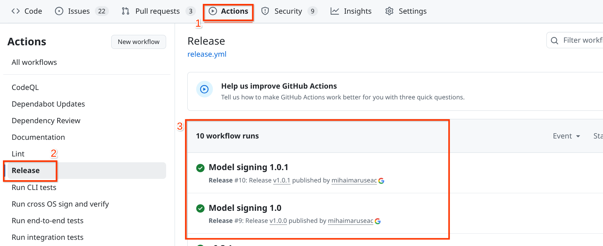
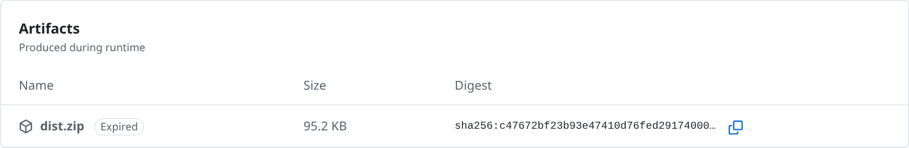
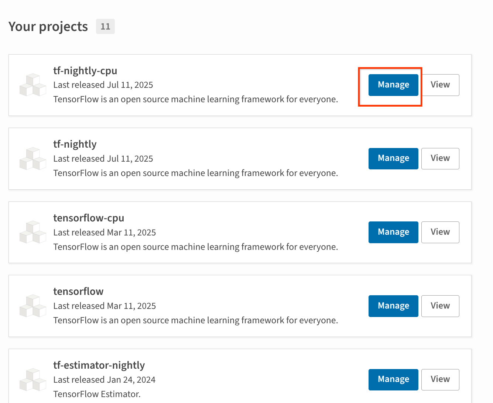
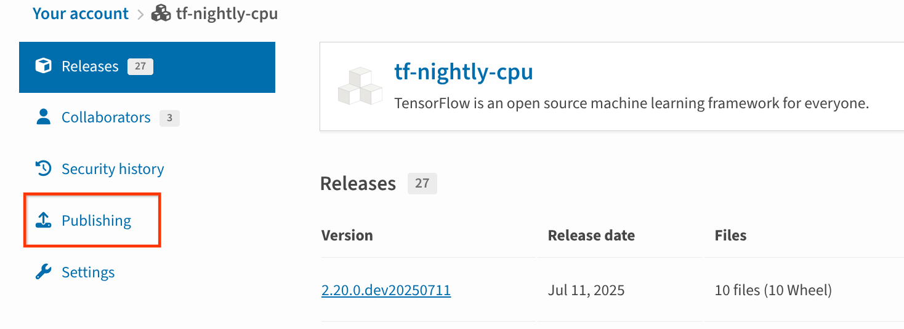

# Setup Trusted Publishing for secure and automated publishing via GitHub Actions

In the previous Python packaging lessons, you've learned:

1. [How to create a Python package](create-python-package)
1. How to publish the code to [PyPI](publish-pypi) and [Conda](publish-conda-forge)

:::{admonition} Learning Objectives
:class: tip

In this lesson you will learn how to:

- Automate building and publishing the package on GitHub Actions
- Configure trusted publishing for the project

:::

## Configure a release job on GitHub Actions

GitHub Actions[^gha] is an infrastructure provided by GitHub to automate
software workflows, straight from the GitHub repository of the project. You can
configure automated testing for every pull request, automated publishing of
documentation, automated creation of webpages for the project, and even automate
the release process. For this lesson we will only focus on the release process
itself.

:::{admonition} Learning Objectives
:class: tip

This tutorial assumes that your project is published to GitHub and that you want
to publish a package from your project to PyPI.
:::

### Step 0: Create a release workflow

To get started, create a file named `release.yaml` under the `.github/workflows`
directory of your project.

:::{admonition} Naming the workflow
:class: tip

The name of the worklow is not relevant, but `release.yaml` is the most
informative name.

If the `.github/workflows` directory does not exist, you can create it. It is
GitHub's convention that all GitHub Actions are configured via YAML files in the
`.github/workflows` directory.
:::

### Step 1: Name the workflow

At the top of the `release.yaml` file type the following:

```yaml
name: Release
```

This gives a name to the workflow. It allows you to quickly find all runs of
this GitHub Action on the "Actions" tab in the GitHub repository.

:::{figure-md} github-actions-release-workflows-summary


This image shows an example of a configured workflow for the release. On the top, in the red box labeled "1" you see the "Actions" tab of the GitHub repository. On the left, in the red box labeled "2" you can see the name of the workflow, as configured in this step. Finally, in the center, in the red box labeled "3" you can see several runs of the workflow, for the "1.0" and "1.0.1" releases of the package.
:::

### Step 2: Add triggers to the workflow

Every GitHub Actions workflow runs only when certain conditions are met. A
release workflow should only run when the repository owner creates a new release
for the package. Add the following to the `release.yaml` file:

```yaml
on:
  release:
    types:
      - published
```

### Step 3: Configure the jobs in the workflow

When triggered, the GitHub Actions runs multiple jobs. We have to configure at
least one job in the workflow file.

For a release job, we need to clone the repository and then use `hatch` to build
the package. We also need to make sure we set up Hatch on the machine GitHub is
using to run the workflow.

A minimal job definition would be:

```yaml
jobs:
  build_package:
    name: Build the package
    runs-on: ubuntu-latest
    steps:
    - uses: actions/checkout
    - uses: pypa/hatch
    - run: hatch build
```

:::{admonition} Hardening the GitHub Actions workflow

There are several improvements we can make to the GitHub Actions workflow we
just configured to improve security and readability.

First, we can give names to relevant steps in the process, to increase
readability of the logs generated during the workflow run. This can be achieved
using `name: <your description here>` lines.

More importantly, each time we use an existing action (via `uses`) we should pin
that action to a commit hash. This ensures that if a malicious user takes over
the action, they won't be able to impact your repository (an example of a supply
chain attack due to GitHub Actions is the recent `tj-actions/changed-files`
attack[^changed-files-supply-chain-attack]). Enabling Dependabot[^dependabot] in
the repository will ensure that you always get a PR to keep the actions up to
date.

Thus, the workflow that you should use, should be similar to:

```yaml
jobs:
  build_package:
    name: Build the package
    runs-on: ubuntu-latest
    steps:
    - uses: actions/checkout@11bd71901bbe5b1630ceea73d27597364c9af683 # v4.2.2
      with:
        persist-credentials: false
    - name: Set up Hatch
      uses: pypa/hatch@257e27e51a6a5616ed08a39a408a21c35c9931bc
    - name: Build artifacts
      run: hatch build
```

:::

Now, you can commit the `.github/workflows/release.yaml` file to the repository.

At this point, if you create a new release for your project on GitHub, the
configured workflow should run and build a wheel for you. Unfortunately, the
wheel is only available on the runner.

### Step 4: Upload the built artifact to the GitHub Artifacts

We need to add one more step to the job definition to be able to access the
wheel. We will upload it to the artifacts temporary area[^github-artifacts]. Add
the following to the `release.yaml` file:

```yaml
    - uses: actions/upload-artifact@ea165f8d65b6e75b540449e92b4886f43607fa02 # v4.6.2
      with:
        path: dist/
        name: dist.zip
        if-no-files-found: error
        retention-days: 1
```

:::{admonition} Upload artifacts parameters
:class: tip

We have configured the artifact to be deleted after 1 day. The artifacts storage
on GitHub actions is temporary, and users should not be getting the package from
here.

We have also configured the release job to error if the `dist/` directory does
not exist. This means that `hatch build` (from the previous step) failed to
build our package, so there is nothing to release.
:::

At this point, if you push the `release.yaml` to GitHub and create a new
release, the GitHub Actions job will run, will clone your repository, set up
Hatch, build the package and then upload it as an archive to the artifacts
storage.

:::{figure-md} github-actions-release-workflows-run


This figure shows an example of a release workflow that has just finished running. Each step in the log is matched to one step in the workflow definition.
:::

At the bottom of the workflow run page on GitHub you should see a section for
the artifacts produced during runtime and uploaded to this storage area:

:::{figure-md} github-actions-release-workflows-artifacts


This figure shows the artifact produced by the above release workflow. It is now marked as expired since the workflow ran more than a day ago.
:::

You can download the artifact (before it expires), unzip it and install the
wheel contained within. However, this should only be done if you want to test
the built wheel. We will proceed to configure uploading to PyPI using trusted
publishing.

## Configure automatic publishing to PyPI

The job we configured on GitHub Actions builds a package for our code, but we
still need to upload it to PyPI. We could upload the package from the same job,
but it is better to create a separate one, to maintain separation of concerns.
This is why in the previous section we uploaded the artifact to the temporary
storage -- in the new job, we will download the package from there and upload it
to PyPI. Since this job does nothing else, there is no possibility that the
package could get compromised before the release.

### Step 1: Add the upload job

In the `release.yaml` file, add the following new job, after the job defined in
the previous section:

```yaml
  publish_release_to_pypi:
    name: Publish release to PyPI
    needs: [build_package]
    runs-on: ubuntu-latest
    environment:
      name: pypi
      url: <URL TO YOUR PROJECT HERE>
    steps:
      - uses: actions/download-artifact@d3f86a106a0bac45b974a628896c90dbdf5c8093 # v4.3.0
        with:
          name: dist.zip
          path: dist/
      - uses: pypa/gh-action-pypi-publish@76f52bc884231f62b9a034ebfe128415bbaabdfc # v1.12.4
```

:::{admonition} Make sure to change the URL

Remember to change the `url:` to the URL for your package on PyPI!
:::

This job has two steps:
- as discussed above, it uses `download-artifact` to download the artifacts
  built in the previous job
- it uses `gh-action-pypi-publish` to publish the package to PyPI.

We are almost there. We just need to enable trusted publishing for the project
and then we are done.

### Step 2: Enable trusted publishing on PyPI

Before trusted publishing was created, in order to upload to PyPI from GitHub
actions you would have needed to add the username and password as arguments to
the `gh-action-pypi-publish` step. While documentation recommends using the
GitHub's `secrets` environment for the password/token, in several cases users
were pasting it directly in the workflow file. Furthermore, accidental leakage
of the token could allow attackers to publish new packages in your name, until
you discover the compromise and revoke the leaked credential.

To prevent these incidents and improve security, supply chain security
developers created Trusted Publishing. This allows registering publishers on
PyPI and mapping them to the automation workflow that is allowed to publish the
package.

:::{admonition} Trusted Publishing outside of GitHub Actions
:class: tip

Trusted Publishing supports other automation platforms, beyond GitHub Actions.
It is also possible to configure a trusted publisher for multiple workflows or
multiple publishers for the same package. These are advanced uses, out of scope
for this lesson.
:::

For this lesson, we will focus on configuring a trusted publisher for a project that already exists on PyPI. If you completed the [lesson about PyPI publishing](create-python-package), you should have this project already created.

This setup step needs to be performed only once for the project. Future releases
will only run the GitHub Actions workflow we are configuring in `release.yaml`.

On the ["Your projects" page on PyPI](https://pypi.org/manage/projects/), click
"Manage" on any project you want to configure.

:::{figure-md} trusted-publishing-your-projects


This image shows several projects. The "Manage" button is highlighted for one of the projects, the one we want to configure trusted publishing for.
:::

Then click "Publishing" in the project's sidebar.

:::{figure-md} trusted-publishing-publishing


Once clicking on the "Manage" button we got to the project's page. In the
sidebar, we have the "publishing" option, as highlighted here.
:::

This will take you to the publisher configuration page for the project. Trusted
publishers can be configured via the forms here. Fill in the GitHub form with
the following information:

- Owner: the GitHub organization name for the organization that owns the
  project. If this is your personal project, then use your GitHub username here.
- Repository name: the name of the repository that contains the project.
- Workflow name: Should be `release.yaml` if you followed this guide, it is the
  workflow we just configured.
- Environment name: Should be `pypi`, as that is what we configured in
  `release.yaml`.

Once you fill in this form and click "Add" the publisher is configured and can
be used to publish new releases of your package.

:::{admonition} Fully hardened GitHub Actions release workflow

For better security it is recommended to also control the permissions of the
GitHub token used within each job of the workflow. The permissions should be
scoped at job level and be as minimal as possible. A workflow that configures
trusted publishing and also does this is the following:

```yaml
name: Release

on:
  release:
    types:
      - published

permissions: {}  # no permissions to the token at global level

jobs:
  build_package:
    name: Build the package
    runs-on: ubuntu-latest
    permissions:
      contents: read  # this job only needs read access
    steps:
    - uses: actions/checkout@11bd71901bbe5b1630ceea73d27597364c9af683 # v4.2.2
      with:
        persist-credentials: false
    - name: Set up Hatch
      uses: pypa/hatch@257e27e51a6a5616ed08a39a408a21c35c9931bc
    - name: Build artifacts
      run: hatch build
    - uses: actions/upload-artifact@ea165f8d65b6e75b540449e92b4886f43607fa02 # v4.6.2
      with:
        path: dist/
        name: dist.zip
        if-no-files-found: error
        retention-days: 1

  publish_release_to_pypi:
    name: Publish release to PyPI
    needs: [build_package]
    runs-on: ubuntu-latest
    environment:
      name: pypi
      url: <URL TO YOUR PROJECT HERE>
    permissions:
      contents: read  # this job needs read access
      id-token: write # but also needs to be able to write the publishing token
    steps:
      - uses: actions/download-artifact@d3f86a106a0bac45b974a628896c90dbdf5c8093 # v4.3.0
        with:
          name: dist.zip
          path: dist/
      - uses: pypa/gh-action-pypi-publish@76f52bc884231f62b9a034ebfe128415bbaabdfc # v1.12.4
```

You can copy the above into your `release.yaml` file. You only need to update
the `url:` field and configure trusted publishing on PyPI.

:::

## You have enabled trusted publishing for your project

Congratulations. You have now configured your project to do secure releases when a new version is being tagged on GitHub. The workflow we have configured builds the package from the exact version of code that we are tagging. This provides a guarantee for your users that the package we have released does exactly what the code states it does -- there is no potential for supply chain related vulnerabilities arising from our package! If you have a package that is ready for real-world use on the real PyPI, then you can follow the same steps to publish it securely.

## Footnotes

[^gha]: https://github.com/features/actions
[^changed-files-supply-chain-attack]: https://www.wiz.io/blog/github-action-tj-actions-changed-files-supply-chain-attack-cve-2025-30066
[^dependabot]: https://docs.github.com/en/code-security/dependabot/working-with-dependabot/keeping-your-actions-up-to-date-with-dependabot
[^github-artifacts]: https://docs.github.com/en/actions/tutorials/store-and-share-data
